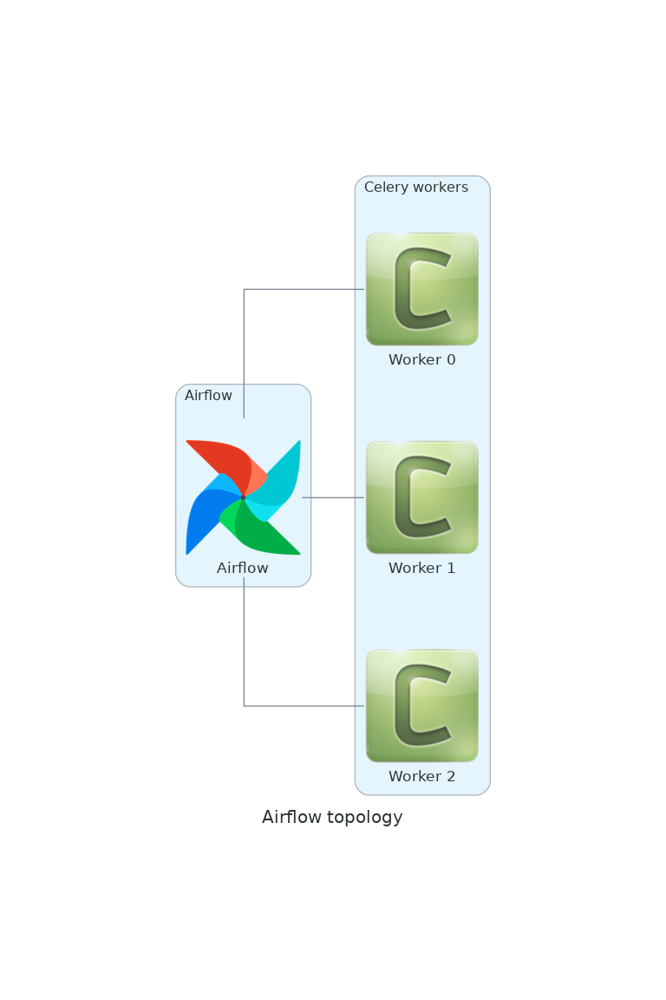
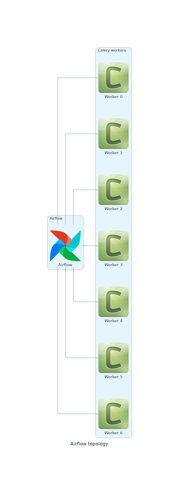
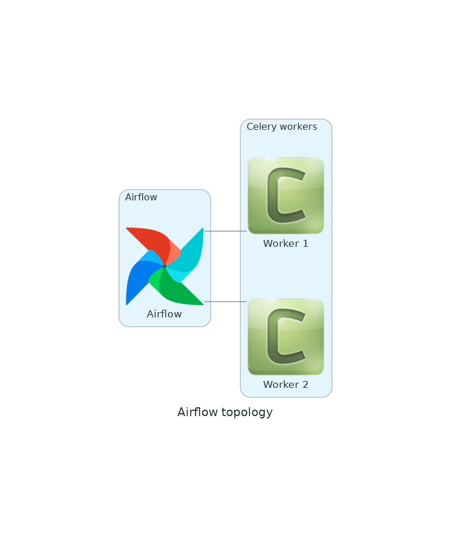

# PythonDebugger Sample Article: How to use the Python debugger

Even if you write small Python programs, you will find out soon enough than tricks like this are not enough to debug a program:

```shell=
[josevnz@dmaf5 ~]$ python3
Python 3.9.9 (main, Nov 19 2021, 00:00:00) 
[GCC 10.3.1 20210422 (Red Hat 10.3.1-1)] on linux
Type "help", "copyright", "credits" or "license" for more information.
>>> DEBUG: bool = True
>>> 
>>> def print_var_function(val: str):
...     print(f"This is a simple dummy function that prints val={val}")
... 
>>> if __name__ == "__main__":
...     print(f"What is your name?")
...     name = input()
...     if DEBUG:
...         print_var_function(name)
... 
What is your name?
jose
This is a simple dummy function that prints val=jose
```

Instead, you can take advantage of the Python debugger ([pdb](https://docs.python.org/3/library/pdb.html)) and get a better insight how your application is behaving.

## What you need to know before we start this tutorial

* Working knowledge of python (objects, workflows, data structures)
* Curiosity how you can troubleshoot your scripts in real time
* A machine that can run Python 3 (for example I'm using Fedora Linux)

*Note*: We will cover only a modern version of Python (3.7+), but you can find about the old syntax for some of the operations in the official documentation.

## Case of study: Simple script that generate a network diagram

A friend of yours gave you a small Python script for you to test; he said he wrote in a rush and may contain bugs (in fact he admited he even tried to run it but he is pretty sure the proof of concept is good). He also said:
* The script depends on the module [Diagrams](https://diagrams.mingrammer.com/docs/getting-started/installation)


First let's create a virtual environment and install some dependencies:

```shell=
python3 -m venv ~/virtualenv/pythondebugger
. ~/virtualenv/pythondebugger/bin/activate
pip install --upgrade pip diagrams
```

Download and install the following script
```shell
pushd $HOME
git clone git@github.com:josevnz/tutorials.git
pushd tutorials/PythonDebugger
```

And when you run the script ... it crashes

```shell=
(pythondebugger) [josevnz@dmaf5 ]$ ./simple_diagram.py --help
Traceback (most recent call last):
  File "/home/josevnz/tutorials/PythonDebugger/./simple_diagram.py", line 8, in <module>
    from diagrams.onprem.queue import Celeri
ImportError: cannot import name 'Celeri' from 'diagrams.onprem.queue' (/home/josevnz/virtualenv/pythondebugger/lib64/python3.9/site-packages/diagrams/onprem/queue.py)
```

So at least one import is wrong. You suspect it is Celery (not _Celeri_ in Spanish), so you launch the script again with the debugger mode enabled:

```shell=
(pythondebugger) [josevnz@dmaf5 ]$ python3 -m pdb simple_diagram.py --help
> /home/josevnz/tutorials/PythonDebugger/simple_diagram.py(2)<module>()
-> """
(Pdb)
```

No crashes and the prompt (pdb) tell us that we are currently on line #2 of our program:

```shell=
(pythondebugger) [josevnz@dmaf5 ]$ python3 -m pdb simple_diagram.py --help
> /home/josevnz/tutorials/PythonDebugger/simple_diagram.py(2)<module>()
-> """
(Pdb) l
  1  	#!/usr/bin/env python
  2  ->	"""
  3  	Script that show a basic Airflow + Celery Topology
  4  	"""
  5  	import argparse
  6  	from diagrams import Cluster, Diagram
  7  	from diagrams.onprem.workflow import Airflow
  8  	from diagrams.onprem.queue import Celeri
  9  	
 10  	
 11  	def generate_diagram(diagram_file: str, workers_n: int):

```

We can continue c(continue) until there is a breakpoint:
```python=
(Pdb) c
Traceback (most recent call last):
  File "/usr/lib64/python3.9/pdb.py", line 1723, in main
    pdb._runscript(mainpyfile)
  File "/usr/lib64/python3.9/pdb.py", line 1583, in _runscript
    self.run(statement)
  File "/usr/lib64/python3.9/bdb.py", line 580, in run
    exec(cmd, globals, locals)
  File "<string>", line 1, in <module>
  File "/home/josevnz/tutorials/PythonDebugger/simple_diagram.py", line 2, in <module>
    """
ImportError: cannot import name 'Celeri' from 'diagrams.onprem.queue' (/home/josevnz/virtualenv/pythondebugger/lib64/python3.9/site-packages/diagrams/onprem/queue.py)
Uncaught exception. Entering post mortem debugging
Running 'cont' or 'step' will restart the program
> /home/josevnz/tutorials/PythonDebugger/simple_diagram.py(2)<module>()
-> """
```

_The bad import won't let us continue_. So in general you want to start with *n*(ext) and move line by line:
```python=
Uncaught exception. Entering post mortem debugging
Running 'cont' or 'step' will restart the program
> /home/josevnz/tutorials/PythonDebugger//simple_diagram.py(2)<module>()
-> """
(Pdb) step
Post mortem debugger finished. The /home/josevnz/tutorials/PythonDebugger//simple_diagram.py will be restarted
> /home/josevnz/tutorials/PythonDebugger//simple_diagram.py(2)<module>()
-> """
(Pdb) n
> /home/josevnz/tutorials/PythonDebugger//simple_diagram.py(5)<module>()
-> import argparse
(Pdb) n
> /home/josevnz/tutorials/PythonDebugger//simple_diagram.py(6)<module>()
-> from diagrams import Cluster, Diagram
(Pdb) n
> /home/josevnz/tutorials/PythonDebugger//simple_diagram.py(7)<module>()
-> from diagrams.onprem.workflow import Airflow
(Pdb) n
> /home/josevnz/tutorials/PythonDebugger//simple_diagram.py(8)<module>()
-> from diagrams.onprem.queue import Celeri
(Pdb) n
ImportError: cannot import name 'Celeri' from 'diagrams.onprem.queue' (/home/josevnz/virtualenv/pythondebugger/lib64/python3.9/site-packages/diagrams/onprem/queue.py)
> /home/josevnz/tutorials/PythonDebugger//simple_diagram.py(8)<module>()
-> from diagrams.onprem.queue import Celeri
```

We won't be able to proceed unless we fix the broken instruction in line 8. Time to use ```import 'Celery'``` instead of ```import Celeri```:

```python=
(Pdb) from diagrams.onprem.queue import Celery
(Pdb) exit()
```

For sake of argument, maybe you want your program to enter the debug mode if a module is missing (in fact you insist there is a Celeri module :-)). The change in the code is simple, just capture the ImportError and call the breakpoint() function (before we show the stack trace using [traceback](https://docs.python.org/3/library/traceback.html)):

```python=
#!/usr/bin/env python
"""
Script that show a basic Airflow + Celery Topology
"""
try:
    import argparse
    from diagrams import Cluster, Diagram
    from diagrams.onprem.workflow import Airflow
    from diagrams.onprem.queue import Celeri
except ImportError:
    breakpoint()
```

If you call the script normally and one of the imports is missing the debugger will get started for you, after printing the stack trace:

```shell=
(pythondebugger) [josevnz@dmaf5 ]$ python3 simple_diagram.py --help
Exception while importing modules:
------------------------------------------------------------
Traceback (most recent call last):
  File "/home/josevnz/tutorials/PythonDebugger//simple_diagram.py", line 11, in <module>
    from diagrams.onprem.queue import Celeri
ImportError: cannot import name 'Celeri' from 'diagrams.onprem.queue' (/home/josevnz/virtualenv/pythondebugger/lib64/python3.9/site-packages/diagrams/onprem/queue.py)
------------------------------------------------------------
Starting the debugger
> /home/josevnz/tutorials/PythonDebugger//simple_diagram.py(21)<module>()
-> def generate_diagram(diagram_file: str, workers_n: int):
(Pdb) 
```

Fix the bad import and move on to see what our little script can do:

```shell=
(pythondebugger) [josevnz@dmaf5 ]$ python3 simple_diagram.py --help
usage: /home/josevnz/tutorials/PythonDebugger//simple_diagram.py [-h] [--workers WORKERS] diagram

Generate network diagrams for examples used on this tutorial

positional arguments:
  diagram            Name of the network diagram to generate

optional arguments:
  -h, --help         show this help message and exit
  --workers WORKERS  Number of workers
  
# Generate a diagram with 3 workers
(pythondebugger) [josevnz@dmaf5 ]$ python3 simple_diagram.py --workers 3 my_airflow.png
```

The resulting Diagram:




## Taking a closer look at the code with step, continue, args and breakpoints

Let's run again the script but using a negative number of workers:

```shell=
python3 simple_diagram.py --workers -3 my_airflow2.png
```

This produces a weird image, no celery workers!:


This *was unexpected*. Let's use the debugger to understand what happened here and also come up with a way to prevent this from happening (right away we ask to see the full source code with *ll*)

```shell=
(pythondebugger) [josevnz@dmaf5 ]$ python3 -m pdb simple_diagram.py --workers -3 my_airflow2.png
> /home/josevnz/tutorials/PythonDebugger/simple_diagram.py(2)<module>()
-> """
(Pdb) ll
  1  	#!/usr/bin/env python
  2  ->	"""
  3  	Script that show a basic Airflow + Celery Topology
  4  	"""
  5  	try:
  6  	    import sys
  7  	    import argparse
  8  	    import traceback
  9  	    from diagrams import Cluster, Diagram
 10  	    from diagrams.onprem.workflow import Airflow
 11  	    from diagrams.onprem.queue import Celery
 12  	except ImportError:
 13  	    print("Exception while importing modules:")
 14  	    print("-"*60)
 15  	    traceback.print_exc(file=sys.stderr)
 16  	    print("-"*60)
 17  	    print("Starting the debugger", file=sys.stderr)
 18  	    breakpoint()
 19  	
 20  	
 21  	def generate_diagram(diagram_file: str, workers_n: int):
 22  	    """
 23  	    Generate the network diagram for the given number of workers
 24  	    @param diagram_file: Where to save the diagram
 25  	    @param workers_n: Number of workers
 26  	    """
 27  	    with Diagram("Airflow topology", filename=diagram_file, show=False):
 28  	        with Cluster("Airflow"):
 29  	            airflow = Airflow("Airflow")
 30  	
 31  	        with Cluster("Celery workers"):
 32  	            workers = []
 33  	            for i in range(workers_n):
 34  	                workers.append(Celery(f"Worker {i}"))
 35  	        airflow - workers
 36  	
 37  	
 38  	if __name__ == "__main__":
 39  	    PARSER = argparse.ArgumentParser(
 40  	        description="Generate network diagrams for examples used on this tutorial",
 41  	        prog=__file__
 42  	    )
 43  	    PARSER.add_argument(
 44  	        '--workers',
 45  	        action='store',
 46  	        type=int,
 47  	        default=1,
 48  	        help="Number of workers"
 49  	    )
 50  	    PARSER.add_argument(
 51  	        'diagram',
 52  	        action='store',
 53  	        help="Name of the network diagram to generate"
 54  	    )
 55  	    ARGS = PARSER.parse_args()
 56  	
 57  	    generate_diagram(ARGS.diagram, ARGS.workers)
(Pdb)
```

Going step by step here is not very efficient, will go just deep enough in the code, *unt*(il) line 57, to see what is the effect of passing number of workers == -1 (*pretty* print ARGS variable):
```python=
> /home/josevnz/tutorials/PythonDebugger//simple_diagram.py(57)<module>()
-> generate_diagram(ARGS.diagram, ARGS.workers)
(Pdb) pp ARGS
Namespace(workers=-3, diagram='my_airflow2.png')
```

Also, very useful is to know the type of object. Let's see what type is ARGS:
```python=
(Pdb) whatis ARGS
<class 'argparse.Namespace'>
```

Looks like the next logical step is to dive into the function that generates the diagram (*l*(ist) to confirm where we are):
```python=
(Pdb) l
 52  	        action='store',
 53  	        help="Name of the network diagram to generate"
 54  	    )
 55  	    ARGS = PARSER.parse_args()
 56  	
 57  ->	    generate_diagram(ARGS.diagram, ARGS.workers)
[EOF]
```
Dive one *s*(tep) inside and then move *n*(ext) one instruction

```python=
(Pdb) s
--Call--
> /home/josevnz/tutorials/PythonDebugger//simple_diagram.py(21)generate_diagram()
-> def generate_diagram(diagram_file: str, workers_n: int):
(Pdb) n
> /home/josevnz/tutorials/PythonDebugger//simple_diagram.py(27)generate_diagram()
-> with Diagram("Airflow topology", filename=diagram_file, show=False):
(Pdb) l
 22  	    """
 23  	    Generate the network diagram for the given number of workers
 24  	    @param diagram_file: Where to save the diagram
 25  	    @param workers_n: Number of workers
 26  	    """
 27  ->	    with Diagram("Airflow topology", filename=diagram_file, show=False):
 28  	        with Cluster("Airflow"):
 29  	            airflow = Airflow("Airflow")
 30  	
 31  	        with Cluster("Celery workers"):
 32  	            workers = []

```

You see the prompt is telling you that you are inside the generate_diagram function. Confirm which *a*(rguments) were passed:

```python=
(Pdb) a generate_diagram
diagram_file = 'my_airflow2.png'
workers_n = -3
(Pdb) 

```

Inspect the code again and study where we iterate 'workers_n' number of times to add celery workers to the diagram:

```python=
(Pdb) l
 33  	            for i in range(workers_n):
 34  	                workers.append(Celery(f"Worker {i}"))
 35  	        airflow - workers
 36  	
 37  	
 38  	if __name__ == "__main__":
 39  	    PARSER = argparse.ArgumentParser(
 40  	        description="Generate network diagrams for examples used on this tutorial",
 41  	        prog=__file__
 42  	    )
 43  	    PARSER.add_argument(
```

Lines 33-34 populate the workers list with Celery objects. We can see what happens to the ```range()``` function when you pass a negative number when trying to create an iterator:

```python=
(Pdb) p range(workers_n)
range(0, -3)
```

The theory says this will generate an empty iterator, meaning the loop will never run. Let's confirm before and after state of the workers variable, to do that we will setup 2 *b*(reakpoints):
1. One after the workers variable is initialized, line 33
2. One after the loop that populates the workers is exited, line 35

I don't want to execute code one step at the time, instead I will *c*(ontinue) through the *b*(reakpoints) instead

```python=
(Pdb) b simple_diagram.py:33
Breakpoint 1 at /home/josevnz/tutorials/PythonDebugger//simple_diagram.py:33
(Pdb) b simple_diagram.py:35
Breakpoint 2 at /home/josevnz/tutorials/PythonDebugger//simple_diagram.py:35
(Pdb) b
Num Type         Disp Enb   Where
1   breakpoint   keep yes   at /home/josevnz/tutorials/PythonDebugger//simple_diagram.py:33
2   breakpoint   keep yes   at /home/josevnz/tutorials/PythonDebugger//simple_diagram.py:35

```

Time to print the contents of workers and continue as promised:
```python=
(Pdb) c
> /home/josevnz/tutorials/PythonDebugger//simple_diagram.py(33)generate_diagram()
-> for i in range(workers_n):
(Pdb) p workers
[]
(Pdb) c
> /home/josevnz/tutorials/PythonDebugger//simple_diagram.py(35)generate_diagram()
-> airflow - workers
(Pdb) workers
[]
```

If we press *c*(ontinue) the program will exit, or *r*(eturn) will get us back to '__main__'; will use return:

```python=
(Pdb) r
--Return--
> /home/josevnz/tutorials/PythonDebugger//simple_diagram.py(35)generate_diagram()->None
-> airflow - workers
(Pdb) c
The program finished and will be restarted
> /home/josevnz/tutorials/PythonDebugger//simple_diagram.py(2)<module>()
-> """
(Pdb) exit()
```

We can fix our application by adding some defensive coding to the ```--workers``` argument to accept values between 1 and say 10 (a diagram with more than 10 workers will probably won't look so good). Time to change the code to add a validation function:

```python=
def valid_range(value: str, upper: int  = 10):
    try:
        int_val = int(value)
        if 1 <= int_val <= upper:
            return int_val
        raise ArgumentTypeError(f"Not true: 1<= {value} <= {upper}")
    except ValueError:
        raise ArgumentTypeError(f"'{value}' is not an Integer")


if __name__ == "__main__":
    PARSER = argparse.ArgumentParser(
        description="Generate network diagrams for examples used on this tutorial",
        prog=__file__
    )
    PARSER.add_argument(
        '--workers',
        action='store',
        type=valid_range,
        default=1,
        help="Number of workers"
    )
```

Of course, we want to learn if this works or not, so launch the debugger again and set a breakpoint on line 39:

```python=
(Pdb) b simple_diagram.py:39
Breakpoint 1 at /home/josevnz/tutorials/PythonDebugger//simple_diagram.py:39
(Pdb) c
> /home/josevnz/tutorials/PythonDebugger//simple_diagram.py(39)valid_range()
-> try:
(Pdb) l
 34  	            for i in range(workers_n):
 35  	                workers.append(Celery(f"Worker {i}"))
 36  	        airflow - workers
 37  	
 38  	def valid_range(value: str, upper: int  = 10):
 39 B->	    try:
 40  	        int_val = int(value)
 41  	        if 1 <= int_val <= upper:
 42  	            return int_val
 43  	        raise ArgumentTypeError(f"Not true: 1<= {value} <= {upper}")
 44  	    except ValueError:
(Pdb) a valid_range
value = '-3'
upper = 10
(Pdb) p int(value)
-3
(Pdb) n
> /home/josevnz/tutorials/PythonDebugger//simple_diagram.py(40)valid_range()
-> int_val = int(value)
(Pdb) n
> /home/josevnz/tutorials/PythonDebugger//simple_diagram.py(41)valid_range()
-> if 1 <= int_val <= upper:
(Pdb) p 1 <= int_val <= upper
False
(Pdb) n
> /home/josevnz/tutorials/PythonDebugger//simple_diagram.py(43)valid_range()
-> raise ArgumentTypeError(f"Not true: 1<= {value} <= {upper}")
(Pdb) n
argparse.ArgumentTypeError: Not true: 1<= -3 <= 10
> /home/josevnz/tutorials/PythonDebugger//simple_diagram.py(43)valid_range()
-> raise ArgumentTypeError(f"Not true: 1<= {value} <= {upper}")
(Pdb) n
> /home/josevnz/tutorials/PythonDebugger//simple_diagram.py(44)valid_range()
-> except ValueError:
(Pdb) n
--Return--
> /home/josevnz/tutorials/PythonDebugger//simple_diagram.py(44)valid_range()->None
-> except ValueError:
(Pdb) n
--Call--
> /usr/lib64/python3.9/argparse.py(744)__init__()
-> def __init__(self, argument, message):
(Pdb) c
usage: /home/josevnz/tutorials/PythonDebugger//simple_diagram.py [-h] [--workers WORKERS] diagram
/home/josevnz/tutorials/PythonDebugger//simple_diagram.py: error: argument --workers: Not true: 1<= -3 <= 10
The program exited via sys.exit(). Exit status: 2
> /home/josevnz/tutorials/PythonDebugger//simple_diagram.py(2)<module>()
-> """

```

A lot happened here as we moved using 'n' and 'c':
1. The function was called as expected, our breakpoint on line 39 was called
2. We printed the arguments for the validation function
3. We evaluated (p) the sanity checks and confirmed that -3 did not pass the range check and an expection was raised as a result
4. The program exited with an error

Without the debugger you can confirm what we inspected before:
```shell=
pythondebugger) [josevnz@dmaf5 ]$ python3 simple_diagram.py --workers -3 my_airflow2.png
usage: /home/josevnz/tutorials/PythonDebugger//simple_diagram.py [-h] [--workers WORKERS] diagram
/home/josevnz/tutorials/PythonDebugger//simple_diagram.py: error: argument --workers: Not true: 1<= -3 <= 10

# A good call
(pythondebugger) [josevnz@dmaf5 ]$ python3 simple_diagram.py --workers 7 my_airflow2.png && echo "OK"
OK
```



## Learning how to jump before running

You can skip through code by jumping using the debugger. You need to be awarer than depending on where you jump you may disable the execution of code (but this is useful to understand the workflow of your program). For example, setup a breakpoint on line 32, just before we create the ```workers``` list and then *j*(ump) to line 36 and print the valye of workers:

```python=
(pythondebugger) [josevnz@dmaf5 ]$ python3 -m pdb simple_diagram.py --workers 2 my_airflow4.png
> /home/josevnz/tutorials/PythonDebugger//simple_diagram.py(2)<module>()
-> """
(Pdb) b simple_diagram.py:32
Breakpoint 1 at /home/josevnz/tutorials/PythonDebugger//simple_diagram.py:32
(Pdb) c
> /home/josevnz/tutorials/PythonDebugger//simple_diagram.py(32)generate_diagram()
-> with Cluster("Celery workers"):
(Pdb) j 36
> /home/josevnz/tutorials/PythonDebugger//simple_diagram.py(36)generate_diagram()
-> airflow - workers
(Pdb) workers
*** NameError: name 'workers' is not defined

```

Oh!. Workers are never initialized. Let's jump back to line 32, set a breakpoint to line 36 and continue to see what happens:

```python=
(Pdb) j 32
> /home/josevnz/tutorials/PythonDebugger//simple_diagram.py(32)generate_diagram()
-> with Cluster("Celery workers"):
(Pdb) b simple_diagram.py:36
Breakpoint 2 at /home/josevnz/tutorials/PythonDebugger//simple_diagram.py:36
(Pdb) c
> /home/josevnz/tutorials/PythonDebugger//simple_diagram.py(36)generate_diagram()
-> airflow - workers
(Pdb) p workers
[<onprem.queue.Celery>, <onprem.queue.Celery>]
(Pdb) 

```

Yes, time traveling is also confusing :-)

## Trying code with interact

If you were paying close attention you may have noticed than the label on the Celery workers start with 'Worker 0' to 'Worker N-1'. Having a 'Worker 0' is not intuitive, the fix is trivial so let's see if we can 'hot-fix' our code:

```python=
(pythondebugger) [josevnz@dmaf5 ]$ python3 -m pdb simple_diagram.py --workers 2 my_airflow4.png
> /home/josevnz/tutorials/PythonDebugger//simple_diagram.py(2)<module>()
-> """
(Pdb) b simple_diagram.py:35
Breakpoint 1 at /home/josevnz/tutorials/PythonDebugger//simple_diagram.py:35
(Pdb) c
> /home/josevnz/tutorials/PythonDebugger/simple_diagram.py(35)generate_diagram()
-> workers.append(Celery(f"Worker {i}"))
(Pdb) p i
0
(Pdb) p f"Worker {i}"
'Worker 0'
(Pdb) interact
*interactive*
>>> f"Worker {i}"
'Worker 0'
>>> f"Worker {i+1}"
'Worker 1'
>>> workers.append(Celery(f"Worker {i+1}"))
>>> workers
[<onprem.queue.Celery>]

```

So what happened here?:
1. Set a breakpoint on line 35, which is the place where we create Celery object instances
2. Print the value of i, we see is 0 and will get through workers_n - 1
3. Evaluate the expression of ```f"Worker {i}"```
4. Start an interactive session. This session will inherit all the variables and context to the moment of the breakpoint. This means we have access to ```i``` and the ```workers``` list
5. Test a new expression adding ```i+1``` and confirm our fix will work

So this is cheaper than restarting the program with the fix. Also imagine the value of doing this if you function is much more complex and is getting data from remote resources like a database. Pure gold!

Going back to our last fix, we replace line 35 with this:

```python=
            for i in range(workers_n):
                workers.append(Celery(f"Worker {i+1}"))
```




## What did we learn

We covered what is possible with the python debugger and
* Ran an application in debug mode
* Executed our script step by step
* inspected the content of variables, learn about members of an module
* Used breakpoints, jumps
* Incorporated the debugger in our application
* Applied a hot-fix in our running code

By now you know than you don't need an IDE in order to debug and troubleshoot your Python application, and the PDB is a very poweful tool you should have in your toolset.

