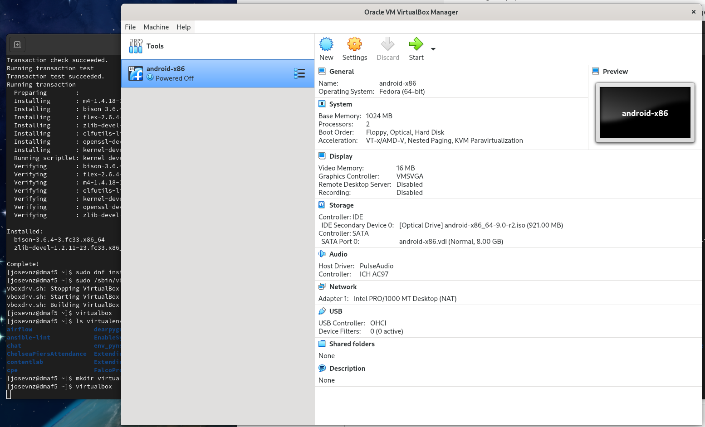
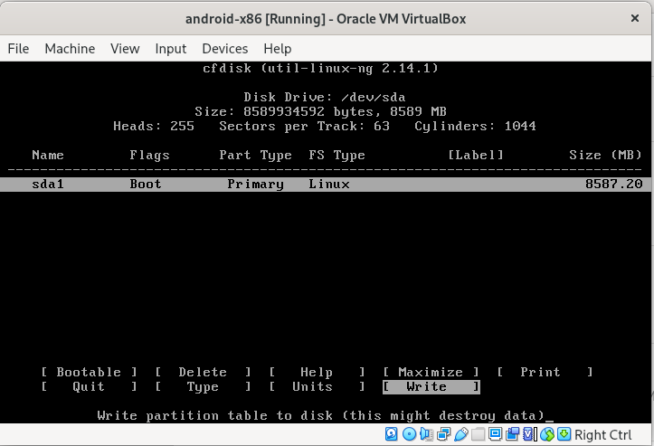
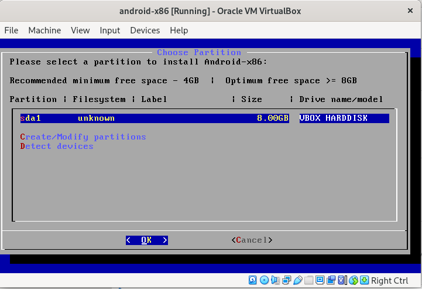
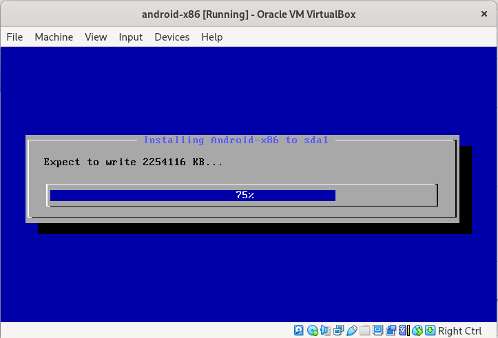
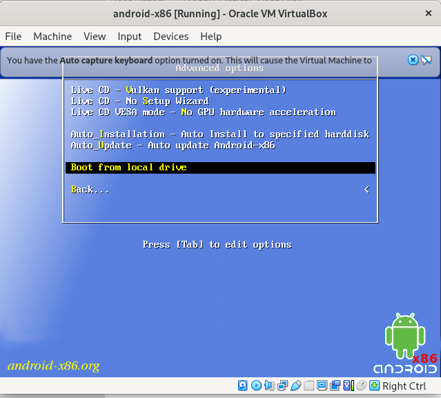
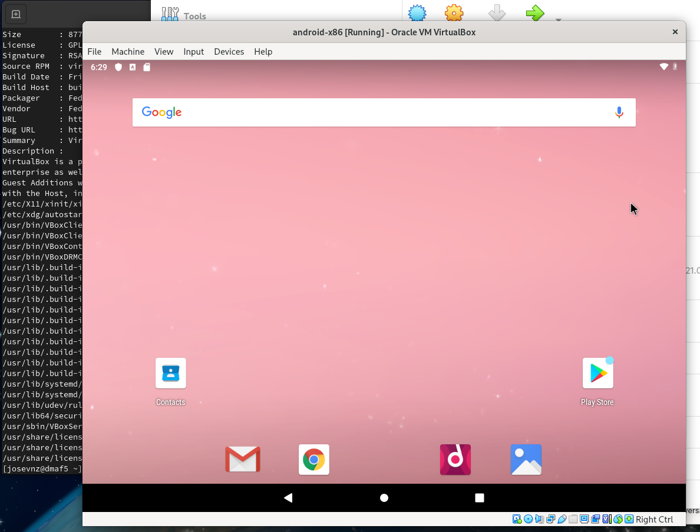
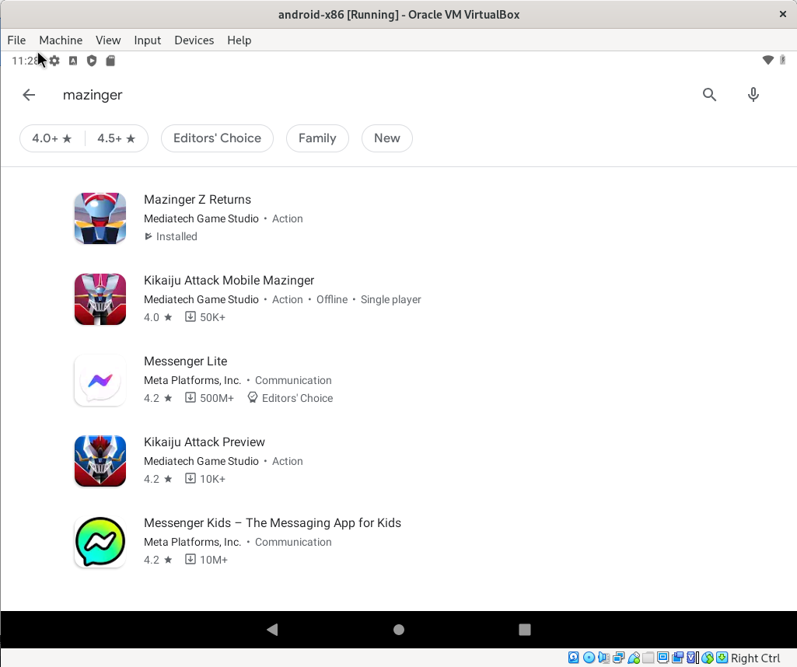
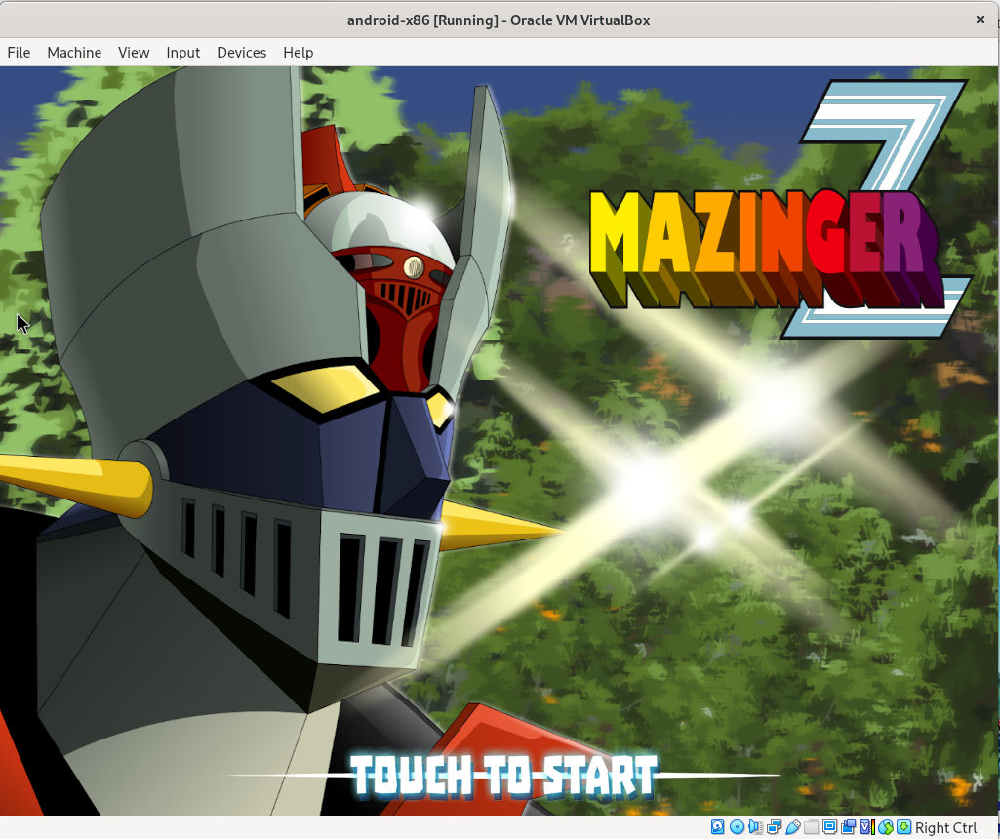

# Running Android games on Linux with android-x86

You have an Android phone and one of your guilty pleasures is playing some very entertaining games; or it could be that there is an application that only runs on your phone.

And then you think what if you could run the same games on your desktop PC?

To simply the scenario, let's assume the applications run on Android.

One approach to solve your problem is to run an Android emulator on your PC; But some of them like [android-x86](https://www.android-x86.org/download.html) requires rebooting your machine so they can take control of the hardware.

If you don't mind a small performance hit you can run a virtual machine at the same time as your native operating system; Specifically on Linux there are several choices, like [QEMU](https://www.qemu.org/), [VirtualBox](https://www.virtualbox.org/) among a few.


By the end of this article you will be able to do the following:

* Install VirtualBox on Fedora Linux
* Run android-x86, finish the basic setup
* Install an application from the Google Play Store, just like your phone.

## Basic requirements

Before you start, it assumed you have the following:

* Ability to run commands as the superuser (like [SUDO](https://www.sudo.ws/))
* An account on Google.com, so you can use the Play store from within the virtual machine.


# Installing VirtualBox

The first step is to install VirtualBox; For practical purposes our installation will be basic, just enough to run our games:

```shell=
sudo dnf install -y kernel-devel kernel-devel-5.14.18-100.fc33.x86_64
curl --remote-name --location https://www.virtualbox.org/download/oracle_vbox.asc
sudo rpm --import ./oracle_vbox.asc
sudo dnf install -y https://download.virtualbox.org/virtualbox/6.1.36/VirtualBox-6.1-6.1.36_152435_fedora33-1.x86_64.rpm
sudo dnf install -y virtualbox-guest-additions.x86_64
sudo /sbin/vboxconfig
```

## Installing the android-x86 ISO

The first step is to download the ISO image from [android-x86](https://sourceforge.net/projects/android-x86/); This ISO contains the Android operating system that will be installed on our virtual hard drive.

After that we can set up our virtual machine like this:



A few things to note:

* After booting the first time, I found than 1GB for the Android image was not enough; performance improved a lot after I bumped the ram to 3GB.
* Another change was the 'Graphics Controller'; Originally was VMSVGA but then Android refused to start in graphic mode, so I switched to VboxVGA and it worked.
* 2 CPUS and 8GB of disk space were enough for my game
* Finally specified than the IDE controller was the android-x86 ISO

To start the virtual machine, you click the 'Start' button on the GUI, and then you will have to make a few decisions like bootable partition:



Once this is done you can choose your new partition to perform the installation:



Then installation will proceed:



After the installation is complete, you can shut down the virtual machine.

## First boot

You now must go to the advanced options and select the virtual disk (instead of the ISO image) to boot:



After that, Android will ask you some basic setup information, just like it will do it on your phone. The final result may look like this:



## Installing the games from the Google Play Store

In my case I decided to install a game where I can fight forces of evil as 1970 [Mazinger Z/ Tranzor Z](https://en.wikipedia.org/wiki/Mazinger_Z) (Yes, I love [Go Nagai ](https://en.wikipedia.org/wiki/Go_Nagai)Mazinger Z); to do that we search on the play store and install our game:



And now success, we got the game up and running



# What did we learn?

* We managed to install a virtual machine engine and ran successfully the Android operating system along with our regular Fedora OS
* You saw how you can try and discard whole operating systems' setup, without going to the hassle of setting up a dual boot system with Grub on Linux

Another nice feature of running the game inside a virtual machine is that you can fully freeze the game, then come back and restore it at exactly the same point where you left it.

Finally, you can do many more things with a virtual machine than just running games; for example:

* You can for example [analyze malware safely](https://www.varonis.com/blog/malware-analysis-tools), run untrusted applications and contain any damage the can cause
* Try a new operating system version before deciding to commit a proper installation (not a big issue these days as most of them provide a lice CD you can boot to try); very convenient
* Be able to run multiple operating systems simultaneously, without rebooting your machine. You most likely will start trying more advanced options of your virtual machine of choice, like [VirtualBox](https://www.virtualbox.org/manual/ch09.html).

Playing games on your PC is a gateway for learning more complex stuff later; also the fun factor is undeniable.
