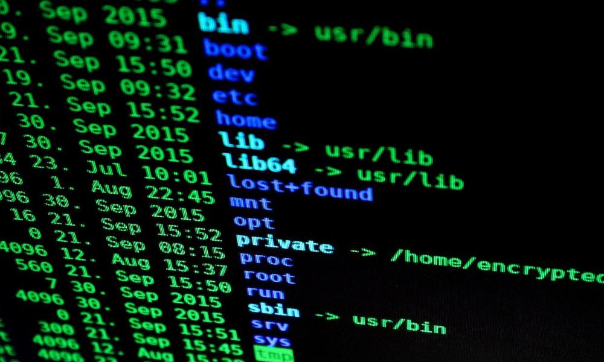

# 10 articles to sharpen your command line skills



The command line interface (also known as the CLI) is probably the most powerful and yet itimidating aspect of Linux as it gives you unparalleled power and complete access to what the operating system can do for you.

Linux inherited UNIX design and its ability to compose more complex commands from simple tools. For the sake of example, you can combine the disk usage (du) tool and the sort tool (sort) to get the size of the items on the current directory:

```
du -s *|sort -r -n
```

You get the picure (or the command in this case).

With that in mind I want to recommend a group of articles for you, hopefully you will learn a thing of two after reading them, and even better you will put them in practice.

So let's dive in with the list and get ready to have fun while learning:

1. David Both [Adding arguments and options to your Bash scripts](http://www.redhat.com/sysadmin/arguments-options-bash-scripts ): Adding arguments and options to your Bash scripts will make them more easy to use and less complex.
2. Jeff Warnica	[5 Linux commands I'm going to start using](http://www.redhat.com/sysadmin/5-linux-commands). You will be surprised how these 5 not so common commands can save your time.
3. [Ken Hess 5 Linux commands I never use](http://www.redhat.com/sysadmin/5-never-use-linux-commands): Another point of view on the same 5 commands and why you should use them. Being a sysadmin or DevOps means you have to choose your tools carefully too!
4. Bryant Son [Exploring the differences between sudo and su](http://www.redhat.com/sysadmin/difference-between-sudo-su) commands in Linux: If want to elevate your privileges on Linux or want to control how your users can do the same then you must understand the differences between these two commands.	
5. Roberto Nozaki [3 must-know Linux commands for text manipulation](http://www.redhat.com/sysadmin/linux-text-manipulation-tools). Sooner or later you will use one of these or all of them. Time to get ready and have some fun.	
6. Evans Amoany	[7 Linux networking commands that every sysadmin should know](http://www.redhat.com/sysadmin/7-great-network-commands). If tcpdump or mtr doesn't sound familiar then you should read about them (and some more). You can thank me later.
7. Ken Hess	[How to capture terminal sessions and output with the Linux script command](http://www.redhat.com/sysadmin/linux-script-command). You have an interactive shell session. You need to capture the output (for troubleshooting). You can read this article and learn how to do just that.
8. Anthony Critelli	[6 OpenSSL command options that every sysadmin should know](http://www.redhat.com/sysadmin/6-openssl-commands). OpenSSL is well know for its power, functionality and very complex options. This article demistifies some of these and will make you more productive 
9. Nathan Lager	[Introduction to Linux Bash programming: 5 `for` loop tips](http://www.redhat.com/sysadmin/bash-scripting-loops). Get ready to learn a few tricks and very useful shortcuts. 
10. Evans Amoany [Managing Linux users with the passwd command](http://www.redhat.com/sysadmin/managing-users-passwd). It is a critical skill if you want to make sure your system is secure.
