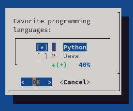
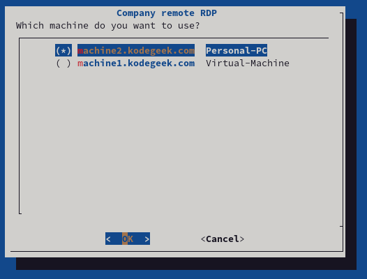

# Writing useful terminal GUI on Linux with dialog and jq

I connect on daily basics from my home computer into my Physical PC, using Linux. After a while it was irritating to be repeating the same commands over and over.

Having a bash function like this was a solution:

```=bash
export REMOTE_RDP_USER="myremoteuser"
function remote_machine() {
  /usr/bin/xfreerdp /cert-ignore /sound:sys:alsa /f /u:$REMOTE_RDP_USER /v:$1 /p:$2
}
```

And then I was constantly doing this:

```bash=
remote_pass=(/bin/cat/.mypassfile)
remote_machine $remote_machine $remote_pass
```

That was annoying. Not to mention that I had my password on cleartext on my machine (I have an encrypted drive but still...)

So I decided to spend a little bit of time and came up with a nice script to handle my basic needs.

## What information I need to connect to my remote desktop?

Not much, I just need it to be structured so a simple JSON file will do:

```
"machines": [
        {
            "name": "machine1.domain.com",
            "description": "Personal-PC"
        },
        {
            "name": "machine2.domain.com",
            "description": "Virtual-Machine"
        }
    ],
    "remote_user": "MYUSER@DOMAIN",
    "title" : "MY COMPANY RDP connection"
}
```

Obviously JSON is not the best format for configuration files (as it doesn't support comments for example) but it has plenty of tools on linux parse its contents from the command line. A very useful tool that stands over the top is '[jq](https://stedolan.github.io/jq/)'. Let me show you how I can extract the list of machines:

```bash=
/usr/bin/jq --compact-output --raw-output '.machines[]| .name' $HOME/.config/scripts/kodegeek_rdp.json)
"machine1.domain.com"
"machine2.domain.com"
```

You can try your expressions at [jq play](https://jqplay.org/) just by copying and pasting your JSON files there and then use the expression on your scripts.

So now that I have all the data I need to connect to my remote computer, let's build a nice UI for it.

## Dialog to the rescue

[Dialog](https://invisible-island.net/dialog/) is one of these underrated Linux tools that you wish you knew long time ago. You can build very nice and simple UI that will work perfectly on your terminal.

For example, to create a simple checkbox list with my favorite languages, selecting Python by default:

```bash=
dialog --clear --checklist "Favorite programming languages:" 10 30 7 1 Python on 2 Java off 3 Bash off 4 Perl off 5 Ruby off
```



## Putting everything together: Writing a TUI with Dialog and JQ

At the end I wrote a UI together that used jq to extract my configuration details from my json file and organized the flow with dialog. I ask the password every single time and I save it on a temporary file that gets removed after the script is done using it.

The script is pretty basic but is secure and also let me focus on more serious tasks :-)

So how the [script](https://raw.githubusercontent.com/josevnz/scripts/main/kodegeek_rdp.sh) looks like?

```bash=
#!/bin/bash
# author Jose Vicente Nunez
# Do not use this script on a public computer. It is not secure...
# https://invisible-island.net/dialog/
: ${DIALOG_OK=0}
: ${DIALOG_CANCEL=1}
: ${DIALOG_HELP=2}
: ${DIALOG_EXTRA=3}
: ${DIALOG_ITEM_HELP=4}
: ${DIALOG_ESC=255}
declare tmp_file=$(/usr/bin/mktemp 2>/dev/null) || declare tmp_file=/tmp/test$$
trap "/bin/rm -f $tmp_file" 0 1 2 5 15 EXIT INT
/bin/chmod go-wrx ${tmp_file} > /dev/null 2>&1

declare TITLE=$(/usr/bin/jq --compact-output --raw-output '.title' $HOME/.config/scripts/kodegeek_rdp.json)|| exit 100
declare REMOTE_USER=$(/usr/bin/jq --compact-output --raw-output '.remote_user' $HOME/.config/scripts/kodegeek_rdp.json)|| exit 100
declare MACHINES=$(
    declare tmp_file2=$(/usr/bin/mktemp 2>/dev/null) || declare tmp_file2=/tmp/test$$
    # trap "/bin/rm -f $tmp_file2" 0 1 2 5 15 EXIT INT
    declare -a MACHINE_INFO=$(/usr/bin/jq --compact-output --raw-output '.machines[]| join(",")' $HOME/.config/scripts/kodegeek_rdp.json > $tmp_file2)
    declare -i i=0
    while read line; do
        declare machine=$(echo $line| /usr/bin/cut -d',' -f1)
        declare desc=$(echo $line| /usr/bin/cut -d',' -f2)
        declare toggle=off
        if [ $i -eq 0 ]; then
            toggle=on
            ((i=i+1))
        fi
        echo $machine $desc $toggle
    done < $tmp_file2
    /bin/cp /dev/null $tmp_file2
) || exit 100
/usr/bin/dialog \
    --clear \
    --title "$TITLE" \
    --radiolist "Which machine do you want to use?" 20 61 2 \
    $MACHINES 2> ${tmp_file}
return_value=$?

export remote_machine=""
case $return_value in
  $DIALOG_OK)
    export remote_machine=$(/bin/cat ${tmp_file})
    ;;
  $DIALOG_CANCEL)
    echo "Cancel pressed.";;
  $DIALOG_HELP)
    echo "Help pressed.";;
  $DIALOG_EXTRA)
    echo "Extra button pressed.";;
  $DIALOG_ITEM_HELP)
    echo "Item-help button pressed.";;
  $DIALOG_ESC)
    if test -s $tmp_file ; then
      /bin/rm -f $tmp_file
    else
      echo "ESC pressed."
    fi
    ;;
esac

if [ -z "${remote_machine}" ]; then
  /usr/bin/dialog \
  	--clear  \
	--title "Error, no machine selected?" --clear "$@" \
       	--msgbox "No machine was selected!. Will exit now..." 15 30
  exit 100
fi

/bin/ping -c 4 ${remote_machine} >/dev/null 2>&1
if [ $? -ne 0 ]; then
  /usr/bin/dialog \
  	--clear  \
	--title "VPN issues or machine is off?" --clear "$@" \
       	--msgbox "Could not ping ${remote_machine}. Time to troubleshoot..." 15 50
  exit 100
fi

/bin/rm -f ${tmp_file}
/usr/bin/dialog \
  --title "$TITLE" \
  --clear  \
  --insecure \
  --passwordbox "Please enter your Windows password for ${remote_machine}\n" 16 51 2> $tmp_file
return_value=$?
case $return_value in
  $DIALOG_OK)
    /usr/bin/mkdir -p -v $HOME/logs
    /usr/bin/xfreerdp /cert-ignore /sound:sys:alsa /f /u:$REMOTE_USER /v:${remote_machine} /p:$(/bin/cat ${tmp_file})| \
    /usr/bin/tee $HOME/logs/$(/usr/bin/basename $0)-$remote_machine.log
    ;;
  $DIALOG_CANCEL)
    echo "Cancel pressed.";;
  $DIALOG_HELP)
    echo "Help pressed.";;
  $DIALOG_EXTRA)
    echo "Extra button pressed.";;
  $DIALOG_ITEM_HELP)
    echo "Item-help button pressed.";;
  $DIALOG_ESC)
    if test -s $tmp_file ; then
      /bin/rm -f $tmp_file
    else
      echo "ESC pressed."
    fi
    ;;
esac
```



## Are dialog and JQ the best options?

You can skin this rabbit in many ways (Gnome [Zenity](https://gitlab.gnome.org/GNOME/zenity/commits/master?ofs=1900), Python [TKinker](https://docs.python.org/3/library/tkinter.html), etc.) I just wanted to show you one nice way to accomplish this in short time, 100 lines of code.

*It is not perfect*. Specially integration with Bash makes the code very verbose, but it is still easy to debug and maintain.


