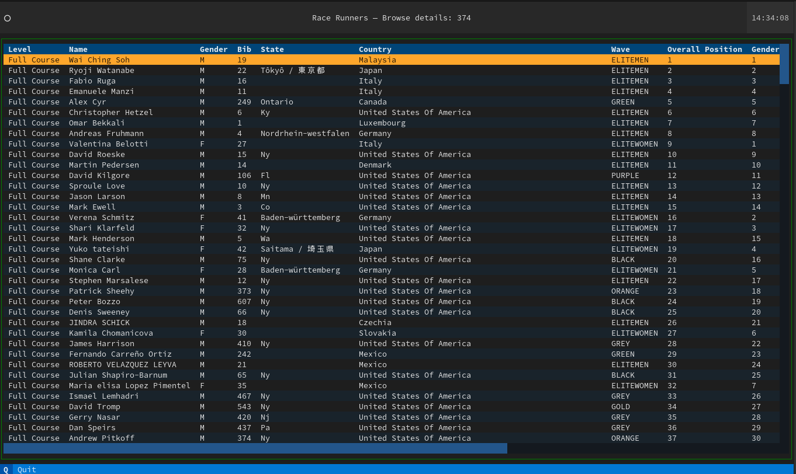
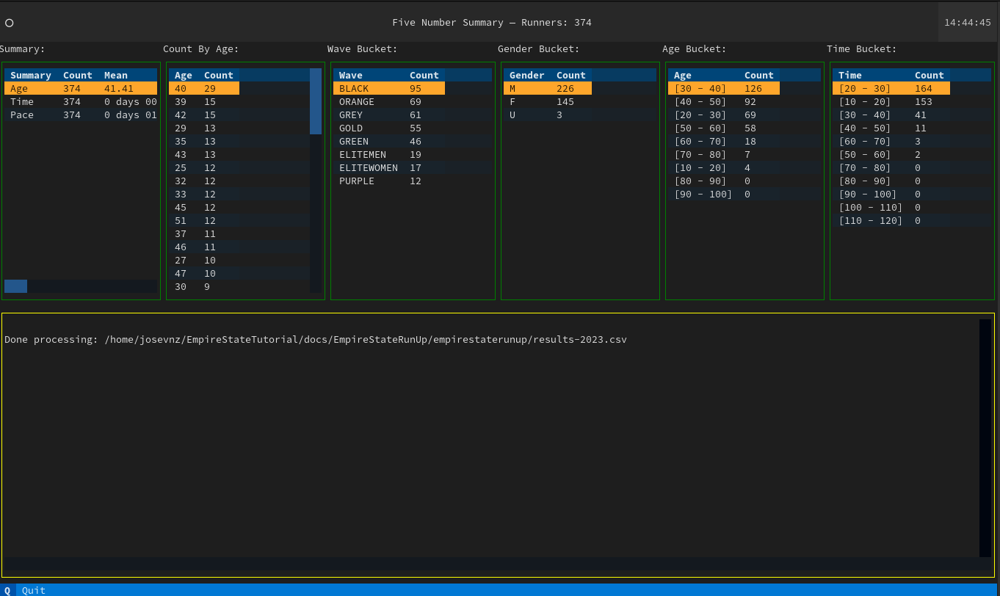
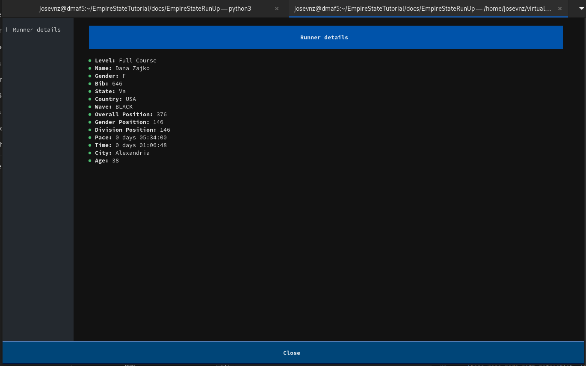
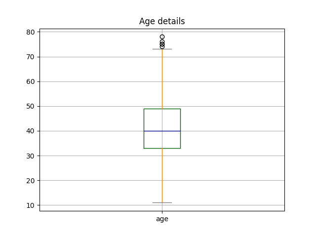
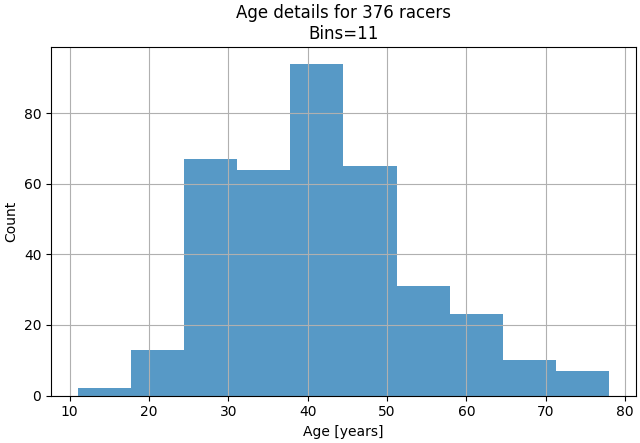
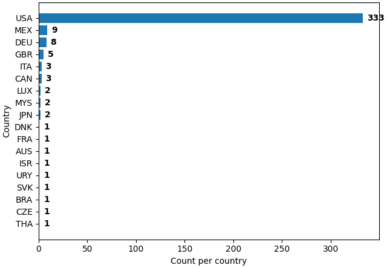
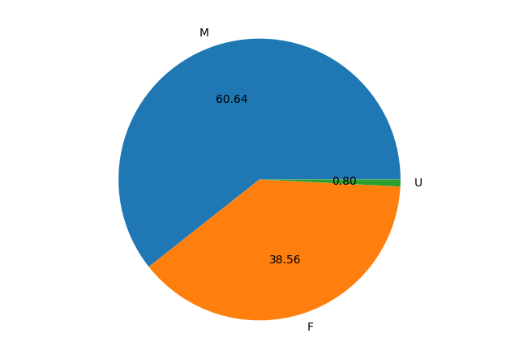

# Empire State Building Run-Up (2023 edition)
```
#########################%%%%####################################
####################%#%###%##%#+#%%%%###%%#%%%%%%#%###############
###############%%%%%%%%%%%%%%%#=*%%%%%%%%%#%%%%%%%%%%%%###########
###############%#%%%%%%%%%%%%%#=#%%%%%%%%%%%%%%%%%%%%%%%%%%#%%%###
#################%%%%%%%%%%%%%*=#%%%%%%%%%%%%%%%%%%%%%%%%%%%%%%%##
################%%%%%%%%%%%%%%*+*%#%%%%%%%%%%%%%%%%%%%%%%%%%%%%%##
#################%###%%%%%%%%#**+=#%%%%%%%%%%%%%%%%%%%%%%%%%%%%%%#
#######################%%%%#*==-=-+%%%%%%%%%%%%%%%%%%%%%%%%%%%%%##
#########################%%-:.--+=*%%%%%%%%%%%%%%%%%%%%%%%%%%%%%##
#**#**#####################:+=+=-:+#%%%%%%%%%%%%%%%%%%%%%%%##%####
******###################*==*=+==:+#%%%%%%%%%%%%%%%%%%%###########
*********################*++#++=+-+###%%%%%%%%%%%##%#%############
**********###############***#++==-=%%#%%%%%######%################
***************##########**+#*+=#==%%%%%%#%#######################
***************#########+:+*#*+=#-=%%%%%%##%######################
***************####*####+-+*#*++#-=%%%%%%#########################
*+*******************###+-+*##++*-=%%%%%%#########################
++++++++****************+-+*##=**-=%%%%%%########################*
++++++++++++++++********=-++#*=**-=%%%%%%########*****#########***
==+++++++++++++++***+***+-++#*=*+:=%%%%%####**********#######*****
====+++++++++++++++++++*=-++#*=*+-+%%%%%%##**********#######******
=====+++++++++++++++++++=-++#*=*+:+%%%%%#***********#######*******
=========++=+=====++++++=-++#*=*+-*%%%%%#*************************
---=================++++=-++#*=*+-*##%%%#*************************
-------===============++=-++#+-++-*##%%%#****************+++*****+
----------===============-++#+-+*-#####%#***************+++*****++
---------------==========-++#=-+*=####%%#*********************++=+
-------------------=====--++#+=+*=####%%#*********************++==
-------------------=====--=+#+=+#+##%%%%%*+*******************+===
-------------------======-=+#==+#+##%%%%%*++***********+****++++==
--------------------------++#==+#**#%%%%%*++++**+++++++++++++++===
---------------=*---------++#==+#**%%%%%%*+++++++++++++++++++=====
-------:------==#---------+++-+*##**+#%%%#++++++++++++++++++======
---:-----==---=+#+-++=====+*+=*###***#%%%%*+++*#*++++++++++++=====
======*###%#*++*#+=#%==+==**+=****+*##%##*#%##*##++***+++*******++
#*==--*%%#%%%#%*+**++#*+=+#*+=*+*#+#%%%%#*%%%%%%***%###*#****#***+
**====#%%#%%%#%*+*+==#=+==#*+=*+*#=#*+*###%%#%**##+*%##%%%%%%%%%%*
**+==-*%%#%%%###*%%%%#++**###=#++%=*+:*##%%%%#**####%%%%%%%%%%%%%#
###*#*##*+++=======-==++%%%%%##*+#-*+-#*#%%%%#%%%==#%%%**###%%*+++
########*+++++++++*#***#%%%%%%+:##-++=#*#%%%%%%%%%*+==+=#*++#%%%#*
*+*#####***#*##*#+***+*+*%%%%%#*##**++##%%%%%%%%%%*+-:-:#*:-+%%#*+
++*#####+*+#++*+%****+#**%%%%##+*+**+*##%%%%%%%%%%*==--:#*-++#%%##
**#######%+*+***%*##*=#+*%%%#:=###---*#%%%%%%%%%%%+==-=:*#****+*##
*##***+++##-:+*#*+#****+#%#**=-###:::#*=+**#%%%%%*+#%%%%***+***###
..:-=+=-=#+.-#*###**+*****####*#%*#+:++==++====+=+++++++=:::**::+:
=--=---=+=+==#*%%%%%%%#%###%#######:::::::--====+***++*+*-::**++++
```

> The Empire State Building Run-Up (ESBRU)—the world’s first and most famous tower race—challenges runners from near and far to race up its famed 86 flights—1,576 stairs. 
> While visitors can reach the building’s Observatory via elevator in under one minute, the fastest runners have covered the 86 floors by foot in about 10 minutes. 
> Leaders in the sport of professional tower-running converge at the Empire State Building in what some consider the ultimate test of endurance.

## How I ended running all the way to the top of the Empire State building

Most of us have run a regular race (5K, 10K, Half Marathon, Full Marathon) but there is no comparison on how you will perform while running the stairs all the way to 
the top on one of the most famous building of the world.

Getting accepted is tough, because unlike a race like the New York Marathon, the building can only accommodate around 500 runners. Add to that fact that demand to run is high, and then
you can see than your chances to get in through the lottery are pretty slim (I read somewhere than lottery positions is only 50 for more than 5000 applicants).

You can imagine my surprise when I got an email saying that I was selected to participate after trying for 4 years in a row.

God news: I wasn't totally unprepared. But I had to adjust my exercise routine to be ready for this challenge with a small window of two months, and no experience about doing a vertical race.

The day of the race came and here are some tough's about it:

* I didn't die. Seriously. I knew I had to pace myself, otherwise the race would have ended for me on floor 20th as opposed on floor 86th.
* You don't sprint, you climb 2 steps at the time at steady pace, and you use the handrails to take off weight from your legs.
* No need to carb load or hydrate too much. If you do well, you will be done under around 30 minutes.
* Nobody is pushing anyone. At least for non-elite racers like me, I was alone for most of the race. I got passed and I passed a lot of people that forgot the 'pace yourself' rule.

I felt compelled to scrap the data from the website with the race results, I wanted to analyze the data to see what other interesting facts where there.

## Getting the data using web scrapping

The race results site doesn't have an export feature and I never heard back from their support team to see if there was an alternate way to get the race data, so the only alternative left was to do some web scrapping.

The website is pretty basic and only allows scrolling through each record, so I decided to do web scrapping to get the results
into a format I could use later for data analysis.

### The rules of web scrapping

There are very 4 simple rules:

1) Rule #1: **Don't do it**. Data flow changes, your scrapper will break the minute you are done getting the data. It will require time an effort. Lots of it.
2) Rule #2: **Read rule number 1**. If you cannot get the data in another format then go to rule #3
3) Rule #3: __Choose a good framework to automate what you can__ and prepare to do heavy data cleanup (also known as give me patience for the stuff I cannot control)

I decided to use Selenium Web Driver as it calls a real browser, like FireFox, to navigate the website. Selenium allows to automate browser actions while you get the same rendered HTML you see when you navigate the site.

Selenium is a complex tool and will require you to spend some time experimenting with what works and what not. Below is a simple script that can get all the runners names and race detail links in one run:

```python
import re
from time import sleep

from selenium import webdriver
from selenium.webdriver.common.by import By
from selenium.webdriver.firefox.options import Options
from selenium.webdriver.firefox.webdriver import WebDriver
from selenium.webdriver.support.wait import WebDriverWait
from selenium.webdriver.support import expected_conditions

RESULTS = "https://www.athlinks.com/event/382111/results/Event/1062909/Course/2407855/Results"
LINKS = {}


def print_links(web_driver: WebDriver, page: int) -> None:
    for a in web_driver.find_elements(By.TAG_NAME, "a"):
        href = a.get_attribute('href')
        if re.search('Bib', href):
            name = a.text.strip().title()
            print(f"Page={page}, {name}={href.strip()}")
            LINKS[name] = href.strip()


def click(level: int) -> None:
    button = WebDriverWait(driver, 20).until(
        expected_conditions.element_to_be_clickable((By.CSS_SELECTOR, f"div:nth-child({level}) > button")))
    driver.execute_script("arguments[0].click();", button)
    sleep(2.5)


options = Options()
options.add_argument("--headless")
driver = webdriver.Firefox(options=options)
driver.get(RESULTS)
sleep(2.5)
print_links(driver, 1)
click(6)
print_links(driver, 2)
click(7)
print_links(driver, 3)
click(7)
print_links(driver, 4)
click(9)
print_links(driver, 5)
click(9)
print_links(driver, 6)
click(7)
print_links(driver, 7)
click(7)
print_links(driver, 8)
print(len(LINKS))
```

The code above is hardly reusable code, but it gets the job done by doing the following:

1) Gets the main webpage with the `driver.get(...)` method, 
2) Then get the `<a href` tags, sleeps a little to get a chance to render the HTML, 
3) Then finds and clicks the `>` (next page) button.
4) Do this steps for a total of 8 times, as this is how many pages of results are available (each page has 50 runners)

To get the full race results I wrote [scrapper.py](empirestaterunup/scrapper.py) code, the code deals with navigating multiple pages and extracting the data. Demonstration below:

```shell
(EmpireStateRunUp2) [josevnz@dmaf5 EmpireStateRunUp]$ esru_scrapper ~/temp/raw_data.csv
2023-11-23 06:18:11,437 Saving results to /home/josevnz/temp/raw_data.csv
2023-11-23 06:19:05,840 Got 377 racer results
2023-11-23 06:19:05,840 Processing BIB: 19, will fetch: https://www.athlinks.com/event/382111/results/Event/1062909/Course/2407855/Bib/19
2023-11-23 06:19:15,687 Wrote: name=Wai Ching Soh, position=1
2023-11-23 06:19:16,583 Processing BIB: 22, will fetch: https://www.athlinks.com/event/382111/results/Event/1062909/Course/2407855/Bib/22
2023-11-23 06:19:25,735 Wrote: name=Ryoji Watanabe, position=2
2023-11-23 06:19:26,504 Processing BIB: 16, will fetch: https://www.athlinks.com/event/382111/results/Event/1062909/Course/2407855/Bib/16
...
```

I do just minimal manipulation on the data from the webpage, the purpose of this code is just to get the data as quickly as possible before the formatting changes

Data cannot be used as-is, needs cleaning up and that is the next step on this article.

## Cleaning up the data

[Getting the data](test/raw_data.txt) is just the first battle of many more to come. [You will notice inconsistencies on the data](https://en.wikibooks.org/wiki/Statistics/Data_Analysis/Data_Cleaning), missing values and in order
to make your numeric results good, you need to make assumptions.

Luckily for me the dataset is very small (374 records, one for each runner) so I was able to come up with a few rules to tidy up the [data file](empirestaterunup/results-first-level-2023.csv) I was going to use during my analysis.

I also supplemented my data with another data set that has the countries [3-digit codes](empirestaterunup/country_codes.csv) as well other details, for a nicer presentation.

The [data_normalizer.raw_read(raw_file: Path) -> Iterable[Dict[str, Any]]](empirestaterunup/runners.py) method does the heavy work of fixing the data for inconsistencies before saving into a CSV format.

As I mention before, there are no hard rules here as cleanup has a high correlation with the data set. For example, to figure out to which wave each runner was assigned I had to make some assumptions based on what I saw the day of the race:

```python
import datetime
from enum import Enum
from typing import Iterable

"""
Runners started on waves, but for basic analysis we will assume all runners were able to run
at the same time.
"""
BASE_RACE_DATETIME = datetime.datetime(
    year=2023,
    month=9,
    day=4,
    hour=20,
    minute=0,
    second=0,
    microsecond=0
)

class Waves(Enum):
    """
    22 Elite male
    17 Elite female
    There are some holes, so either some runners did not show up or there was spare capacity.
    https://runsignup.com/Race/EmpireStateBuildingRunUp/Page-4
    https://runsignup.com/Race/EmpireStateBuildingRunUp/Page-5
    I guessed who went on which category, based on the BIB numbers I saw that day
    """
    EliteMen = ["Elite Men", [1, 25], BASE_RACE_DATETIME]
    EliteWomen = ["Elite Women", [26, 49], BASE_RACE_DATETIME + datetime.timedelta(minutes=2)]
    Purple = ["Specialty", [100, 199], BASE_RACE_DATETIME + datetime.timedelta(minutes=10)]
    Green = ["Sponsors", [200, 299], BASE_RACE_DATETIME + datetime.timedelta(minutes=20)]
    """
    The date people applied for the lottery determined the colors?. Let's assume that
    General Lottery Open: 7/17 9AM- 7/28 11:59PM
    General Lottery Draw Date: 8/1
    """
    Orange = ["Tenants", [300, 399], BASE_RACE_DATETIME + datetime.timedelta(minutes=30)]
    Grey = ["General 1", [400, 499], BASE_RACE_DATETIME + datetime.timedelta(minutes=40)]
    Gold = ["General 2", [500, 599], BASE_RACE_DATETIME + datetime.timedelta(minutes=50)]
    Black = ["General 3", [600, 699], BASE_RACE_DATETIME + datetime.timedelta(minutes=60)]

class RaceFields(Enum):
    level = "level"
    name = "name"
    gender = "gender"
    bib = "bib"
    state = "state"
    country = "country"
    wave = "wave"
    overall_position = "overall position"
    gender_position = "gender position"
    division_position = "division position"
    pace = "pace"
    time = "time"
    city = "city"
    age = "age"
    
# ...

def get_wave_from_bib(bib: int) -> Waves:
    for wave in Waves:
        (lower, upper) = wave.value[1]
        if lower <= bib <= upper:
            return wave
    return Waves.Black
record: Iterable[str] = []
# ...
record[RaceFields.wave.value] = get_wave_from_bib(record[RaceFields.bib.value]).name.upper()
```

I used enums to make it more clear on what type of data I was working on, specially for the name of the fields. Consistency is key.

At the end, I ran the `es_normalizer` script, which takes the raw captured data and writes a CSV file with some important corrections:

```shell
es_normalizer --rawfile /home/josevnz/tutorials/docs/EmpireStateRunUp/raw_data.txt /home/josevnz/tutorials/docs/EmpireStateRunUp/empirestaterunup/results-first-level-2023.csv
```

Now with the data ready we can proceed to do some analysis.

## Analyzing the data

Once the data is clean (or as clean as we can), it is time to move into running some numbers.

So before throwing a single line of code, I took a piece of paper and asked myself a few questions:

* Find interesting buckets (Age, race time, wave, country distribution)
* Histogram for Age and Country
* Describe the data! (median, percentiles)
* Find outliers. [There is a way to apply Z-scores](https://www.investopedia.com/terms/z/zscore.asp) here?

I decided to use [Python Pandas](https://pandas.pydata.org/) for this task. The framework has an arsenal of tools to manipulate the data and to calculate statistics. It also has good tools to perform additional cleanup if needed.

So _how Pandas work_?

#### Crash course on Pandas

I strongly recommend that you take the [10 minutes to pandas](https://pandas.pydata.org/pandas-docs/stable/user_guide/10min.html) if you are not familiar with Pandas. 

In the end, this is how my [DataFrame](https://pandas.pydata.org/pandas-docs/stable/user_guide/dsintro.html) loading loked like:

```shell
(EmpireStateRunUp) [josevnz@dmaf5 EmpireStateRunUp]$ python3
Python 3.11.6 (main, Oct  3 2023, 00:00:00) [GCC 12.3.1 20230508 (Red Hat 12.3.1-1)] on linux
Type "help", "copyright", "credits" or "license" for more information.
>>> from empirestaterunup.data import load_data
```

And the resulting **DataFrame** instance:

```shell
from empirestaterunup.data import load_data
load_data('empirestaterunup/results-first-level-2023.csv')
           level                 name gender           state country  ...            pace            time               city  age     finishtimestamp
bib                                                                   ...                                                                            
19   Full Course        Wai Ching Soh      M                     MYS  ... 0 days 00:53:00 0 days 00:10:36       Kuala lumpur   29 2023-09-04 20:10:36
22   Full Course       Ryoji Watanabe      M     Tôkyô / 東京都     JPN  ... 0 days 00:54:20 0 days 00:10:52              Tokyo   40 2023-09-04 20:10:52
16   Full Course           Fabio Ruga      M                     ITA  ... 0 days 00:56:10 0 days 00:11:14           San siro   42 2023-09-04 20:11:14
11   Full Course       Emanuele Manzi      M                     ITA  ... 0 days 00:57:20 0 days 00:11:28             Cremia   45 2023-09-04 20:11:28
249  Full Course             Alex Cyr      M         Ontario     CAN  ... 0 days 00:59:20 0 days 00:11:52            Toronto   28 2023-09-04 20:11:52
..           ...                  ...    ...             ...     ...  ...             ...             ...                ...  ...                 ...
555  Full Course     Caroline Edwards      F  Leicestershire     GBR  ... 0 days 04:36:25 0 days 00:55:17  Ashby de la zouch   47 2023-09-04 20:55:17
557  Full Course        Sarah Preston      F      Derbyshire     GBR  ... 0 days 04:36:50 0 days 00:55:22        Swadlincote   34 2023-09-04 20:55:22
544  Full Course  Christopher Winkler      M              Ny     USA  ... 0 days 05:00:50 0 days 01:00:10         Massapequa   40 2023-09-04 21:00:10
545  Full Course          Jay Winkler      U              Ny     USA  ... 0 days 05:26:35 0 days 01:05:19         Massapequa   33 2023-09-04 21:05:19
646  Full Course           Dana Zajko      F              Va     USA  ... 0 days 05:34:00 0 days 01:06:48         Alexandria   38 2023-09-04 21:06:48

[374 rows x 14 columns]
```

I made the bib an index as it is unique, and it has no special value for aggregation functions, The code below shows a custom function I wrote to load the CSV file into a DataFrame, with some manipulations:

```python
# Not importing some definitions here, you can check the data.py file to see the real code
from pathlib import Path
from enum import Enum
import pandas
from pandas import DataFrame
import datetime

class RaceFields(Enum):
    level = "level"
    name = "name"
    gender = "gender"
    bib = "bib"
    state = "state"
    country = "country"
    wave = "wave"
    overall_position = "overall position"
    gender_position = "gender position"
    division_position = "division position"
    pace = "pace"
    time = "time"
    city = "city"
    age = "age"
    twenty_floor_position = "20th floor position"
    twenty_floor_gender_position = "20th floor gender position"
    twenty_floor_division_position = "20th floor division position"
    twenty_floor_pace = '20th floor Pace'
    twenty_floor_time = '20th floor time'
    sixty_five_floor_position = "65th floor position"
    sixty_five_floor_gender_position = "65th floor gender position"
    sixty_five_floor_division_position = "65th floor division position"
    sixty_five_floor_pace = '65th floor pace'
    sixty_five_floor_time = '65th floor time'
    url = "url"
FIELD_NAMES = [x.value for x in RaceFields]

BASE_RACE_DATETIME = datetime.datetime(
    year=2023,
    month=9,
    day=4,
    hour=20,
    minute=0,
    second=0,
    microsecond=0
)
RACE_RESULTS = Path(__file__).parent.joinpath("results-first-level-2023.csv")
def load_data(data_file: Path = None, remove_dnf: bool = True) -> DataFrame:
    """
    ```csv
    level,name,gender,bib,state,country,wave,overall position,gender position,division position,pace,time,city,age
    Full Course,Wai Ching Soh,M,19,-,MYS,ELITEMEN,1,1,1,53:00,10:36,Kuala lumpur,29
    ```
    * The code remove by default the DNF runners to avoid distortion on the results.
    * Replace unknown ages with the median, to make analysis easier and avoid distortions
    """
    if data_file:
        def_file = data_file
    else:
        def_file = RACE_RESULTS
    df = pandas.read_csv(
        def_file
    )
    df[RaceFields.pace.value] = pandas.to_timedelta(df[RaceFields.pace.value])
    df[RaceFields.time.value] = pandas.to_timedelta(df[RaceFields.time.value])
    df['finishtimestamp'] = BASE_RACE_DATETIME + df[RaceFields.time.value]
    if remove_dnf:
        df.drop(df[df.level == 'DNF'].index, inplace=True)
    # Normalize Age
    median_age = df[RaceFields.age.value].median()
    df[RaceFields.age.value].fillna(median_age, inplace=True)
    df[RaceFields.age.value] = df[RaceFields.age.value].astype(int)
    # Normalize state and city
    df.replace({RaceFields.state.value: {'-': ''}}, inplace=True)
    df[RaceFields.state.value].fillna('', inplace=True)
    df[RaceFields.city.value].fillna('', inplace=True)
    # Normalize gender position
    median_gender_pos = df[RaceFields.gender_position.value].median()
    df[RaceFields.gender_position.value].fillna(median_gender_pos, inplace=True)
    df[RaceFields.gender_position.value] = df[RaceFields.gender_position.value].astype(int)

    # Normalize BIB and make it the index
    df[RaceFields.bib.value] = df[RaceFields.bib.value].astype(int)
    df.set_index(RaceFields.bib.value, inplace=True)
    return df
```

I do a few things here after giving back the converted CSV back to the user, as a DataFrame:
* Replacing "Not a Number" (nan) values with the median, to avoid affecting the aggregation results. Makes analysis easier.
* Drop rows for runners that did not reach floor 86. Makes the analysis easier, and it is too few of them.
* Convert some string columns into native data types like integers, timestamps
* A few entries did not have the gender defined. That affected other fields like 'gender_position'. To avoid distortions, these were filled with the median.

Once data was loaded, I was able to start asking questions. For example, to detect the outliers I used a Z-score:

```python
from pandas import DataFrame
import numpy as np
def get_zscore(df: DataFrame, column: str):
    filtered = df[column]
    return filtered.sub(filtered.mean()).div(filtered.std(ddof=0))

def get_outliers(df: DataFrame, column: str, std_threshold: int = 3) -> DataFrame:
    """
    Use the z-score, anything further away than 3 standard deviations is considered an outlier.
    """
    filtered_df = df[column]
    z_scores = get_zscore(df=df, column=column)
    is_over = np.abs(z_scores) > std_threshold
    return filtered_df[is_over]
```

Also, it is very simple to get common statistics just by calling describe on our data:

```python
from pandas import DataFrame
def get_5_number(criteria: str, data: DataFrame) -> DataFrame:
    return data[criteria].describe()
```

All the analysis logic [was kep together on a single module](empirestaterunup/analyze.py), separate from presentation, data loading or reports, in order to promote reuse.

Testing is part integral of writing code, and as I kept adding more of it and went back to write unit tests.

Let's check how to test our code (feel free to skip next section if you are familiar with unit testing)

### Testing, testing and after that ... testing

I assume you are familiar writing small, self-contained pieces of code to test your code. These are called unit tests.

> The unittest unit testing framework was originally inspired by JUnit and has a similar flavor as major unit testing frameworks in other languages. It supports test automation, sharing of setup and shutdown code for tests, aggregation of tests into collections, and independence of the tests from the reporting framework.

I tried to have a simple [unit test](https://docs.python.org/3/library/unittest.html) for every method I wrote on the code. This saved me lots of headaches down the road, 
as I refactored code I found better ways to get the same results, producing correct numbers.

A Unit test on this context is a class that extends 'unittest.TestCase'. Each method that starts with 'test_' is a test that must pass several assertions:

```python
import unittest

from pandas import DataFrame

from empirestaterunup.analyze import get_country_counts
from empirestaterunup.data import load_data

class AnalyzeTestCase(unittest.TestCase):
    df: DataFrame

    @classmethod
    def setUpClass(cls) -> None:
        cls.df = load_data()
    def test_get_country_counts(self):
        country_counts, filtered_countries = get_country_counts(df=AnalyzeTestCase.df)
        self.assertIsNotNone(country_counts)
        self.assertEqual(2, country_counts['JPN'])
        self.assertIsNotNone(filtered_countries)
        self.assertEqual(3, filtered_countries.shape[0])


if __name__ == '__main__':
    unittest.main()
```

So far we got the data, made sure [it meets the expectations](test/test_data.py)and wrote [more test](test/test_analyze.py) on the analytics.

Now that we have some results we can try to visualize them.

## Visualizing the results

I wanted to use the terminal as much as possible to visualize my findings, to keep requirements to the minimum. I decided to use the [Textual](https://textual.textualize.io/) framework to accomplish that.
This framework is very complete and allows you to build text applications that are responsive and beautiful to look at.

They are also easy to write, so before we go deeper into the resulting applications let's make a pause to learn about Textual.

### A crash course of Textual

The Textual project has a really nice tutorial that [you can read](https://textual.textualize.io/tutorial/) to get up to speed.

But let's see how this applies to our problem. For example, I wanted to display the race details of all the 374 runners on a
scrollable table. I ended writing the following class:

```python
from textual.app import ComposeResult, App, CSSPathType
import pandas
from pandas import DataFrame
from textual.driver import Driver
from typing import Type
from pathlib import Path
from textual.widgets import DataTable, Footer, Header
from typing import Tuple, Union
from enum import Enum
import datetime
from textual import on
COUNTRY_DETAILS = Path(__file__).parent.joinpath("country_codes.csv")
def load_country_details(data_file: Path = None) -> DataFrame:
    """
    ```csv
    name,alpha-2,alpha-3,country-code,iso_3166-2,region,sub-region,intermediate-region,region-code,sub-region-code,intermediate-region-code
    United States of America,US,USA,840,ISO 3166-2:US,Americas,Northern America,"",019,021,""
    """
    if data_file:
        def_file = data_file
    else:
        def_file = COUNTRY_DETAILS
    df = pandas.read_csv(
        def_file
    )
    return df
RACE_RESULTS = Path(__file__).parent.joinpath("results-first-level-2023.csv")
class RaceFields(Enum):
    level = "level"
    name = "name"
    gender = "gender"
    bib = "bib"
    state = "state"
    country = "country"
    wave = "wave"
    overall_position = "overall position"
    gender_position = "gender position"
    division_position = "division position"
    pace = "pace"
    time = "time"
    city = "city"
    age = "age"
    twenty_floor_position = "20th floor position"
    twenty_floor_gender_position = "20th floor gender position"
    twenty_floor_division_position = "20th floor division position"
    twenty_floor_pace = '20th floor Pace'
    twenty_floor_time = '20th floor time'
    sixty_five_floor_position = "65th floor position"
    sixty_five_floor_gender_position = "65th floor gender position"
    sixty_five_floor_division_position = "65th floor division position"
    sixty_five_floor_pace = '65th floor pace'
    sixty_five_floor_time = '65th floor time'
    url = "url"

class CountryColumns(Enum):
    name = "name"
    alpha_2 = "alpha-2"
    alpha_3 = "alpha-3"
    country_code = "country-code"
    iso_3166_2 = "iso_3166-2"
    region = "region"
    sub_region = "sub-region"
    intermediate_region = "intermediate-region"
    region_code = "region-code"
    sub_region_code = "sub-region-code"
    intermediate_region_code = "intermediate-region-code"
    
FIELD_NAMES = [x.value for x in RaceFields]
BASE_RACE_DATETIME = datetime.datetime(year=2023, month=9, day=4, hour=20, minute=0, second=0, microsecond=0)

def load_data(data_file: Path = None, remove_dnf: bool = True) -> DataFrame:
    # Adding the load data function here for clarity, this belongs to its own module for reuse
    if data_file:
        def_file = data_file
    else:
        def_file = RACE_RESULTS
    df = pandas.read_csv(
        def_file
    )
    df[RaceFields.pace.value] = pandas.to_timedelta(df[RaceFields.pace.value])
    df[RaceFields.time.value] = pandas.to_timedelta(df[RaceFields.time.value])
    df['finishtimestamp'] = BASE_RACE_DATETIME + df[RaceFields.time.value]
    if remove_dnf:
        df.drop(df[df.level == 'DNF'].index, inplace=True)
    median_age = df[RaceFields.age.value].median()
    df[RaceFields.age.value].fillna(median_age, inplace=True)
    df[RaceFields.age.value] = df[RaceFields.age.value].astype(int)
    df.replace({RaceFields.state.value: {'-': ''}}, inplace=True)
    df[RaceFields.state.value].fillna('', inplace=True)
    df[RaceFields.city.value].fillna('', inplace=True)
    # Normalize gender position
    median_gender_pos = df[RaceFields.gender_position.value].median()
    df[RaceFields.gender_position.value].fillna(median_gender_pos, inplace=True)
    df[RaceFields.gender_position.value] = df[RaceFields.gender_position.value].astype(int)

    # Normalize BIB and make it the index
    df[RaceFields.bib.value] = df[RaceFields.bib.value].astype(int)
    df.set_index(RaceFields.bib.value, inplace=True)
    return df

def to_list_of_tuples(df: DataFrame, bibs: list[int] = None) -> Union[Tuple | list[Tuple]]:
    bib_as_column = df.reset_index(level=0, inplace=False)
    if not bibs:
        filtered = bib_as_column
    else:
        filtered = bib_as_column[bib_as_column[RaceFields.bib.value].isin(bibs)]
    rows = [(
        r.level, r[RaceFields.name.value], r.gender, r.bib, r.state, r.country,
        r.wave, r[RaceFields.overall_position.value], r[RaceFields.gender_position.value],
        r[RaceFields.division_position.value], r.pace, r.time, r.city, r.age
    ) for _, r in filtered.iterrows()]
    return tuple(FIELD_NAMES), rows

def lookup_country_by_code(df: DataFrame, three_letter_code: str) -> DataFrame:
    if not isinstance(three_letter_code, str):
        raise ValueError(f"Invalid type for three letter country code: '{three_letter_code}'")
    if len(three_letter_code) != 3:
        raise ValueError(f"Invalid three letter country code: '{three_letter_code}'")
    return df.loc[df[CountryColumns.alpha_3.value] == three_letter_code]

class BrowserApp(App):
    ENABLE_COMMAND_PALETTE = False
    BINDINGS = [("q", "quit_app", "Quit")]
    CSS_PATH = "browser.tcss"

    def __init__(
            self,
            driver_class: Type[Driver] | None = None,
            css_path: CSSPathType | None = None,
            watch_css: bool = False,
            country_data: DataFrame = None,
            df: DataFrame = None
    ):
        super().__init__(driver_class, css_path, watch_css)
        if not country_data:
            self.country_data = load_country_details()
        else:
            self.country_data = country_data
        if df:
            self.df = df
        else:
            self.df = load_data()
        for three_letter_code in set(self.df[RaceFields.country.value].tolist()):
            filtered_country = lookup_country_by_code(
                df=self.country_data,
                three_letter_code=three_letter_code
            )
            country_name: str = three_letter_code
            if CountryColumns.name.value in filtered_country.columns:
                country_name = filtered_country[CountryColumns.name.value].values[0]
            filtered = self.df[RaceFields.country.value] == three_letter_code
            self.df.loc[
                filtered,
                [RaceFields.country.value]
            ] = [country_name.strip().title()]

    def action_quit_app(self):
        self.exit(0)

    def compose(self) -> ComposeResult:
        yield Header(show_clock=True)
        yield DataTable(id='runners')
        yield Footer()

    def on_mount(self) -> None:
        table = self.get_widget_by_id(f'runners', expect_type=DataTable)
        table.zebra_stripes = True
        table.cursor_type = 'row'
        columns_raw, rows = to_list_of_tuples(self.df)
        for column in columns_raw:
            table.add_column(column.title(), key=column)
        table.add_rows(rows)
        table.sort('overall position')

    @on(DataTable.HeaderSelected, '#runners')
    def on_header_clicked(self, event: DataTable.HeaderSelected):
        table = event.data_table
        table.sort(event.column_key)
```

Time to dissect what each method of the `BrowserApp` class does:

* Constructor `__init__` takes two extra DataFrames, one with the country codes and the other with the race results. I use the country codes to beautify the results on the table.
* Method `action_quit_app` is what is called a method binding. If you press the letter 'q' it will exit the app
* The `compose` method creates the TUI components, it 'yields' components back to the framework, and they get added to the screen in that order. I return a header, a table and a footer
* Method `on_mount` is more interesting, here you can get your components and change their behaviour. I add columns, populate data into the table, define sorting columns
* I allow the table to sort by column by defining a method called `on_header_clicked` and by using an annotation which is just a function decorator that tells the framework to call this method when a 'DataTable.HeaderSelected' ocurrs.

As you can see, Textual is a pretty powerful framework that reminds me a lot of Java Swing, but without the complexity.

## Running the applications

### Browsing through the data

The 'esru_browser' is a simple browser that lets you navigate through the race raw data.

```shell
esru_browser
```

The application shows all the race details for every Runner, on a table that allows sorting by column.




### Running summary reports

This application provides details about the following:

* count, std, mean, min, max 45%, 50% and 75% for age, time, and pace
* Group and count distribution for Age,  Wave and Gender

```shell
esru_numbers
```

Some interesting facts about the race:

* Average age is 41 years old and 40 years old is the largest age group
* Majority number of people belonged to the 'BLACK WAVE'
* Majority of the people finished the race between 20 and 30 minutes.
* Youngest runner was 11 years old, oldest 78




### Finding outliers

This application uses the Z-score to find the outliers for several metrics for this race

```shell
esru_outlier
```


Because this results drill down to the BIB number, you can click on a row and get more details of a runner:



Textual as excellent support for rendering Markdown, programing languages. Take a look on the code to see yourself.

### A few plot graphics for you

These were made with matplotlib. The code to generate the plots os very straightforward.

The [simple_plot](empirestaterunup/apps.py) application offers a few plot graphics to help you visualize the data.

The class `Plotter` does all the heavy lifting

```python
from pathlib import Path
from empirestaterunup.data import load_data, RaceFields
class Plotter:

    def __init__(self, data_file: Path = None):
        self.df = load_data(data_file)

    def plot_age(self, gtype: str):
        if gtype == 'box':
            self.df[RaceFields.age.value].plot.box(
                title="Age details",
                grid=True,
                color={
                    "boxes": "DarkGreen",
                    "whiskers": "DarkOrange",
                    "medians": "DarkBlue",
                    "caps": "Gray",
                }
            )
        elif gtype == 'hist':
            self.df[RaceFields.age.value].plot.hist(
                title="Age details",
                grid=True,
                color='k'
            )

    def plot_country(self):
        self.df[RaceFields.country.value].value_counts().plot.barh(
            title="Participants per country",
            stacked=True
        )

    def plot_gender(self):
        self.df[RaceFields.gender.value].value_counts().plot.pie(
            title="Gender participation",
            subplots=True,
            autopct="%.2f"
        )
```

Each method basically ingest a Panda Dataframe to produce the desired plot.

#### Age plots

The program can generate two flavors for the same data, one is a Box diagram:



And the second is a regular histogram:



You can see from both graphics that the group age with most partipants is the 40-45 year old bracket, and the outliers
are on the 10-20 and 70-80 year old groups.

#### Participants per country plot



No surprises here, the overwhelming majority of racers come from the United States, followed by Mexico. Interestingly 
the winner of the 2013 race is from Malaysia, with only 2 runners. 

#### Gender distribution



Majority of the runners identified themselves as Males, followed by Female.

## What is next?

There is plenty more to learn about the tools you just saw on this tutorial:

* There are a lot of race public datasets, you can apply what you learned here. Just take a look at [this dataset of the New York City Marathon, period 1970-2018](https://github.com/davidjaimes/nyc-marathon). What [other questions](https://github.com/meiguan/nyc2018marathonfinishers) you can ask about the data?
* You saw just the tip of what you can do with Textual. I encourage you to explore the [apps.py](empirestaterunup/apps.py) module. Take a look at the [example applications](https://github.com/Textualize/textual/tree/main/examples).
* [Selenium Webdriver](https://www.selenium.dev/documentation/webdriver/) is not a tool for web scrapping but automated testing of web applications. It doesn't get better than having your browser to perform automated testing for you. It is a big framework, so be prepared to spend time reading and running your tests. I strongly suggest you look [at the examples](https://github.com/SeleniumHQ/seleniumhq.github.io/tree/trunk/examples/python).


