# Empire State Building Run-Up (2023 edition)

[](https://pepy.tech/project/EmpireStateRunUp)


> The Empire State Building Run-Up (ESBRU)—the world’s first and most famous tower race—challenges runners from near and far to race up its famed 86 flights—1,576 stairs. 
> While visitors can reach the building’s Observatory via elevator in under one minute, the fastest runners have covered the 86 floors by foot in about 10 minutes. 
> Leaders in the sport of professional tower-running converge at the Empire State Building in what some consider the ultimate test of endurance.

## How I ended running all the way to the top of the Empire State building

Most of us have run a regular race (5K, 10K, Half Marathon, Full Marathon) but there is no comparison on how you will perform while running the stairs all the way to 
the top on one of the most famous building of the world.

Getting accepted is tough, because unlike a race like the New York Marathon, the building can only accommodate around 500 runners (or should I say _climbers_?). Add to that fact that demand to participate is high, and then
you can see than your chances to get in through the lottery are pretty slim (I read somewhere than lottery positions is only 50 for more than 5,000 applicants).

You can imagine my surprise when I got an email saying that I was selected to participate after trying for 4 years in a row.

And then I panicked. Have you ever been at the base of the Empire State and looked up? Some days when is cloudy you cannot even see the top of the building.

God news: I wasn't totally unprepared. But I had to adjust my training routine to be ready for this challenge with a small window of two months, and no experience about doing a vertical run.

Long story/ short story, the day of the race came and here are some tough's about how it went:

* I didn't die. I knew I had to pace myself, otherwise the race would have ended for me on floor 20th as opposed on floor 86th.
* You don't sprint, you climb 2 steps at the time at steady pace, and you use the handrails to take off weight from your legs.
* No need to carb load or hydrate too much. If you do well, you will be done under around 30 minutes.
* Nobody is pushing anyone. At least for non-elite racers like me, I was alone for most of the race. 
* I got passed and I passed a lot of people that forgot the 'pace yourself' rule. If you sprint, you will be toasted before floor 25, for sure.

After the race felt compelled to scrap the data from the website with the race results, wanted to analyze the data to see what other interesting facts where there.

## What do you need to follow this tutorial

Like the race, most of the challenges to write the application were mental. You only need to break the main problem into smaller pieces and then tackle each one at the time:

1) Get the data, scraping the website (very few sites allow you to export race results as CSV)
2) Clean up the data, normalize it
3) Ask questions. Then translate those questions into code and tests
4) Present the results. A UI (Text or Graphic) will do wonders.

You should have some experience in a programing language, my code is writen in [Python](https://www.python.org/) (you will need version 3.8+) and runs on Linux (I used [Fedora 37 distribution](https://fedoraproject.org/)).

I strongly recommend you [get the source code](https://github.com/josevnz/tutorials/tree/main/docs/EmpireStateRunUp) (It is [Open Source](https://github.com/josevnz/tutorials/tree/main?tab=Apache-2.0-1-ov-file#readme)!). Get your hands dirty, break the scripts, have fun. You will need git to clone the repository:

````shell
git clone https://github.com/josevnz/tutorials.git
cd tutorials/docs/EmpireStateRunUp/
python -m ~/virtualenv/EmpireStateRunUp
. ~/virtualenv/EmpireStateRunUp/bin/activate
pip install --upgrade pip
pip install --upgrade build
pip install --upgrade wheel
pip install --editable .
````

Or if you just want to run the code while reading this tutorial (using my latest version from [Pypi](https://pypi.org/project/EmpireStateRunUp/)):

```shell
python -m ~/virtualenv/EmpireStateRunUp
. ~/virtualenv/EmpireStateRunUp/bin/activate 
pip install --upgrade EmpireStateRunUp
```

We can now move to the next stage, getting the data.

## Getting the data using web scrapping

The race results site doesn't have an export feature and I never heard back from their support team to see if there was an alternate way to get the race data, so the only alternative left was to do some web scrapping.

The website is pretty basic and only allows scrolling through each record, so I decided to do web scrapping to get the results
into a format I could use later for data analysis.

### The rules of web scrapping

There are very 3 simple rules:

1) Rule #1: **Don't do it**. Data flow changes, your scrapper will break the minute you are done getting the data. It will require time an effort. _Lots of it_.
2) Rule #2: **Read rule number 1**. If you cannot get the data in another format then go to rule #3
3) Rule #3: __Choose a good framework to automate what you can__ and prepare to do heavy data cleanup (also known as give me patience for the stuff I cannot control)

I decided to use [Selenium Web Driver](https://www.selenium.dev/documentation/webdriver/) as it calls a real browser, like [FireFox](https://www.mozilla.org/en-US/firefox/new/), to navigate the website. Selenium allows to automate browser actions while you get the same rendered HTML you see when you navigate the site.

Selenium _is a complex tool_ and will require you to spend some time experimenting with what works and what not. Below is a simple script that can get all the runners names and race detail links in one run:

```python
import re
from time import sleep

from selenium import webdriver
from selenium.webdriver.common.by import By
from selenium.webdriver.firefox.options import Options
from selenium.webdriver.firefox.webdriver import WebDriver
from selenium.webdriver.support.wait import WebDriverWait
from selenium.webdriver.support import expected_conditions

RESULTS = "https://www.athlinks.com/event/382111/results/Event/1062909/Course/2407855/Results"
LINKS = {}


def print_links(web_driver: WebDriver, page: int) -> None:
    for a in web_driver.find_elements(By.TAG_NAME, "a"):
        href = a.get_attribute('href')
        if re.search('Bib', href):
            name = a.text.strip().title()
            print(f"Page={page}, {name}={href.strip()}")
            LINKS[name] = href.strip()


def click(level: int) -> None:
    button = WebDriverWait(driver, 20).until(
        expected_conditions.element_to_be_clickable((By.CSS_SELECTOR, f"div:nth-child({level}) > button")))
    driver.execute_script("arguments[0].click();", button)
    sleep(2.5)


options = Options()
options.add_argument("--headless")
driver = webdriver.Firefox(options=options)
driver.get(RESULTS)
sleep(2.5)
print_links(driver, 1)
click(6)
print_links(driver, 2)
click(7)
print_links(driver, 3)
click(7)
print_links(driver, 4)
click(9)
print_links(driver, 5)
click(9)
print_links(driver, 6)
click(7)
print_links(driver, 7)
click(7)
print_links(driver, 8)
print(len(LINKS))
```

The code above is hardly reusable code, but it gets the job done by doing the following:

1) Gets the main webpage with the `driver.get(...)` method, 
2) Then get the `<a href` tags, sleeps a little to get a chance to render the HTML, 
3) Then finds and clicks the `>` (next page) button.
4) Do this steps for a total of 8 times, as this is how many pages of results are available (each page has 50 runners)

To get the full race results I wrote [scrapper.py](empirestaterunup/scrapper.py) code, the code deals with navigating multiple pages and extracting the data. Demonstration below:

```shell
(EmpireStateRunUp) [josevnz@dmaf5 EmpireStateRunUp]$ esru_scrapper /home/josevnz/temp/raw_data.csv
2023-12-30 14:05:00,987 Saving results to /home/josevnz/temp/raw_data.csv
2023-12-30 14:05:53,091 Got 377 racer results
2023-12-30 14:05:53,091 Processing BIB: 19, will fetch: https://www.athlinks.com/event/382111/results/Event/1062909/Course/2407855/Bib/19
2023-12-30 14:06:02,207 Wrote: name=Wai Ching Soh, position=1, {'name': 'Wai Ching Soh', 'url': 'https://www.athlinks.com/event/382111/results/Event/1062909/Course/2407855/Bib/19', 'overall position': '1', 'gender': 'M', 'age': 29, 'city': 'Kuala Lumpur', 'state': '-', 'country': 'MYS', 'bib': 19, '20th floor position': '1', '20th floor gender position': '1', '20th floor division position': '1', '20th floor pace': '42:30', '20th floor time': '1:42', '65th floor position': '1', '65th floor gender position': '1', '65th floor division position': '1', '65th floor pace': '54:03', '65th floor time': '7:34', 'gender position': '1', 'division position': '1', 'pace': '53:00', 'time': '10:36', 'level': 'Full Course'}
...
```

It does just minimal manipulation on the data from the web page, the purpose of this code is just to get the data as quickly as possible before the formatting changes

Data cannot be used yet as-is, needs cleaning up and that is the next step on this article.

## Cleaning up the data

[Getting the data](test/raw_data.txt) is just the first battle of many more to come. [You will notice inconsistencies on the data](https://en.wikibooks.org/wiki/Statistics/Data_Analysis/Data_Cleaning), missing values and in order
to make your numeric results good, you need to make assumptions.

Luckily for me the dataset is very small (375+ records, one for each runner) so I was able to come up with a few rules to tidy up the [data file](empirestaterunup/results-first-level-2023.csv) I was going to use during my analysis.

I also supplemented my data with another data set that has the countries [3-digit codes](empirestaterunup/country_codes.csv) as well other details, for a nicer presentation.

The [data_normalizer.raw_read(raw_file: Path) -> Iterable[Dict[str, Any]]](empirestaterunup/runners.py) method does the heavy work of fixing the data for inconsistencies before saving into a CSV format.

There are no hard rules here as cleanup has a high correlation with the data set. For example, to figure out to which wave each runner was assigned I had to make some assumptions based on what I saw the day of the race.

Let me show you what I mean with some code:

```python
import datetime
from enum import Enum
from typing import Dict

"""
Runners started on waves, but for basic analysis we will assume all runners were able to run
at the same time.
"""
BASE_RACE_DATETIME = datetime.datetime(
    year=2023,
    month=9,
    day=4,
    hour=20,
    minute=0,
    second=0,
    microsecond=0
)

class Waves(Enum):
    """
    22 Elite male
    17 Elite female
    There are some holes, so either some runners did not show up or there was spare capacity.
    https://runsignup.com/Race/EmpireStateBuildingRunUp/Page-4
    https://runsignup.com/Race/EmpireStateBuildingRunUp/Page-5
    I guessed who went on which category, based on the BIB numbers I saw that day
    """
    ELITE_MEN = ["Elite Men", [1, 25], BASE_RACE_DATETIME]
    ELITE_WOMEN = ["Elite Women", [26, 49], BASE_RACE_DATETIME + datetime.timedelta(minutes=2)]
    PURPLE = ["Specialty", [100, 199], BASE_RACE_DATETIME + datetime.timedelta(minutes=10)]
    GREEN = ["Sponsors", [200, 299], BASE_RACE_DATETIME + datetime.timedelta(minutes=20)]
    """
    The date people applied for the lottery determined the colors?. Let's assume that
    General Lottery Open: 7/17 9AM- 7/28 11:59PM
    General Lottery Draw Date: 8/1
    """
    ORANGE = ["Tenants", [300, 399], BASE_RACE_DATETIME + datetime.timedelta(minutes=30)]
    GREY = ["General 1", [400, 499], BASE_RACE_DATETIME + datetime.timedelta(minutes=40)]
    GOLD = ["General 2", [500, 599], BASE_RACE_DATETIME + datetime.timedelta(minutes=50)]
    BLACK = ["General 3", [600, 699], BASE_RACE_DATETIME + datetime.timedelta(minutes=60)]

"""
Interested only in people who completed the 86 floors. So is either full course or dnf
"""
class Level(Enum):
    FULL = "Full Course"
    DNF = "DNF"

# Fields are sorted by interest
class RaceFields(Enum):
    BIB = "bib"
    NAME = "name"
    OVERALL_POSITION = "overall position"
    TIME = "time"
    GENDER = "gender"
    GENDER_POSITION = "gender position"
    AGE = "age"
    DIVISION_POSITION = "division position"
    COUNTRY = "country"
    STATE = "state"
    CITY = "city"
    PACE = "pace"
    TWENTY_FLOOR_POSITION = "20th floor position"
    TWENTY_FLOOR_GENDER_POSITION = "20th floor gender position"
    TWENTY_FLOOR_DIVISION_POSITION = "20th floor division position"
    TWENTY_FLOOR_PACE = '20th floor pace'
    TWENTY_FLOOR_TIME = '20th floor time'
    SIXTY_FLOOR_POSITION = "65th floor position"
    SIXTY_FIVE_FLOOR_GENDER_POSITION = "65th floor gender position"
    SIXTY_FIVE_FLOOR_DIVISION_POSITION = "65th floor division position"
    SIXTY_FIVE_FLOOR_PACE = '65th floor pace'
    SIXTY_FIVE_FLOOR_TIME = '65th floor time'
    WAVE = "wave"
    LEVEL = "level"
    URL = "url"

FIELD_NAMES = [x.value for x in RaceFields if x != RaceFields.URL]
FIELD_NAMES_FOR_SCRAPPING = [x.value for x in RaceFields]
FIELD_NAMES_AND_POS: Dict[RaceFields, int] = {}
pos = 0
for field in RaceFields:
    FIELD_NAMES_AND_POS[field] = pos
    pos += 1

def get_wave_from_bib(bib: int) -> Waves:
    for wave in Waves:
        (lower, upper) = wave.value[1]
        if lower <= bib <= upper:
            return wave
    return Waves.BLACK

def get_description_for_wave(wave: Waves) -> str:
    return wave.value[0]
```

I used [enums](https://docs.python.org/3/library/enum.html) to make it more clear on what type of data I was working on, specially for the name of the fields. Consistency is key.

As for cleaning the data, well there were some obvious fixes I had to apply like:
1) Format of the times like pace, race time, etc. so it could be parsed later
2) Capitalize some values to make them easier to read
3) Early string to integer conversion for values like age, position, etc. If that fails assign 'not a number'

By all means we are not done massaging the data. A simple function takes care of this stage inside the [data](empirestaterunup/data.py) module:

```python
# Omitted imports and Enum declarations as they were shown early on. 
# Check the source code for 'data.py' for more details
def raw_csv_read(raw_file: Path) -> Iterable[Dict[str, Any]]:
    record = {}
    with open(raw_file, 'r') as raw_csv_file:
        reader = csv.DictReader(raw_csv_file)
        row: Dict[str, Any]
        for row in reader:
            try:
                csv_field: str
                for csv_field in FIELD_NAMES_FOR_SCRAPPING:
                    column_val = row[csv_field].strip()
                    if csv_field == RaceFields.BIB.value:
                        bib = int(column_val)
                        record[csv_field] = bib
                    elif csv_field in [ RaceFields.GENDER_POSITION.value, RaceFields.DIVISION_POSITION.value, RaceFields.OVERALL_POSITION.value,  RaceFields.TWENTY_FLOOR_POSITION.value,
                        RaceFields.TWENTY_FLOOR_DIVISION_POSITION.value, RaceFields.TWENTY_FLOOR_GENDER_POSITION.value, RaceFields.SIXTY_FLOOR_POSITION.value, RaceFields.SIXTY_FIVE_FLOOR_DIVISION_POSITION.value,
                        RaceFields.SIXTY_FIVE_FLOOR_GENDER_POSITION.value, RaceFields.AGE.value ]:
                        try:
                            record[csv_field] = int(column_val)
                        except ValueError:
                            record[csv_field] = math.nan
                    elif csv_field == RaceFields.WAVE.value:
                        record[csv_field] = get_description_for_wave(get_wave_from_bib(bib)).upper()
                    elif csv_field in [RaceFields.GENDER.value, RaceFields.COUNTRY.value]:
                        record[csv_field] = column_val.upper()
                    elif csv_field in [RaceFields.CITY.value, RaceFields.STATE.value,

                    ]:
                        record[csv_field] = column_val.capitalize()
                    elif csv_field in [RaceFields.SIXTY_FIVE_FLOOR_PACE.value, RaceFields.SIXTY_FIVE_FLOOR_TIME.value, RaceFields.TWENTY_FLOOR_PACE.value,
                        RaceFields.TWENTY_FLOOR_TIME.value, RaceFields.PACE.value, RaceFields.TIME.value ]:
                        parts = column_val.strip().split(':')
                        for idx in range(0, len(parts)):
                            if len(parts[idx]) == 1:
                                parts[idx] = f"0{parts[idx]}"
                        if len(parts) == 2:
                            parts.insert(0, "00")
                        record[csv_field] = ":".join(parts)
                    else:
                        record[csv_field] = column_val
                if record[csv_field] in ['-', '--']:
                    record[csv_field] = ""
                yield record
            except IndexError:
                raise
```

The `esru_csv_cleaner` script is the sum on the first stage cleanup effort, which takes the raw captured data and writes a CSV file with some important corrections:

```shell
esru_csv_cleaner --rawfile /home/josevnz/temp/raw_data.csv /home/josevnz/tutorials/docs/EmpireStateRunUp/empirestaterunup/results-full-level-2023.csv
```

Now with the data ready we can proceed to load the data and ask some questions about the race.

## Analyzing the data

Once the data is clean (or as clean as we can), it is time to move into running some numbers. Before writing more code, I took a piece of paper and asked myself a few questions about the race:

* There are any interesting buckets/ clusters for age, race time, wave, country participation? 
* A histogram for Age and Country would be nice to see
* Describe the data! (median, percentiles, etc.)
* Find outliers. [There is a way to apply Z-scores](https://www.investopedia.com/terms/z/zscore.asp) here?

I decided to use [Python Pandas](https://pandas.pydata.org/) for this task. This Open Source framework has an arsenal of tools to manipulate the data and to calculate statistics. It also has good tools to perform additional cleanup if needed.

So _how Pandas work_?

#### Crash course on Pandas

I strongly recommend that you take the [10 minutes to pandas](https://pandas.pydata.org/pandas-docs/stable/user_guide/10min.html) if you are not familiar with Pandas. For my DataFrame, I made the BIB an index as it is unique, and it has no special value for aggregation functions but id unique. It is important to say that also at this stage I needed to normalize the data, which I'll explain shortly:

```python
# Omitted imports and Enum declarations as they were shown early on. 
# Check the source code for 'data.py' for more details
def load_data(data_file: Path = None, remove_dnf: bool = True) -> DataFrame:
    """
    * The code remove by default the DNF runners to avoid distortion on the results.
    * Replace unknown/ nan values with the median, to make analysis easier and avoid distortions
    """
    if data_file:
        def_file = data_file
    else:
        def_file = RACE_RESULTS_FULL_LEVEL
    df = pandas.read_csv(
        def_file
    )
    for time_field in [
        RaceFields.PACE.value,
        RaceFields.TIME.value,
        RaceFields.TWENTY_FLOOR_PACE.value,
        RaceFields.TWENTY_FLOOR_TIME.value,
        RaceFields.SIXTY_FIVE_FLOOR_PACE.value,
        RaceFields.SIXTY_FIVE_FLOOR_TIME.value
    ]:
        try:
            df[time_field] = pandas.to_timedelta(df[time_field])
        except ValueError as ve:
            raise ValueError(f'{time_field}={df[time_field]}', ve)
    df['finishtimestamp'] = BASE_RACE_DATETIME + df[RaceFields.TIME.value]
    if remove_dnf:
        df.drop(df[df.level == 'DNF'].index, inplace=True)

    # Normalize Age
    median_age = df[RaceFields.AGE.value].median()
    df[RaceFields.AGE.value].fillna(median_age, inplace=True)
    df[RaceFields.AGE.value] = df[RaceFields.AGE.value].astype(int)

    # Normalize state and city
    df.replace({RaceFields.STATE.value: {'-': ''}}, inplace=True)
    df[RaceFields.STATE.value].fillna('', inplace=True)
    df[RaceFields.CITY.value].fillna('', inplace=True)

    # Normalize overall position, 3 levels
    median_pos = df[RaceFields.OVERALL_POSITION.value].median()
    df[RaceFields.OVERALL_POSITION.value].fillna(median_pos, inplace=True)
    df[RaceFields.OVERALL_POSITION.value] = df[RaceFields.OVERALL_POSITION.value].astype(int)
    median_pos = df[RaceFields.TWENTY_FLOOR_POSITION.value].median()
    df[RaceFields.TWENTY_FLOOR_POSITION.value].fillna(median_pos, inplace=True)
    df[RaceFields.TWENTY_FLOOR_POSITION.value] = df[RaceFields.TWENTY_FLOOR_POSITION.value].astype(int)
    median_pos = df[RaceFields.SIXTY_FLOOR_POSITION.value].median()
    df[RaceFields.SIXTY_FLOOR_POSITION.value].fillna(median_pos, inplace=True)
    df[RaceFields.SIXTY_FLOOR_POSITION.value] = df[RaceFields.SIXTY_FLOOR_POSITION.value].astype(int)

    # Normalize gender position, 3 levels
    median_gender_pos = df[RaceFields.GENDER_POSITION.value].median()
    df[RaceFields.GENDER_POSITION.value].fillna(median_gender_pos, inplace=True)
    df[RaceFields.GENDER_POSITION.value] = df[RaceFields.GENDER_POSITION.value].astype(int)
    median_gender_pos = df[RaceFields.TWENTY_FLOOR_GENDER_POSITION.value].median()
    df[RaceFields.TWENTY_FLOOR_GENDER_POSITION.value].fillna(median_gender_pos, inplace=True)
    df[RaceFields.TWENTY_FLOOR_GENDER_POSITION.value] = df[RaceFields.TWENTY_FLOOR_GENDER_POSITION.value].astype(int)
    median_gender_pos = df[RaceFields.SIXTY_FIVE_FLOOR_GENDER_POSITION.value].median()
    df[RaceFields.SIXTY_FIVE_FLOOR_GENDER_POSITION.value].fillna(median_gender_pos, inplace=True)
    df[RaceFields.SIXTY_FIVE_FLOOR_GENDER_POSITION.value] = df[
        RaceFields.SIXTY_FIVE_FLOOR_GENDER_POSITION.value].astype(int)

    # Normalize age/ division position, 3 levels
    median_div_pos = df[RaceFields.DIVISION_POSITION.value].median()
    df[RaceFields.DIVISION_POSITION.value].fillna(median_div_pos, inplace=True)
    df[RaceFields.DIVISION_POSITION.value] = df[RaceFields.DIVISION_POSITION.value].astype(int)
    median_div_pos = df[RaceFields.TWENTY_FLOOR_DIVISION_POSITION.value].median()
    df[RaceFields.TWENTY_FLOOR_DIVISION_POSITION.value].fillna(median_div_pos, inplace=True)
    df[RaceFields.TWENTY_FLOOR_DIVISION_POSITION.value] = df[RaceFields.TWENTY_FLOOR_DIVISION_POSITION.value].astype(int)
    median_div_pos = df[RaceFields.SIXTY_FIVE_FLOOR_DIVISION_POSITION.value].median()
    df[RaceFields.SIXTY_FIVE_FLOOR_DIVISION_POSITION.value].fillna(median_div_pos, inplace=True)
    df[RaceFields.SIXTY_FIVE_FLOOR_DIVISION_POSITION.value] = df[
        RaceFields.SIXTY_FIVE_FLOOR_DIVISION_POSITION.value].astype(int)

    # Normalize 65th floor pace and time
    sixty_five_floor_pace_median = df[RaceFields.SIXTY_FIVE_FLOOR_PACE.value].median()
    sixty_five_floor_time_median = df[RaceFields.SIXTY_FIVE_FLOOR_TIME.value].median()
    df[RaceFields.SIXTY_FIVE_FLOOR_PACE.value].fillna(sixty_five_floor_pace_median, inplace=True)
    df[RaceFields.SIXTY_FIVE_FLOOR_TIME.value].fillna(sixty_five_floor_time_median, inplace=True)

    # Normalize BIB and make it the index
    df[RaceFields.BIB.value] = df[RaceFields.BIB.value].astype(int)
    df.set_index(RaceFields.BIB.value, inplace=True)

    # URL was useful during scrapping, not needed for analysis
    df.drop([RaceFields.URL.value], axis=1, inplace=True)

    return df
```

I do a few things here after giving back the converted CSV back to the user, as a DataFrame:
* Replacing "Not a Number" (nan) values with the median, to avoid affecting the aggregation results. Makes analysis easier.
* Drop rows for runners that did not reach floor 86. Makes the analysis easier, and it is too few of them.
* Convert some string columns into native data types like integers, timestamps
* A few entries did not have the gender defined. That affected other fields like 'gender_position'. To avoid distortions, these were filled with the median.

In the end, this is how my [DataFrame](https://pandas.pydata.org/pandas-docs/stable/user_guide/dsintro.html) loading looked like:

```shell
(EmpireStateRunUp) [josevnz@dmaf5 EmpireStateRunUp]$ python3
Python 3.11.6 (main, Oct  3 2023, 00:00:00) [GCC 12.3.1 20230508 (Red Hat 12.3.1-1)] on linux
Type "help", "copyright", "credits" or "license" for more information.
```

And the resulting **[DataFrame](https://pandas.pydata.org/pandas-docs/stable/reference/api/pandas.DataFrame.html)** instance:

```shell
>>> # Using custom load_data function that returns a Panda DataFrame
>>> from empirestaterunup.data import load_data
>>> load_data('empirestaterunup/results-full-level-2023.csv')
                    name  overall position            time gender  gender position  age  ...  65th floor division position 65th floor pace 65th floor time       wave        level     finishtimestamp
bib                                                                                      ...                                                                                                          
19         Wai Ching Soh                 1 0 days 00:10:36      M                1   29  ...                             1 0 days 00:54:03 0 days 00:07:34  ELITE MEN  Full Course 2023-09-04 20:10:36
22        Ryoji Watanabe                 2 0 days 00:10:52      M                2   40  ...                             1 0 days 00:54:31 0 days 00:07:38  ELITE MEN  Full Course 2023-09-04 20:10:52
16            Fabio Ruga                 3 0 days 00:11:14      M                3   42  ...                             2 0 days 00:57:09 0 days 00:08:00  ELITE MEN  Full Course 2023-09-04 20:11:14
11        Emanuele Manzi                 4 0 days 00:11:28      M                4   45  ...                             3 0 days 00:59:17 0 days 00:08:18  ELITE MEN  Full Course 2023-09-04 20:11:28
249             Alex Cyr                 5 0 days 00:11:52      M                5   28  ...                             2 0 days 01:01:19 0 days 00:08:35   SPONSORS  Full Course 2023-09-04 20:11:52
..                   ...               ...             ...    ...              ...  ...  ...                           ...             ...             ...        ...          ...                 ...
555     Caroline Edwards               372 0 days 00:55:17      F              143   47  ...                            39 0 days 04:57:23 0 days 00:41:38  GENERAL 2  Full Course 2023-09-04 20:55:17
557        Sarah Preston               373 0 days 00:55:22      F              144   34  ...                            41 0 days 04:58:20 0 days 00:41:46  GENERAL 2  Full Course 2023-09-04 20:55:22
544  Christopher Winkler               374 0 days 01:00:10      M              228   40  ...                            18 0 days 01:49:53 0 days 00:15:23  GENERAL 2  Full Course 2023-09-04 21:00:10
545          Jay Winkler               375 0 days 01:05:19      U               93   33  ...                            18 0 days 05:28:56 0 days 00:46:03  GENERAL 2  Full Course 2023-09-04 21:05:19
646           Dana Zajko               376 0 days 01:06:48      F              145   38  ...                            42 0 days 05:15:14 0 days 00:44:08  GENERAL 3  Full Course 2023-09-04 21:06:48

[375 rows x 24 columns]
```

Once data was loaded, I was able to start asking questions. For example, to detect the outliers I used a [Z-score](https://en.wikipedia.org/wiki/Standard_score).

All the analysis logic [was kept together on a single module called 'analyze'](empirestaterunup/analyze.py), separate from presentation, data loading or reports, in order to promote reuse.

```python
from pandas import DataFrame
import numpy as np
def get_zscore(df: DataFrame, column: str):
    filtered = df[column]
    return filtered.sub(filtered.mean()).div(filtered.std(ddof=0))

def get_outliers(df: DataFrame, column: str, std_threshold: int = 3) -> DataFrame:
    """
    Use the z-score, anything further away than 3 standard deviations is considered an outlier.
    """
    filtered_df = df[column]
    z_scores = get_zscore(df=df, column=column)
    is_over = np.abs(z_scores) > std_threshold
    return filtered_df[is_over]
```

Also, it is very simple to get common statistics just by calling describe on our data:

```python
from pandas import DataFrame
def get_5_number(criteria: str, data: DataFrame) -> DataFrame:
    return data[criteria].describe()
```

For example, let me show you summary metrics for different aspects of the race:

```shell
>>> from empirestaterunup.data import load_data
>>> df = load_data('empirestaterunup/results-full-level-2023.csv')
>>> from empirestaterunup.analyze import get_5_number
>>> from empirestaterunup.analyze import SUMMARY_METRICS
>>> print(SUMMARY_METRICS)
('age', 'time', 'pace')
>>> for key in SUMMARY_METRICS:
...     ndf = get_5_number(criteria=key, data=df)
...     print(ndf)
... 
count    375.000000
mean      41.309333
std       11.735968
min       11.000000
25%       33.000000
50%       40.000000
75%       49.000000
max       78.000000
Name: age, dtype: float64
count                          375
mean     0 days 00:23:03.461333333
std      0 days 00:08:06.313479117
min                0 days 00:10:36
25%                0 days 00:18:09
50%                0 days 00:21:20
75%         0 days 00:25:13.500000
max                0 days 01:06:48
Name: time, dtype: object
count                          375
mean     0 days 01:55:17.306666666
std      0 days 00:40:31.567395588
min                0 days 00:53:00
25%                0 days 01:30:45
50%                0 days 01:46:40
75%         0 days 02:06:07.500000
max                0 days 05:34:00
Name: pace, dtype: object
```

Making sure data web scrapping, data loading, analytics works well is a must. Testing is part integral of writing code, I kept adding more of it and went back to write unit tests.

Let's check how to test our code (feel free to skip next section if you are familiar with unit testing)

### Testing, testing and after that ... testing

I assume you are familiar writing small, self-contained pieces of code to test your code. These are called unit tests.

> The unittest unit testing framework was originally inspired by JUnit and has a similar flavor as major unit testing frameworks in other languages. It supports test automation, sharing of setup and shutdown code for tests, aggregation of tests into collections, and independence of the tests from the reporting framework.

I tried to have a simple [unit test](https://docs.python.org/3/library/unittest.html) for every method I wrote on the code. This saved me lots of headaches down the road, 
as I refactored code I found better ways to get the same results, producing correct numbers.

A Unit test on this context is a class that extends 'unittest.TestCase'. Each method that starts with 'test_' is a test that must pass several assertions.

For example, to make sure the analytics work as expected I wrote a test module called '[test_analyze](test/test_analyze.py)':

```python
# Not all test cases shown, please check the full code of 'test/test_analyze.py'
import unittest
from pandas import DataFrame
from empirestaterunup.analyze import get_country_counts
from empirestaterunup.data import load_data

class AnalyzeTestCase(unittest.TestCase):
    df: DataFrame

    @classmethod
    def setUpClass(cls) -> None:
        cls.df = load_data()

    def test_get_country_counts(self):
        country_counts, min_countries, max_countries = get_country_counts(df=AnalyzeTestCase.df)
        self.assertIsNotNone(country_counts)
        self.assertEqual(2, country_counts['JPN'])
        self.assertIsNotNone(min_countries)
        self.assertEqual(3, min_countries.shape[0])
        self.assertIsNotNone(max_countries)
        self.assertEqual(14, max_countries.shape[0])


if __name__ == '__main__':
    unittest.main()
```

So far we got the data, made sure [it meets the expectations](test/test_data.py). I wrote [separate tests](test/test_analyze.py) for the analytics code and also for the [scrapper](test/test_scrapper.py).

Testing the user interface requires a different approach, it needs to simulate clicks, wait for screen changes. Sometimes failure are easy to spot (like crashes), but sometimes issues are much more subtle (did we got the right data displayed).

Will revisit this particular testing modality after we introduce first how to visualize the results. 

## Visualizing the results

I wanted to use the terminal as much as possible to visualize my findings, to keep requirements to the minimum. I decided to use the [Textual](https://textual.textualize.io/) framework to accomplish that.
This framework is very complete and allows you to build text applications that are responsive and beautiful to look at.

They are also easy to write, so before we go deeper into the resulting applications let's make a pause to learn about Textual.

### Text User Interfaces (TUI) with Textual
The [Textual project](https://textual.textualize.io/) has a really nice tutorial that [you can read](https://textual.textualize.io/tutorial/) to get up to speed.

Let's see some code, one of the applications is called 'esru_outlier', TUI code lives  on the [apps](empirestaterunup/apps.py) module that shows several tables together with the outliers we found before, using the z-score.

OutlierApp (extends App), collects all the basic information on a table for each outlier group and then calls the RunnerDetailScreen to display details about a runner.

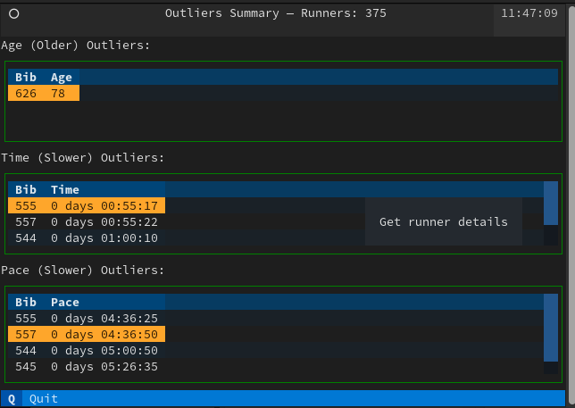

Next is code with explanations

```python
# Only code of the application shown here
# This application shows 3 tables: SUMMARY_METRICS = (RaceFields.AGE.value, RaceFields.TIME.value, RaceFields.PACE.value)
# Every application in Textual extends the App class
class OutlierApp(App):
    DF: DataFrame = None
    BINDINGS = [ ("q", "quit_app", "Quit"), ]  # Bind 'q' to 'quit_app' method `action_quit_app`, which in turn exists the app
    CSS_PATH = "outliers.tcss"  # Styling can be done externally, similar to using CSS
    ENABLE_COMMAND_PALETTE = False

    def action_quit_app(self):
        self.exit(0)

    def compose(self) -> ComposeResult:
        """
        Here we 'Yield' Widgets/ components that will be rendered in order on the TUI
        How the components get their layout on the screen? They use a cascade style sheet (CSS): outliers.tcss and
        some explicit layout containers like the class `Vertical` that can contain other Widgets
        Here we have a header, tables and a footer 
        """
        yield Header(show_clock=True)
        for column_name in SUMMARY_METRICS:
            table = DataTable(id=f'{column_name}_outlier')
            table.cursor_type = 'row'
            table.zebra_stripes = True
            table.tooltip = "Get runner details"
            if column_name == RaceFields.AGE.value:
                label = Label(f"{column_name} (older) outliers:".title())
            else:
                label = Label(f"{column_name} (slower) outliers:".title())
            yield Vertical(
                label,
                table
            )
        yield Footer()

    def on_mount(self) -> None:
        """
        Here we populate each table with data from the DataFrame. Eatch table has outliers of different type,
        all can be obtained with the `get_outliers` method.
        """
        for column in SUMMARY_METRICS:
            table = self.get_widget_by_id(f'{column}_outlier', expect_type=DataTable)
            columns = [x.title() for x in ['bib', column]]
            table.add_columns(*columns)
            table.add_rows(*[get_outliers(df=OutlierApp.DF, column=column).to_dict().items()])

    @on(DataTable.HeaderSelected)
    def on_header_clicked(self, event: DataTable.HeaderSelected):
        """
        When the user selects a column header it generates a 'HeaderSelected' event.
        The annotation on this method tells Textual that will handle this event here
        We can extract the table, the selected column and then sort the table contents.
        """
        table = event.data_table
        table.sort(event.column_key)

    @on(DataTable.RowSelected)
    def on_row_clicked(self, event: DataTable.RowSelected) -> None:
        """
        Similarly, when the user selects on a row it generates a RowSelected method
        What we do on the 'on_row_clicked' method is to capture the event, get the row contents and construct
        a new modal screen (RunnerDetailScreen) which we push on top of the regular screen.
        There we show the runner details in a different way. 
        """
        table = event.data_table
        row = table.get_row(event.row_key)
        runner_detail = RunnerDetailScreen(df=OutlierApp.DF, row=row)
        self.push_screen(runner_detail)
```

The class `RunnerDetailScreen` (extends ModalScreen), handles showing the racer details using formatted Markdown:

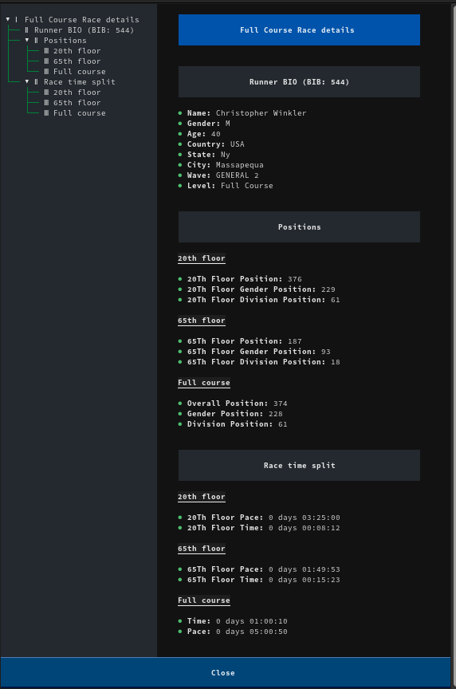

And the code with explanations:

```python
# Omitted imports and helper methods, only showing TUI related code. See the 'apps.py' file for full code
class RunnerDetailScreen(ModalScreen):
    ENABLE_COMMAND_PALETTE = False  # Disable the search bar, it is active by default and is not needed here
    CSS_PATH = "runner_details.tcss"  # Handle the styles using an external CSS

    def __init__(
            self,
            name: str | None = None,
            ident: str | None = None,
            classes: str | None = None,
            row: List[Any] | None = None,
            df: DataFrame = None,
            country_df: DataFrame = None
    ):
        """
        Override the constructor and load useful data like country ISO codes
        We get the Panda DataFrame with the details that will be shown to the user
        """
        super().__init__(name, ident, classes)
        self.row = row
        self.df = df
        if not country_df:
            self.country_df = load_country_details()
        else:
            self.country_df = country_df

    def compose(self) -> ComposeResult:
        """
        In compose we prepare the markdown and we let the MarkdownViewer handle details like 
        a nice automatic table of contents.
        Notice that we call `self.log.info('xxx'). We use that for debugging when this application
        is called using 'textual'.
        """
        bib_idx = FIELD_NAMES_AND_POS[RaceFields.BIB]
        bibs = [self.row[bib_idx]]
        columns, details = df_to_list_of_tuples(self.df, bibs)
        self.log.info(f"Columns: {columns}")
        self.log.info(f"Details: {details}")
        row_markdown = ""
        position_markdown = {}
        split_markdown = {}
        for legend in ['full', '20th', '65th']:
            position_markdown[legend] = ''
            split_markdown[legend] = ''
        for i in range(0, len(columns)):
            column = columns[i]
            detail = details[0][i]
            if re.search('pace|time', column):
                if re.search('20th', column):
                    split_markdown['20th'] += f"\n* **{column.title()}:** {detail}"
                elif re.search('65th', column):
                    split_markdown['65th'] += f"\n* **{column.title()}:** {detail}"
                else:
                    split_markdown['full'] += f"\n* **{column.title()}:** {detail}"
            elif re.search('position', column):
                if re.search('20th', column):
                    position_markdown['20th'] += f"\n* **{column.title()}:** {detail}"
                elif re.search('65th', column):
                    position_markdown['65th'] += f"\n* **{column.title()}:** {detail}"
                else:
                    position_markdown['full'] += f"\n* **{column.title()}:** {detail}"
            elif re.search('url|bib', column):
                pass  # Skip uninteresting columns
            else:
                row_markdown += f"\n* **{column.title()}:** {detail}"
        yield MarkdownViewer(f"""# Full Course Race details     
## Runner BIO (BIB: {bibs[0]})
{row_markdown}
## Positions
### 20th floor        
{position_markdown['20th']}
### 65th floor        
{position_markdown['65th']}
### Full course        
{position_markdown['full']}                
## Race time split   
### 20th floor        
{split_markdown['20th']}
### 65th floor        
{split_markdown['65th']}
### Full course        
{split_markdown['full']}         
        """)
        # This button is used to close this screen and send the user to the previous screen
        btn = Button("Close", variant="primary", id="close")
        btn.tooltip = "Back to main screen"
        yield btn

    @on(Button.Pressed, "#close")
    def on_button_pressed(self, _) -> None:
        """
        Simple logic, pop the previous screen and make this one disappear
        """
        self.app.pop_screen()
```

This class is reusable, there are other classes (like `BrowserApp`) part of this tutorial that also sends data when a user clicks on a table row, and those details get displayed using this modal screen.

What about the CSS? It looks a lot like the web applications [CSS](https://en.wikipedia.org/wiki/CSS) (not exactly the same). For example the [](empirestaterunup/runner_details.tcss):

```text
Button {
    dock: bottom;
    width: 100%;
    height: auto;
}
```

As you can see, Textual is a pretty powerful framework that _reminds me a lot of [Java Swing](https://en.wikipedia.org/wiki/Swing_(Java))_, but without the extra complexity.

But is just information in tabular format? I also wanted to have different graph types that could explain behaviour like age cluster, gender distribution. For that I wrote a few classes on the 'apps' module with the help of Mathplotlib:

### Plots with Matplotlib

I wanted to get some charts, these were made with [matplotlib](https://matplotlib.org/). The code to generate the plots is very straightforward.

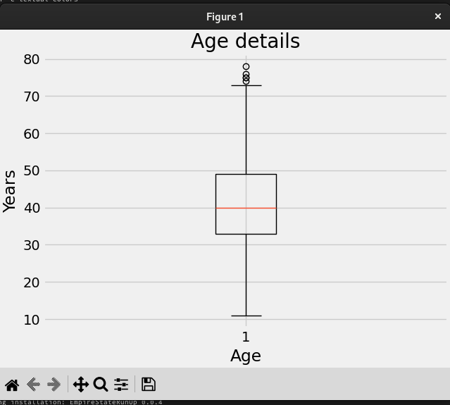

And the code:

```python
# Not all code is shown here (helper methods, imports)
# Please check the apps.py module to see all missing code
class Plotter:
    def plot_gender(self):
        """
        In this method, we get our dataframe filtering by gender and getting counts
        Then we create a pie plot
        """
        series = self.df[RaceFields.GENDER.value].value_counts()
        fig, ax = plt.subplots(layout='constrained')
        wedges, texts, auto_texts = ax.pie(
            series.values,
            labels=series.keys(),
            autopct="%%%.2f",
            shadow=True,
            startangle=90,
            explode=(0.1, 0, 0)
        )
        ax.set_title = "Gender participation"
        ax.set_xlabel('Gender distribution')
        
        # Legend with the fastest runners by gender
        fastest = find_fastest(self.df, FastestFilters.Gender)
        fastest_legend = [f"{fastest[gender]['name']} - {beautify_race_times(fastest[gender]['time'])}" for gender in
                          series.keys()]
        ax.legend(wedges, fastest_legend,
                  title="Fastest by gender",
                  loc="center left",
                  bbox_to_anchor=(1, 0, 0.5, 1))
```

Now let's go back to testing TUI

### Testing the user interfaces

When I started working on this small project I knew than there was going to be a lot of testing. What I wasn't sure was how I would be able to test the TUI.

I figured at least two ways with Textual:

#### Following the message flow with textual

Textual supports an interesting development mode that allows you to change CSS and see the changes on your application without a restart. Also, you can see how the TUI events propagate, which is invaluable for debugging.

On one terminal you start the console:

```shell
(EmpireStateRunUp) [josevnz@dmaf5 EmpireStateRunUp]$ . ~/virtualenv/EmpireStateRunUp/bin/activate
(EmpireStateRunUp) [josevnz@dmaf5 EmpireStateRunUp]$ textual console
▌Textual Development Console v0.46.0                                                                                                                                             
▌Run a Textual app with textual run --dev my_app.py to connect.                                                                                                                  
▌Press Ctrl+C to quit.
```

Then on another terminal you start your application but using the development mode:

```shell
(EmpireStateRunUp) [josevnz@dmaf5 EmpireStateRunUp]$ textual run --dev --command esru_browser
```

if you check back on your console terminal, you will see any messages you sent with App.log and also the events:

```shell
─────────────────────────────────────────────────────────────────────────── Client '127.0.0.1' connected ───────────────────────────────────────────────────────────────────────────
[18:28:17] SYSTEM                                                                                                                                                        app.py:2188
Connected to devtools ( ws://127.0.0.1:8081 )
[18:28:17] SYSTEM                                                                                                                                                        app.py:2192
---
[18:28:17] SYSTEM                                                                                                                                                        app.py:2194
driver=<class 'textual.drivers.linux_driver.LinuxDriver'>
[18:28:17] SYSTEM                                                                                                                                                        app.py:2195
loop=<_UnixSelectorEventLoop running=True closed=False debug=False>
[18:28:17] SYSTEM                                                                                                                                                        app.py:2196
features=frozenset({'debug', 'devtools'})
[18:28:17] SYSTEM                                                                                                                                                        app.py:2228
STARTED FileMonitor({PosixPath('/home/josevnz/EmpireStateCleanup/docs/EmpireStateRunUp/empirestaterunup/browser.tcss')})
[18:28:17] EVENT                                                                                                                                                 message_pump.py:706
Load() >>> BrowserApp(title='Race Runners', classes={'-dark-mode'}) method=None
[18:28:17] EVENT                                                                                                                                                 message_pump.py:697
Mount() >>> DataTable(id='runners') method=<ScrollView.on_mount>
[18:28:17] EVENT                                                                                                                                                 message_pump.py:697
Mount() >>> DataTable(id='runners') method=<Widget.on_mount>
[18:28:17] EVENT                                                                                                                                                 message_pump.py:697
Mount() >>> Footer() method=<Footer.on_mount>
[18:28:17] EVENT                                                                                                                                                 message_pump.py:697
Mount() >>> Footer() method=<Widget.on_mount>
[18:28:17] EVENT                                                                                                                                                 message_pump.py:697
Mount() >>> ToastRack(id='textual-toastrack') method=<Widget.on_mount>
...
RowHighlighted(cursor_row=0, row_key=<textual.widgets._data_table.RowKey object at 0x7fc8d98800d0>) >>> BrowserApp(title='Race Runners', classes={'-dark-mode'}) method=None
[18:28:17] EVENT                                                                                                                                                 message_pump.py:697
Mount() >>> ScrollBarCorner() method=<Widget.on_mount>
[18:28:17] EVENT                                                                                                                                                 message_pump.py:706
Resize(size=Size(width=2, height=1), virtual_size=Size(width=178, height=47), container_size=Size(width=178, height=47)) >>> ScrollBarCorner() method=None
[18:28:17] EVENT                                                                                                                                                 message_pump.py:706
Show() >>> ScrollBarCorner() method=None
```

#### Using unittest and Pilot

The framework has the [Pilot class](https://textual.textualize.io/api/pilot/), that can be used to make automated calls to Textual Widgets and wait for events, so you can simulate user interaction with the application to validate it behaves as expected:

```python
import unittest
from textual.widgets import DataTable, MarkdownViewer
from empirestaterunup.apps import BrowserApp


class AppTestCase(unittest.IsolatedAsyncioTestCase):
    async def test_browser_app(self):
        app = BrowserApp()
        self.assertIsNotNone(app)
        async with app.run_test() as pilot:

            """
            Test the command palette
            """
            await pilot.press("ctrl+\\")
            for char in "jose".split():
                await pilot.press(char)
            await pilot.press("enter")
            # This returns the runner screen, check it has some contents
            markdown_viewer = app.screen.query(MarkdownViewer).first()
            self.assertTrue(markdown_viewer.document)
            await pilot.click("#close")  # Close the new screen, pop the original one
            # Go back to the main screen, now select a runner but using the table
            table = app.screen.query(DataTable).first()
            coordinate = table.cursor_coordinate
            self.assertTrue(table.is_valid_coordinate(coordinate))
            await pilot.press("enter")
            await pilot.pause()
            markdown_viewer = app.screen.query(MarkdownViewer).first()
            self.assertTrue(markdown_viewer)
            # After validating the markdown one more time, close the app
            # Quit the app by pressing q
            await pilot.press("q")


if __name__ == '__main__':
    unittest.main()
```

This is very invaluable, and something that many times require an external tool set to validate.

## Running the applications

Finally, time to get familiar with the applications.

### Browsing through the data

The 'esru_browser' is a simple browser that lets you navigate through the race raw data.

```shell
esru_browser
```

The application shows all the race details for every Runner, on a table that allows sorting by column.

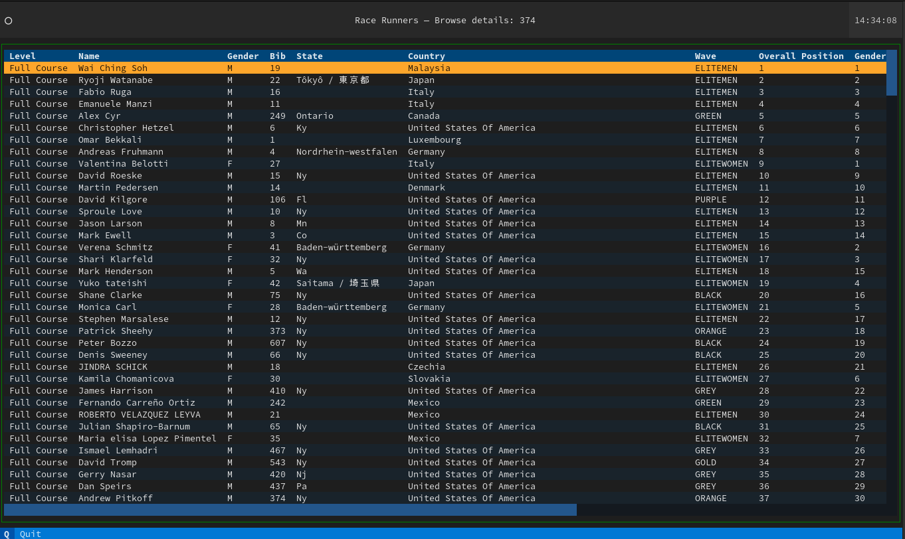

And the command palette, searching for runners by name:

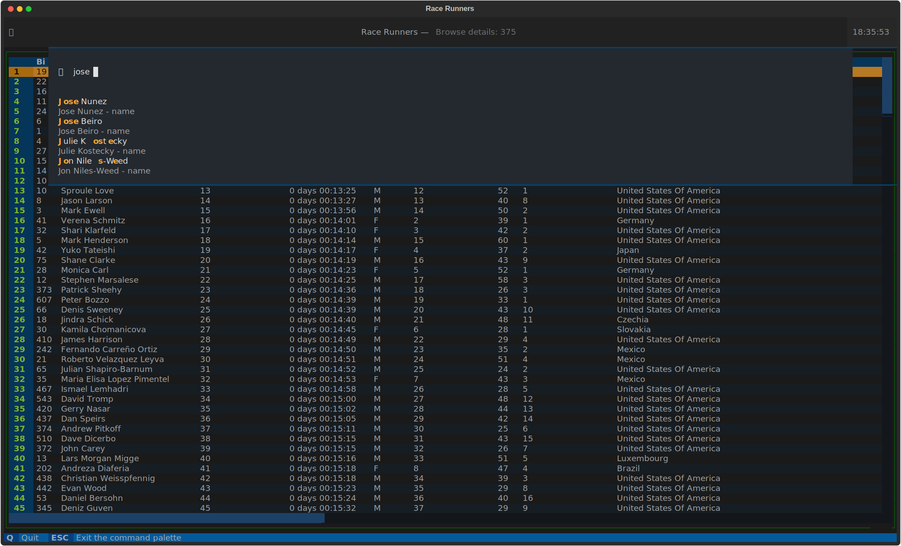

### Summary reports

This application provides details about the following:

* Count, standard deviation, mean, min, max 45%, 50% and 75% for age, time, and pace
* Group and count distribution for Age,  Wave and Gender

```shell
esru_numbers
```

Some interesting facts about the race:

* Average age is 41 years old and 40 years old is the largest age group
* Majority number of people belonged to the 'BLACK WAVE'
* Majority of the people finished the race between 20 and 30 minutes.
* Youngest runner was 11 years old, oldest 78

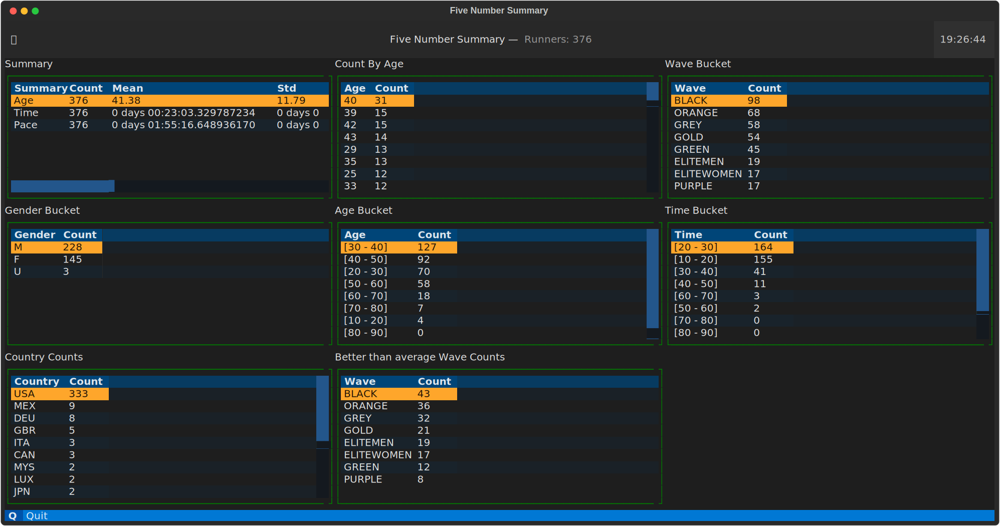


### Finding outliers

This application uses the _Z-score_ to find the outliers for several metrics for this race

```shell
esru_outlier
```

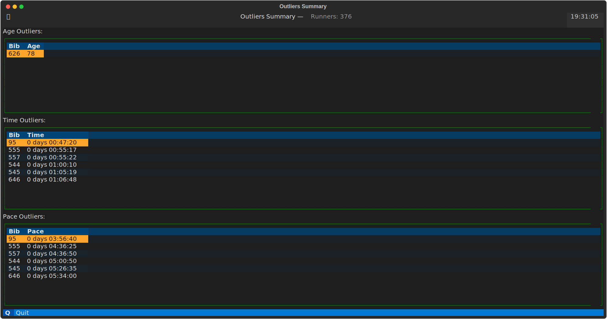

Because this results drill down to the BIB number, you can click on a row and get more details of a runner:

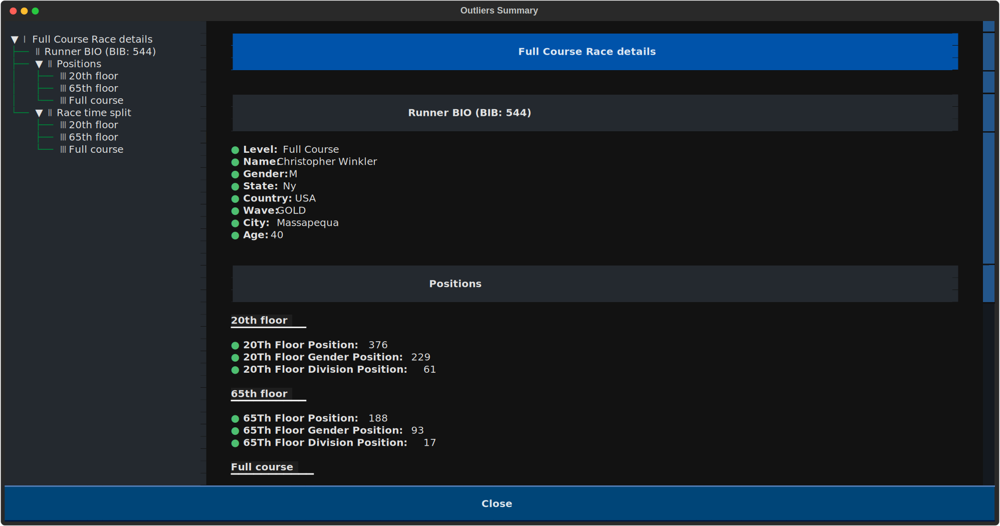

Textual as excellent support for rendering Markdown, programing languages. Take a look on the code to see yourself.

### A few plot graphics for you

The [esru_plot](empirestaterunup/apps.py) application offers a few plot graphics to help you visualize the data. Inside, the class `Plotter` does all the heavy lifting

#### Age plots

The program can generate two flavors for the same data, one is a Box diagram:

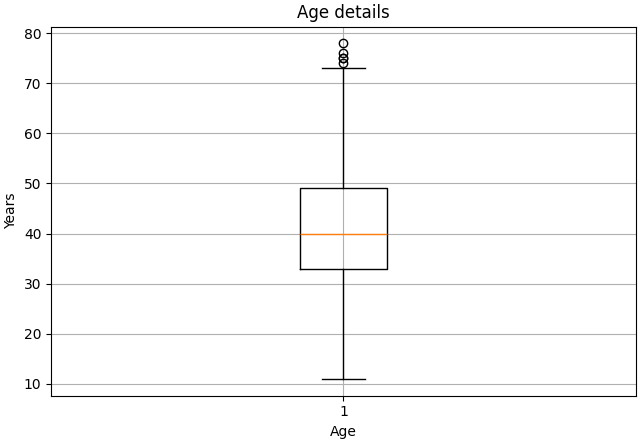

And the second is a regular histogram:

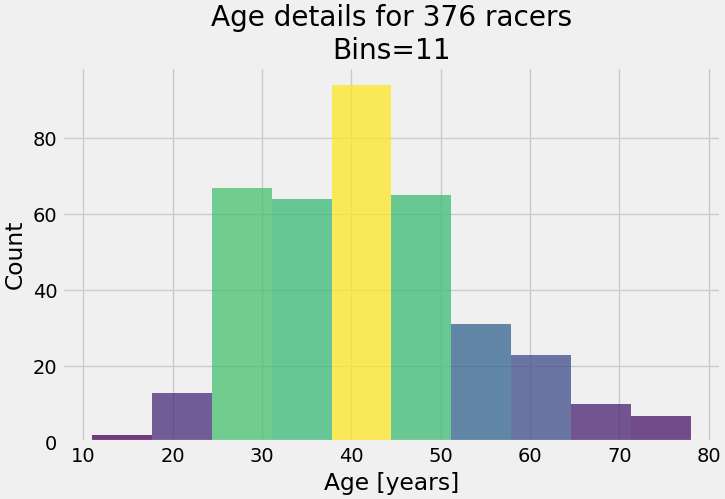

You can see from both graphics that the group age with most participants is the 40-45 year old bracket, and the outliers
are on the 10-20 and 70-80 year old groups.

#### Participants per country plot

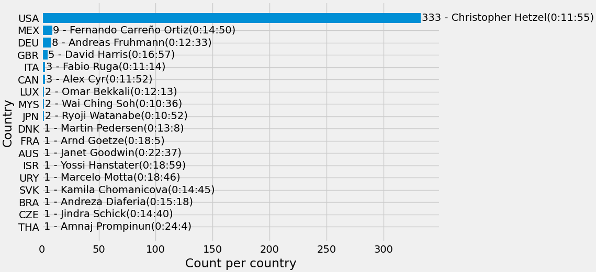

No surprises here, the overwhelming majority of racers come from the United States, followed by Mexico. Interestingly 
the winner of the 2013 race is from Malaysia, with only 2 runners participating. 

#### Gender distribution

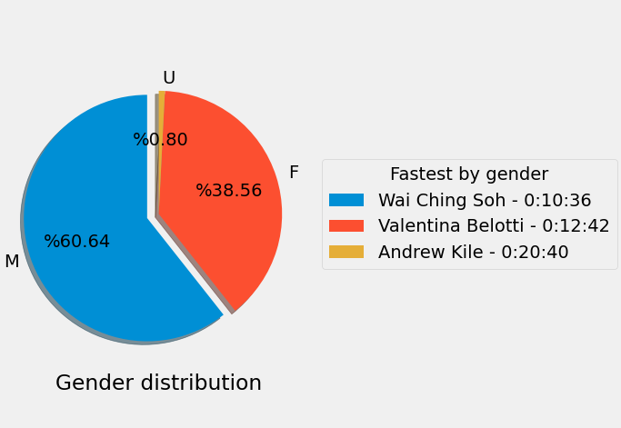

Majority of the runners identified themselves as Males, followed by Female.

## What is next?

*TODO: Talk more about the race, tools used*

There is plenty more to learn about the tools you just saw on this tutorial:

* There are a lot of race public datasets, you can apply what you learned here. Just take a look at [this dataset of the New York City Marathon, period 1970-2018](https://github.com/davidjaimes/nyc-marathon). What [other questions](https://github.com/meiguan/nyc2018marathonfinishers) you can ask about the data?
* You saw just the tip of what you can do with Textual. I encourage you to explore the [apps.py](empirestaterunup/apps.py) module. Take a look at the [example applications](https://github.com/Textualize/textual/tree/main/examples).
* [Selenium Webdriver](https://www.selenium.dev/documentation/webdriver/) is not a tool for web scrapping but automated testing of web applications. It doesn't get better than having your browser to perform automated testing for you. It is a big framework, so be prepared to spend time reading and running your tests. I strongly suggest you look [at the examples](https://github.com/SeleniumHQ/seleniumhq.github.io/tree/trunk/examples/python).
* Apply for the [Empire Estate Run Up](https://www.esbnyc.com/empire-state-building-run) lottery or run through a charity, if you like this kind of races. Who said [King Kong](https://en.wikipedia.org/wiki/King_Kong) is the only one who could make it to the top?.


