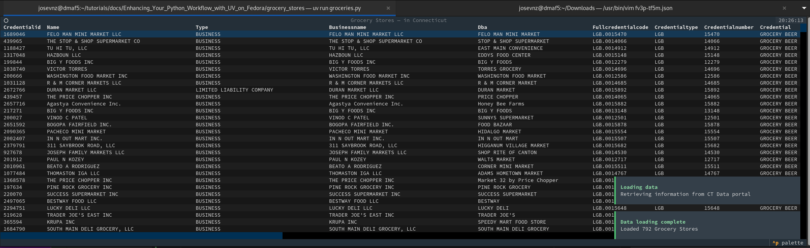

# Enhancing Your Python Workflow with UV on Fedora

If you use Python you most likely have used any or all of the following tools:

* Used [pip](https://pypi.org/project/pip/) to install packages or [pipx](https://github.com/pypa/pipx) to install them on virtual environments.
* [Anaconda](https://www.anaconda.com/docs/tools/main) to install packages and custom Python versions and manage dependencies
* [Poetry](https://python-poetry.org/docs/) and pipx, to manage your Python project and packaging.

Why you need then another tool to manage your Python packaging or to install your favorite Python tools? For me, it was decision based on the following:

1) Simplicity: uv can handle all the tasks for packaging or installing tools with a very easy to use cli.
2) Better dependency management: When there are conflicts, the tools does a great job explaining what went wrong
3) Speed: If you ever used Anaconda to install multiple dependencies like PyTorch, Ansible, Pandas, etc. you will appreciate how fast uv can do those things.
4) Easy to install: No third party dependencies to install, comes with batteries included
5) Documentation: Yes, the online documentation is easy to follow and clear.

I will show you how to tackle some common tasks using uv. You will need a few things to follow this tutorial:

* A Linux distribution: I use [Fedora](https://fedoraproject.org/) but any other distribution will work pretty much the same
* An Internet connection, to download [uv](https://docs.astral.sh/uv/) from their website.
* Elevated privileges ([SUDO](https://www.sudo.ws/)), if you want to install binaries system-wide (like RPMS). This is entirely optional.
* Be familiar with [pip](https://docs.python.org/3/installing/index.html) and [virtual environments](https://docs.python.org/3/library/venv.html): Optional but it helps if you have installed a python package before
* Python programming experience: We will not code much here, but knowing about Python [modules](https://docs.python.org/3/tutorial/modules.html) and how to [package](https://packaging.python.org/en/latest/) a project using [pyproject.toml](https://packaging.python.org/en/latest/guides/writing-pyproject-toml/) with frameworks like [setuptools](https://setuptools.pypa.io/en/latest/setuptools.html) will make it easier to follow.

Let's start by installing uv if you haven't done so already.

## Installing UV

If you have a Linux installation you can install uv like this:

```shell
curl -LsSf https://astral.sh/uv/install.sh | sh
```

Using an RPM? [Fedora lists](https://src.fedoraproject.org/rpms/uv) several packages since version 40. So there you can do something like this:

```shell
sudo dnf install -y uv
```

Or make yourself an RPM using the statically compiled binaries from Astral and a little help from Podman and [fpm](https://www.freecodecamp.org/news/getting-started-with-fpm/):

```shell
josevnz@dmaf5 docs]$ podman run --mount type=bind,src=$HOME/tmp,target=/mnt/result --rm --privileged --interactive --tty fedora:37 bash
[root@a9e9dc561788 /]# gem install --user-install fpm
...
[root@a9e9dc561788 /]# curl --location --fail --remote-name https://github.com/astral-sh/uv/releases/download/0.6.9/uv-x86_64-unknown-linux-gnu.tar.gz
  % Total    % Received % Xferd  Average Speed   Time    Time     Time  Current
                                 Dload  Upload   Total   Spent    Left  Speed
  0     0    0     0    0     0      0      0 --:--:-- --:--:-- --:--:--     0
100 15.8M  100 15.8M    0     0  8871k      0  0:00:01  0:00:01 --:--:-- 11.1M
[root@a9e9dc561788 /]# fpm -t rpm -s tar --name uv --rpm-autoreq --rpm-os linux --rpm-summary 'An extremely fast Python package and project manager, written in Rust.' --license 'Apache 2.0' --version v0.6.9 --depends bash --maintainer 'Jose Vicente Nunez <kodegeek.com@protonmail.com>' --url https://github.com/astral-sh/uv  uv-x86_64-unknown-linux-gnu.tar.gz
Created package {:path=>"uv-v0.6.9-1.x86_64.rpm"}
mv uv-v0.6.9-1.x86_64.rpm /mnt/result/
# exit the container
exit
```

You can then install on /usr/local, using `--prefix`:
```shell
sudo -i
[root@a9e9dc561788 /]# rpm --force --prefix /usr/local -ihv /mnt/result/uv-v0.6.9-1.x86_64.rpm 
Verifying...                          ################################# [100%]
Preparing...                          ################################# [100%]
Updating / installing...
   1:uv-v0.6.9-1                      ################################# [100%]
[root@a9e9dc561788 /]# rpm -qil uv-v0.6.9-1
Name        : uv
Version     : v0.6.9
Release     : 1
Architecture: x86_64
Install Date: Sat Mar 22 23:32:49 2025
Group       : default
Size        : 40524181
License     : Apache 2.0
Signature   : (none)
Source RPM  : uv-v0.6.9-1.src.rpm
Build Date  : Sat Mar 22 23:28:48 2025
Build Host  : a9e9dc561788
Relocations : / 
Packager    : Jose Vicente Nunez <kodegeek.com@protonmail.com>
Vendor      : none
URL         : https://github.com/astral-sh/uv
Summary     : An extremely fast Python package and project manager, written in Rust.
Description :
no description given
/usr/local/usr/lib/.build-id
/usr/local/usr/lib/.build-id/a1
/usr/local/usr/lib/.build-id/a1/8ee308344b9bd07a1e3bb79a26cbb47ca1b8e0
/usr/local/usr/lib/.build-id/e9
/usr/local/usr/lib/.build-id/e9/4f273a318a0946893ee81326603b746f4ffee1
/usr/local/uv-x86_64-unknown-linux-gnu/uv
/usr/local/uv-x86_64-unknown-linux-gnu/uvx
```
Again, you have several choices. Now is time to move to the next section and see what uv can do to make our Python workflows faster.

## Using UV to run everyday tools like Ansible, Glances, Autopep8

One of the best things about uv is that you can download and install tools on your account with less typing.

One of my favorite monitoring tools, glances, can be installed with pip on the user account:

```shell
pip install --user glances
glances
```

But that will pollute my python installation with glances dependencies. So the best next thing is to isolate it on a virtual environment:

```shell
python -m venv ~/venv/glances
. ~/venv/glances/bin/activate
pip install glances
glances
```

You can see now where this is going. Instead, I could do the following with uv:

```shell
uv tool run glances
```

OK, a single line to _run and install glances_, This creates a temporary environment which is discarded once we're done with the tool.

Let me show you the equivalent command, it is called `uvx`:

```shell
uvx --from glances glances
```

If the command and the distribution matches then we can skip explicitly where it comes '--from':

```shell
uvx glances
```

_Less typing_, uv created a virtual environment for me and downloaded glaces there. Say that I want to use a different Python 3.12 to run it:

```shell
uvx --from glances --python 3.12 glances
```

If you call this command again, uvx will re-use the virtual environment it created, using the Python interpreter of your choice.

We just saw how uv allow you install custom python interpreters, we will cover this topic in a little bit of more detail next.

### It is a good idea to install custom Python interpreters?

Letting developers and DevOps [install custom Python interpreters](https://docs.astral.sh/uv/concepts/python-versions/#installing-a-python-version) can be a time saver, specially if you can contain your installation using a virtual environment.

Say than you are ready to use Python 3.13:

```shell
[josevnz@dmaf5 ~]$ which uv
~/.local/bin/uv
Installed Python 3.13.1 in 3.21s
 + cpython-3.13.1-linux-x86_64-gnu
```

Where it was installed? Let search for it and run it:
```shell
# Is not the system python3
[josevnz@dmaf5 ~]$ which python3
/usr/bin/python3
# And is not in the default PATH
[josevnz@dmaf5 ~]$ which python3.13
/usr/bin/which: no python3.13 in (/home/josevnz/.cargo/bin:/home/josevnz/.local/bin:/home/josevnz/bin:/usr/local/bin:/usr/local/sbin:/usr/bin:/usr/sbin:/home/josevnz/.local/share/JetBrains/Toolbox/scripts)
# Let's find it (Pun intended)
[josevnz@dmaf5 ~]$ find ~/.local -name python3.13
/home/josevnz/.local/share/uv/python/cpython-3.13.1-linux-x86_64-gnu/bin/python3.13
/home/josevnz/.local/share/uv/python/cpython-3.13.1-linux-x86_64-gnu/include/python3.13
/home/josevnz/.local/share/uv/python/cpython-3.13.1-linux-x86_64-gnu/lib/python3.13
# Let's run it
[josevnz@dmaf5 ~]$ /home/josevnz/.local/share/uv/python/cpython-3.13.1-linux-x86_64-gnu/bin/python3.13
Python 3.13.1 (main, Jan 14 2025, 22:47:38) [Clang 19.1.6 ] on linux
Type "help", "copyright", "credits" or "license" for more information.
>>> 
```

Interesting, a custom location that is not in the [PATH](https://en.wikipedia.org/wiki/PATH_(variable)). Imagine now that I want to install the tool [autopep8](https://github.com/hhatto/autopep8) using Python 3.13
```shell
[josevnz@dmaf5 ~]$ uv tool install autopep8 --python 3.13.1
Resolved 2 packages in 158ms
Prepared 2 packages in 72ms
Installed 2 packages in 8ms
 + autopep8==2.3.2
 + pycodestyle==2.12.1
Installed 1 executable: autopep8
```

Did the new autopep8 installation re-used the Python3.13 we installed before? 

```shell
[josevnz@dmaf5 ~]$ which autopep8
~/.local/bin/autopep8
[josevnz@dmaf5 ~]$ head -n 1 ~/.local/bin/autopep8
#!/home/josevnz/.local/share/uv/tools/autopep8/bin/python
[josevnz@dmaf5 ~]$ ls -l /home/josevnz/.local/share/uv/tools/autopep8/bin/python
lrwxrwxrwx. 1 josevnz josevnz 83 Mar 22 16:50 /home/josevnz/.local/share/uv/tools/autopep8/bin/python -> /home/josevnz/.local/share/uv/python/cpython-3.13.1-linux-x86_64-gnu/bin/python3.13
```

Yes, very good, we are not wasting space with duplicate python interpreter installations. 

But what if we want to re-use the existing _system_ python3? If we force the installation, we will have a duplicate?

My system has Python 3.11, let's force the autopep8 and see what happens:

```shell
josevnz@dmaf5 ~]$ uv tool install autopep8 --force --python 3.11 
Resolved 2 packages in 3ms
Uninstalled 1 package in 1ms
Installed 1 package in 3ms
 ~ autopep8==2.3.2
Installed 1 executable: autopep8
[josevnz@dmaf5 ~]$ which autopep8
~/.local/bin/autopep8
[josevnz@dmaf5 ~]$ head -n 1 ~/.local/bin/autopep8
#!/home/josevnz/.local/share/uv/tools/autopep8/bin/python3
[josevnz@dmaf5 ~]$ ls -l /home/josevnz/.local/share/uv/tools/autopep8/bin/python3
lrwxrwxrwx. 1 josevnz josevnz 6 Mar 22 16:56 /home/josevnz/.local/share/uv/tools/autopep8/bin/python3 -> python
[josevnz@dmaf5 ~]$ ls -l /home/josevnz/.local/share/uv/tools/autopep8/bin/python
lrwxrwxrwx. 1 josevnz josevnz 19 Mar 22 16:56 /home/josevnz/.local/share/uv/tools/autopep8/bin/python -> /usr/bin/python3.11
```

It is smart enough to use the system Python.

Say that you want to make this Python3 version the default for your user? There is a way to do that using the experimental flag `--preview` and `--default` (makes it python3):

```shell
[josevnz@dmaf5 ~]$ uv python install 3.13 --default --preview
Installed Python 3.13.1 in 23ms
 + cpython-3.13.1-linux-x86_64-gnu (python, python3, python3.13)
# Which one is now python3
[josevnz@dmaf5 ~]$ which python3
~/.local/bin/python3
# Is python3.13 our default python3?
[josevnz@dmaf5 ~]$ which python3.13
~/.local/bin/python3.13
```

If you want to enforce a more strict control on what interpreters can be installed? If you create a `$XDG_CONFIG_DIRS/uv/uv.toml` or `~/.config/uv/uv.toml` file, you can put the following [settings](https://docs.astral.sh/uv/reference/settings/) there:

```toml
# ~/.config/uv/uv.toml or /etc/uv/uv.toml
# https://docs.astral.sh/uv/reference/settings/#python-preference: only-managed, *managed*, system, only-system
python-preference = "only-system"
# https://docs.astral.sh/uv/reference/settings/#python-downloads: *automatic*, manual or never
python-downloads = "manual"
```

The Fedora managers had an interesting conversation about [how set this policy system-wide](https://src.fedoraproject.org/rpms/uv/pull-request/18), worth reading. Or you can go and check the [Fedora system uv.toml](https://src.fedoraproject.org/rpms/uv/blob/rawhide/f/uv.toml) file yourself.

To wrap this section, let me show you how can remove an installed python as well using uv:

```shell
[josevnz@dmaf5 docs]$ uv python uninstall 3.9
Searching for Python versions matching: Python 3.9
Uninstalled Python 3.9.21 in 212ms
 - cpython-3.9.21-linux-x86_64-gnu
```

Time to go back to time saving features. There is a way to type less when installing applications? Let's find out on the next section.

### Bash to the rescue

Nothing like ye old Bourne Shell (or favorite shell) cannot fix.  Put this on your ~/.profile or [environment initialization configuration file](https://fedoramagazine.org/customizing-bash/):

```shell
#  Use a function instead of an alias (deprecated but still supported)
function glances
   uvx --from glances --python 3.12 glances $*
}
```

Another cool trick you can teach bash is to [autocomplete](https://github.com/scop/bash-completion) your uv commands. Just set it up like this:

```shell
josevnz@dmaf5 docs]$ uv --generate-shell-completion bash > ~/.uv_autocomplete
[josevnz@dmaf5 docs]$ cat<<UVCONF>>~/.bash_profile
> if [[ -f ~/.uv_autocomplete ]]; then
>     . ~/.uv_autocomplete
> fi
> UVCONF
[josevnz@dmaf5 docs]$ . ~/.uv_autocomplete
```

There is an even better way to install tools in our environment, once we are sure we want to keep a tool around.

### Consider installing your tool it instead of running it with a transient deployment.

You probably use [Ansible](https://docs.ansible.com/ansible/latest/index.html)  all the time to manage your infrastructure as code. And you don't want to use uv or uvx to call it. It is time to _install it_:

```shell
uv tool install --force ansible
Resolved 10 packages in 17ms
Installed 10 packages in 724ms
 + ansible==11.3.0
 + ansible-core==2.18.3
 + jinja2==3.1.6
...
```

Then we can call it without using uv nor uvx as long as you put ~/.local/bin in your PATH environment variable. You can confirm if that is the case by calling which:

```shell
which ansible-playbook
~/.local/bin/ansible-playbook
```

Another advantage of using 'tools install' is that if they are big (like Ansible), or you have a slow network connection, you only install once and next time you call it, is there. 

Last trick for this section, if you installed several python tools using uv, you can upgrade them all in one shot as well with the `--upgrade` flag:

```shell
[josevnz@dmaf5 ~]$ uv tool upgrade --all
Updated glances v4.3.0.8 -> v4.3.1
 - glances==4.3.0.8
 + glances==4.3.1
Installed 1 executable: glances
```

Pretty convenient!

We have seen so far how to manage someone else's packages, what about our own? Next section explores that

## Managing your Python projects with UV

Eventually you will find yourself packaging a [Python project](https://docs.astral.sh/uv/concepts/projects/) that has multiple modules, scripts and data files. Python offers a rich ecosystem to manage this scenario and uv takes away some of the complexity.

Our small demo project is an application that will use the '[Grocery Stores](https://data.ct.gov/Business/Grocery-Stores/fv3p-tf5m/about_data)' from the Connecticut Data portal

I always like to start a project with a description and a name:

```shell
[josevnz@dmaf5 Enhancing_Your_Python_Workflow_with_UV_on_Fedora]$ uv init --description 'Grocery Stores in Connecticut' grocery_stores
Initialized project `pretty-csv` at `/home/josevnz/tutorials/docs/Enhancing_Your_Python_Workflow_with_UV_on_Fedora/grocery_stores`
```

uv created a few files here:
```shell
[josevnz@dmaf5 Enhancing_Your_Python_Workflow_with_UV_on_Fedora]$ ls -a grocery_stores/
.  ..  hello.py  pyproject.toml  .python-version  README.md
```

The most important for now is pyproject.toml. It has a full description of your project:
```toml
[project]
name = "pretty-csv"
version = "0.1.0"
description = "Grocery Stores in Connecticut"
readme = "README.md"
requires-python = ">=3.13"
dependencies = []
```

_[.python-version](grocery_stores/.python-version)_ has the version of python supported by this project.

The other file is `hello.py`. You can get rid of it, it has a hello world in Python. Also later, we will fill the _README.md_ with proper content.

Back to our script, we will use a TUI framework called [Textual](https://textual.textualize.io/) that will allow us to take the CSV file and show the contents as a table. Because we know that dependency, let's use uv to add it to our project:
```shell
[josevnz@dmaf5 grocery_stores]$ uv add 'textual==2.1.2'
Using CPython 3.13.1
Creating virtual environment at: .venv
Resolved 11 packages in 219ms
Prepared 2 packages in 143ms
Installed 10 packages in 47ms
 + linkify-it-py==2.0.3
 + markdown-it-py==3.0.0
 + mdit-py-plugins==0.4.2
 + mdurl==0.1.2
 + platformdirs==4.3.7
 + pygments==2.19.1
 + rich==13.9.4
 + textual==2.1.2
 + typing-extensions==4.12.2
 + uc-micro-py==1.0.3
```

Three things happened:
1) We downloaded textual and their transitive dependencies
2) pyproject.toml was updated and now the dependencies section has values
```toml
[project]
name = "pretty-csv"
version = "0.1.0"
description = "Simple program that shows contents of a CSV file as a table on the terminal"
readme = "README.md"
requires-python = ">=3.13"
dependencies = [
    "textual==2.1.2",
]
```

3) uv created an [uv.lock](uv.lock) file next to the pyproject.toml. This file has exact version of all the packages used in your project, which ensures consistency.
```toml
version = 1
requires-python = ">=3.13"

[[package]]
name = "linkify-it-py"
version = "2.0.3"
source = { registry = "https://pypi.org/simple" }
dependencies = [
    { name = "uc-micro-py" },
]
sdist = { url = "https://files.pythonhosted.org/packages/2a/ae/bb56c6828e4797ba5a4821eec7c43b8bf40f69cda4d4f5f8c8a2810ec96a/linkify-it-py-2.0.3.tar.gz", hash = "sha256:68cda27e162e9215c17d786649d1da0021a451bdc436ef9e0fa0ba5234b9b048", size = 27946 }
wheels = [
    { url = "https://files.pythonhosted.org/packages/04/1e/b832de447dee8b582cac175871d2f6c3d5077cc56d5575cadba1fd1cccfa/linkify_it_py-2.0.3-py3-none-any.whl", hash = "sha256:6bcbc417b0ac14323382aef5c5192c0075bf8a9d6b41820a2b66371eac6b6d79", size = 19820 },
]
...
```

You can see _uv.lock_ is very detailed, as its purpose is to be as specific and unambiguous as possible. This file is meant to be added your repository on git.

In the next section we will actually write some code to have a more useful project. For now let's add also the '[httpx](https://www.python-httpx.org/)' library, so we can download the CSV grocery data.

```shell
[josevnz@dmaf5 pretty_csv]$ uv add 'httpx==0.28.1'
Resolved 18 packages in 229ms
Prepared 6 packages in 108ms
Installed 7 packages in 8ms
 + anyio==4.9.0
 + certifi==2025.1.31
 + h11==0.14.0
 + httpcore==1.0.7
 + httpx==0.28.1
 + idna==3.10
 + sniffio==1.3.1
```

Also, I want to add pylint amd pytest to check my code statically and to write unit tests. This is a development dependency, one that I don't want to require when installing my application:

```shell
[josevnz@dmaf5 grocery_stores]$ uv add --dev pylint==3.3.6 pytest==8.3.5
Resolved 29 packages in 15ms
Installed 10 packages in 19ms
 + astroid==3.3.9
 + dill==0.3.9
 + iniconfig==2.1.0
 + isort==6.0.1
 + mccabe==0.7.0
 + packaging==24.2
 + pluggy==1.5.0
 + pylint==3.3.6
 + pytest==8.3.5
 + tomlkit==0.13.2
```

This produces the following section on my pyproject.toml file:
```toml
[dependency-groups]
dev = [
    "pylint==3.3.6",
    "pytest==8.3.5",
]
```


### Writing a CSV to Table display application

The first step is to have the code that loads the data, then renders the Grocery store as a table. I will let you read the Textual tutorial on how to do this and instead will share the bulk of the code on a file called '[groceries.py](grocery_stores/src/grocery_stores_ct/groceries.py)':

```python
"""
Displays the latest Grocery Store data from
the Connecticut Data portal.
Author: Jose Vicente Nunez <kodegeek.com@protonmail.com>
Press ctrl+q to exit the application.
"""

import httpx
from httpx import HTTPStatusError
from textual.app import App, ComposeResult
from textual.widgets import DataTable, Header, Footer
from textual import work, on
from orjson import loads

GROCERY_API_URL = "https://data.ct.gov/resource/fv3p-tf5m.json"


class GroceryStoreApp(App):
    def compose(self) -> ComposeResult:
        header = Header(show_clock=True)
        yield header
        table = DataTable(id="grocery_store_table")
        yield table
        yield Footer()

    @work()
    async def update_grocery_data(self) -> None:
        """
        Update the Grocery data table and provide some feedback to the user
        :return:
        """
        table = self.query_one("#grocery_store_table", DataTable)

        async with httpx.AsyncClient() as client:
            response = await client.get(GROCERY_API_URL)
            try:
                response.raise_for_status()
                groceries_data = loads(response.text)
                table.add_columns(*[key.title() for key in groceries_data[0].keys()])
                cnt = 0
                for row in groceries_data[1:]:
                    table.add_row(*(row.values()))
                    cnt += 1
                table.loading = False
                self.notify(
                    message=f"Loaded {cnt} Grocery Stores",
                    title="Data loading complete",
                    severity="information"
                )
            except HTTPStatusError:
                self.notify(
                    message=f"HTTP code={response.status_code}, message={response.text}",
                    title="Could not download grocery data",
                    severity="error"
                )

    def on_mount(self) -> None:
        """
        Render the initial component status, show an initial loading message
        :return:
        """
        table = self.query_one("#grocery_store_table", DataTable)
        table.zebra_stripes = True
        table.cursor_type = "row"
        table.loading = True
        self.notify(
            message=f"Retrieving information from CT Data portal",
            title="Loading data",
            severity="information",
            timeout=5
        )
        self.update_grocery_data()

    @on(DataTable.HeaderSelected)
    def on_header_clicked(self, event: DataTable.HeaderSelected):
        """
        Sort rows by column header
        """
        table = event.data_table
        table.sort(event.column_key)


if __name__ == "__main__":
    app = GroceryStoreApp()
    app.title = "Grocery Stores"
    app.sub_title = "in Connecticut"
    app.run()
```

Now that we have some code and a script, let's test it first using an editable mode (similar way than pip):

```shell
[josevnz@dmaf5 grocery_stores]$ uv pip install --editable . --reinstall
Resolved 18 packages in 105ms
   Built grocery-stores @ file:///home/josevnz/tutorials/docs/Enhancing_Your_Python_Workflow_with_UV_on_Fedora/grocery_stores
Prepared 18 packages in 1.07s
Uninstalled 18 packages in 87ms
Installed 18 packages in 53ms
 ~ anyio==4.9.0
 ~ certifi==2025.1.31
 ~ grocery-stores==0.1.0 (from file:///home/josevnz/tutorials/docs/Enhancing_Your_Python_Workflow_with_UV_on_Fedora/grocery_stores)
 ~ h11==0.14.0
 ~ httpcore==1.0.7
 ~ httpx==0.28.1
 ~ idna==3.10
 ~ linkify-it-py==2.0.3
 ~ markdown-it-py==3.0.0
 ~ mdit-py-plugins==0.4.2
 ~ mdurl==0.1.2
 ~ platformdirs==4.3.7
 ~ pygments==2.19.1
 ~ rich==13.9.4
 ~ sniffio==1.3.1
 ~ textual==2.1.2
 ~ typing-extensions==4.12.2
 ~ uc-micro-py==1.0.3
```

Then run it:
```shell
uv run groceries.py
```

The application looks more or less like this:


Time to see next how we can lint and unit test our new grocery store application

### Linting code with pylint:

**_TODO_**

```shell
[josevnz@dmaf5 grocery_stores]$ uv run --with 'pylint==3.3.6' pylint groceries.py 
************* Module groceries
groceries.py:15:0: C0115: Missing class docstring (missing-class-docstring)
groceries.py:25:8: W0612: Unused variable 'table' (unused-variable)
groceries.py:27:12: W0612: Unused variable 'response' (unused-variable)
groceries.py:29:4: C0116: Missing function or method docstring (missing-function-docstring)
groceries.py:10:0: W0611: Unused work imported from textual (unused-import)

------------------------------------------------------------------
Your code has been rated at 7.73/10 (previous run: 7.73/10, +0.00)
```

### Running unit tests with pytest

My textual app uses async so it requires a little bit of support. Not a problem:

```shell
[josevnz@dmaf5 grocery_stores]$ uv add --dev pytest_asyncio
[josevnz@dmaf5 grocery_stores]$ uv run --dev pytest test_groceries.py
======================================================================================================================= test session starts ========================================================================================================================
platform linux -- Python 3.13.1, pytest-8.3.5, pluggy-1.5.0
rootdir: /home/josevnz/tutorials/docs/Enhancing_Your_Python_Workflow_with_UV_on_Fedora/grocery_stores
configfile: pyproject.toml
plugins: anyio-4.9.0, asyncio-0.25.3
asyncio: mode=Mode.STRICT, asyncio_default_fixture_loop_scope=None
collected 1 item                                                                                                                                                                                                                                                   

test_groceries.py .                                                                                                                                                                                                                                          [100%]

======================================================================================================================== 1 passed in 0.43s =========================================================================================================================
```

After fixing:
```shell
[josevnz@dmaf5 grocery_stores]$ uv run --with 'pylint==3.3.6' pylint groceries.py 

-------------------------------------------------------------------
Your code has been rated at 10.00/10 (previous run: 9.04/10, +0.96)
```

### Packaging and uploading to your Artifact repository

It is time to package our new application. For that we build it:

```shell
[josevnz@dmaf5 grocery_stores]$ uv build
Building source distribution...
error: Multiple top-level modules discovered in a flat-layout: ['groceries', 'test_groceries'].

To avoid accidental inclusion of unwanted files or directories,
setuptools will not proceed with this build.
...
```

Not so fast. uv is getting confused as we have 2 main modules, instead of one. The right thing to do is to setup a [src-layout](https://packaging.python.org/en/latest/discussions/src-layout-vs-flat-layout/).

After moving groceries.py to a module called src/grocery_stores_ct and tests_groceries to test: 

```shell
[josevnz@dmaf5 grocery_stores]$ tree
.
├── pyproject.toml
├── README.md
├── src
│   ├── grocery_stores_ct
│   │   ├── groceries.py
│   │   └── __init__.py
│   └── grocery_stores.egg-info
│       ├── dependency_links.txt
│       ├── PKG-INFO
│       ├── requires.txt
│       ├── SOURCES.txt
│       └── top_level.txt
├── test
│   └── test_groceries.py
└── uv.lock
```

Re-test it:
```shell
uv pip install --editable .[dev]
uv run --dev pytest test/test_groceries.py
uv run --with 'pylint==3.3.6' pylint src/grocery_stores_ct/groceries.py
```

Build it:

```shell
[josevnz@dmaf5 grocery_stores]$ uv build
Building source distribution...
running egg_info
writing src/grocery_stores.egg-info/PKG-INFO
writing dependency_links to src/grocery_stores.egg-info/dependency_links.txt
removing build/bdist.linux-x86_64/wheel
Successfully built dist/grocery_stores-0.1.0.tar.gz
Successfully built dist/grocery_stores-0.1.0-py3-none-any.whl
```

### Uploading to a custom index

I don't want to pollute the real [pypi.org](https://pypi.org/) with a test application, so instead I will set my index to be something [else](https://test.pypi.org/) (in your case can be a Nexus 3 repository, an Artifactory repository, etc.)

For that, add the following to your project.toml file:

```toml
[[tool.uv.index]]
name = "testpypi"
url = "https://test.pypi.org/simple/"
publish-url = "https://test.pypi.org/legacy/"
explicit = true
```

Also, you need to generate an application token (this varies from provider). Once you get yours, call `uv publish --index testpypi $token`:

```shell
[josevnz@dmaf5 grocery_stores]$ uv publish --index testpypi --token pypi-AgENdGVzdC5weXBpLm9yZwIkYzFkODg5ODMtODUxZS00ODc2LWFhYzMtZjhhNWFmNjZhODJmAAIqWzMsIjZmZGNjMzc1LTYxNmEtNDA5Zi1hNTJkLWJhMDZmNWQ3N2NlZSJdAAAGIG3wrTZdgmOBlahBlahBlah 
warning: `uv publish` is experimental and may change without warning
Publishing 2 files https://test.pypi.org/legacy/
Uploading grocery_stores-0.1.0-py3-none-any.whl (2.7KiB)
Uploading grocery_stores-0.1.0.tar.gz (2.5KiB)
```

### Things that you should have on your project.toml

UV does a lot of things but doesn't do everything. There is a lot of extra Metadata that you should have on your [pyproject.toml](https://packaging.python.org/en/latest/guides/writing-pyproject-toml/) file:

```toml
[project]
authors = [
    {name = "Jose Vicente Nunez", email = "kodegeek.com@protonmail.com"}
]
maintainers = [
    {name = "Jose Vicente Nunez", email = "kodegeek.com@protonmail.com"}
]
license = "MIT AND (Apache-2.0 OR BSD-2-Clause)"
keywords = ["ct", "tui", "grocery stores", "store"]
classifiers = [
    "Development Status :: 4 - Beta",
    "Intended Audience :: End Users/Desktop",
    "Topic :: Desktop Environment",
    "Programming Language :: Python :: 3.13",
]
[project.urls]
Homepage = "https://github.com/josevnz/tutorials"
Repository = "https://github.com/josevnz/tutorials.git"
```

A few things before wrapping this section:
* You can see the full list of classifiers [here](https://pypi.org/classifiers/).
* If you do not want a project to be uploaded to Pypi by accident, add the following classifier: `Private :: Do Not Upload`

## Learning more

We covered a lot of material but there is still more to learn. As everything, you will need to try to see what fits better to your style and available resources.

Below is a list of links I found useful and may also help you:

* The official [uv](https://docs.astral.sh/uv/) documentation is very complete, and you will most likely spend your time going back and forth reading it.
* Users of older Fedora distributions may take a look at the [UV Source RPM](https://src.fedoraproject.org/rpms/uv/blob/rawhide/f/uv.spec). Lots of good stuff, including Bash auto-completion for UV.