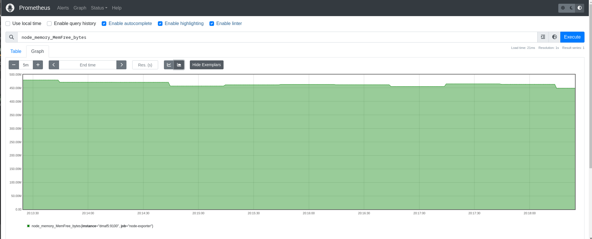
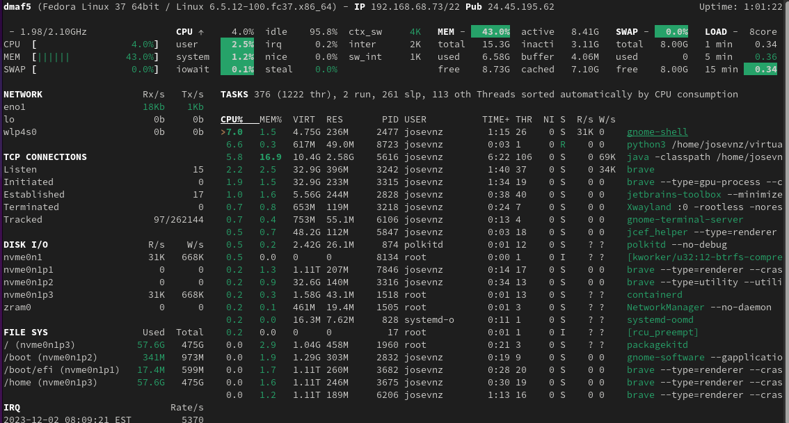
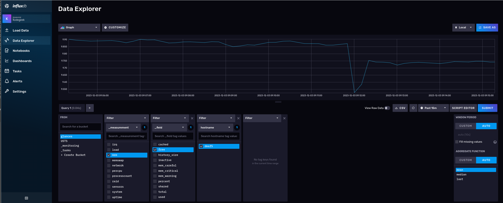

# Monitoring Linux Systems With InfluxDB

InfluxDB offers very complete query capabilities, and it is also pretty good at storing time series data. On this article
I will demonstrate how you can use existing performance collection tools with InfluxDB as the storage of the captured metrics.

## What you will require for this tutorial
 
* A Docker or [Podman](https://podman.io/) installation, so you can run and instance of Influxdb; you can also do a bare metal installation, but I won't cover that here and instead will use a container.
* Influxdb 2.7.4 or better.
* A linux distribution. I used Fedora Linux.
* Python3 and [some experience writing scripts](https://www.redhat.com/sysadmin/python-scripting-intro).

## Running an Influxdb server from a container

This is maybe the easiest way to get you started; We will use an external volume to persist the data across container reboots and upgrades (please check the container page to see [all the possible options](https://hub.docker.com/_/influxdb)):

```shell=
podman pull influxdb:latest
podman run --detach --volume /data/influxdb:/var/lib/influxdb --volumne /data:/data:rw  --name influxdb_raspberrypi --restart always --publish 8086:8086 influxdb:latest --reporting-disabled
podman logs --follow influxdb_raspberrypi
```

If you run this container on Fedora or Red Hat Enterprise Linux (RHEL), use option Z when mounting a volume to ensure it receives the correct [SELinux labels](https://www.redhat.com/en/topics/linux/what-is-selinux?intcmp=701f20000012ngPAAQ).

Our running container is called 'influxdb_raspberrypi', and with the `podman logs` command we do a quick check to make sure there are no errors. 


## Integration with Prometheus

What is Prometheus? 

> Prometheus is an open source systems monitoring and alerting toolkit originally built at SoundCloud by ex-Googlers who wanted to monitor metrics on their servers and applications. 

The InfluxDB website has good documentation that explains [how to integrate Prometheus with InfluxDB](https://www.influxdata.com/integration/prometheus-monitoring-tool/) as the database backend/

### Setting up the node-exporter agent

We will run a program called [node-exporter](https://prometheus.io/docs/guides/node-exporter/), who will be responsible for catpuring Linux metrics:

```shell
curl --location --silent --output ~josevnz/Downloads/node_exporter-1.7.0.linux-amd64.tar.gz --fail https://github.com/prometheus/node_exporter/releases/download/v1.7.0/node_exporter-1.7.0.linux-amd64.tar.gz
sudo tar --directory /opt --extract --verbose --file ~josevnz/Downloads/node_exporter-1.7.0.linux-amd64.tar.gz
rm ~/Downloads/node_exporter-1.7.0.linux-amd64.tar.gz
```

Then to make it easier to start automatically across reboots, we create a systemd unit:

```shell
sudo useradd --system --comment  'Prometheus account' --no-create-home --shell /sbin/nologin prometheus
sudo chown -R prometheus /opt/prometheus
sudo EDITOR=vi systemctl edit --force --full node_exporter.service
```

And then save the following:

```text
[Unit]
Description=Node exporter Server
Documentation=https://prometheus.io/docs/guides/node-exporter/
After=network-online.target

[Service]
Restart=always
User=prometheus
EnvironmentFile=/etc/default/prometheus-node-exporter
ExecStart=/opt/prometheus/node_exporter-1.7.0.linux-amd64/node_exporter $ARGS
ExecReload=/bin/kill -HUP $MAINPID
TimeoutStopSec=20s
SendSIGKILL=no

[Install]
WantedBy=multi-user.target
```

Bring it up:

```shell
# Basic settings for the exporter
sudo echo 'ARGS="--web.listen-address=:9100"' > /etc/default/prometheus-node-exporter
# Enable the service
sudo systemctl daemon-reload
sudo systemctl enable --now node_exporter.service
[josevnz@dmaf5 MonitoringWithInfluxDB]$ sudo systemctl status node_exporter.service
● node_exporter.service - Node exporter Server
     Loaded: loaded (/etc/systemd/system/node_exporter.service; enabled; preset: disabled)
     Active: active (running) since Sun 2023-12-03 07:43:39 EST; 6h ago
       Docs: https://prometheus.io/docs/guides/node-exporter/
   Main PID: 1624 (node_exporter)
      Tasks: 5 (limit: 18743)
     Memory: 18.0M
        CPU: 44ms
     CGroup: /system.slice/node_exporter.service
             └─1624 /opt/prometheus/node_exporter-1.5.0.linux-amd64/node_exporter --web.listen-address=:9100
```

Then you can open your browser on http://localhost:9100. For example, using curl:

```shell
[josevnz@dmaf5 MonitoringWithInfluxDB]$ curl --fail --silent http://dmaf5:9100/metrics
# HELP go_gc_duration_seconds A summary of the pause duration of garbage collection cycles.
# TYPE go_gc_duration_seconds summary
go_gc_duration_seconds{quantile="0"} 3.228e-05
go_gc_duration_seconds{quantile="0.25"} 3.228e-05
go_gc_duration_seconds{quantile="0.5"} 5.1216e-05
go_gc_duration_seconds{quantile="0.75"} 5.1216e-05
go_gc_duration_seconds{quantile="1"} 5.1216e-05
go_gc_duration_seconds_sum 8.3496e-05
go_gc_duration_seconds_count 2
# HELP go_goroutines Number of goroutines that currently exist.
# TYPE go_goroutines gauge
go_goroutines 8
# HELP go_info Information about the Go environment.
# TYPE go_info gauge
go_info{version="go1.19.3"} 1
```

### Connecting Prometheus with node-exporter

Prometheus is in charge is collecting metrics from agents on our Linux machine and other servers. Time to install it:

```shell
curl --fail --silent --location --output ~/Downloads/prometheus-2.45.1.linux-amd64.tar.gz  https://github.com/prometheus/prometheus/releases/download/v2.45.1/prometheus-2.45.1.linux-amd64.tar.gz && echo OK|| echo FAIL
sudo tar --extract --file --verbose ~josevnz/Downloads/prometheus-2.45.1.linux-amd64.tar.gz
sudo chown -R prometheus /opt/prometheus-2.45.1.linux-amd64
rm ~/Downloads/prometheus-2.45.1.linux-amd64.tar.gz
```

Prometheus needs details where to scrape the data, we define settings like this:
```shell
sudo vi /etc/prometheus/prometheus.yaml
```

The resulting `/etc/prometheus/prometheus.yaml` file:

```yaml
---
global:
    scrape_interval: 30s
    evaluation_interval: 30s
    scrape_timeout: 10s
    external_labels:
        monitor: 'nunez-family-monitor'

scrape_configs:
    - job_name: 'node-exporter'
      static_configs:
          - targets: ['dmaf5.home:9100']
```

I strongly recommend you validate your syntax using `yamllint /etc/promethus/prometheus.yaml`.

Once the vi editor is open, you can then define the following systemd unit for it:

```shell
sudo EDITOR=vi systemctl edit --force --full prometheus.service
```

Then add the following:

```text
[Unit]
Description=Prometheus Server
Documentation=https://prometheus.io/docs/guides/
After=network-online.target

[Service]
Restart=always
User=prometheus
EnvironmentFile=/etc/default/prometheus-node-exporter
ExecStart=/opt/prometheus-2.45.1.linux-amd64/prometheus $ARGS
ExecReload=/bin/kill -HUP $MAINPID
TimeoutStopSec=20s
SendSIGKILL=no

[Install]
WantedBy=multi-user.target
```

Enable it and check the logs:

```shell
sudo systemctl daemon-reload
sudo systemctl enable prometheus.service --now
[josevnz@dmaf5 MonitoringWithInfluxDB]$ sudo systemctl status prometheus.service
● prometheus.service - Prometheus Server
     Loaded: loaded (/etc/systemd/system/prometheus.service; enabled; preset: disabled)
     Active: active (running) since Sun 2023-12-03 14:59:13 EST; 4s ago
       Docs: https://prometheus.io/docs/guides/
   Main PID: 34580 (prometheus)
      Tasks: 13 (limit: 18743)
     Memory: 15.5M
        CPU: 107ms
     CGroup: /system.slice/prometheus.service
             └─34580 /opt/prometheus-2.45.1.linux-amd64/prometheus --config.file /etc/prometheus/prometheus.yaml --storage.tsdb.path=/opt/prometheus-2.45.1.linux-amd64/data
```

We can check now the prometheus web interface on localhost://9000:



### Connecting Prometheus with InfluxDB

Prometheus [cannot talk directly with InfluxDB 2.xx](https://www.influxdata.com/blog/prometheus-remote-write-support-with-influxdb-2-0/), so we need a third component, it is called 'Telegraf'

```shell
curl --location --fail --silent --output ~josevnz/Downloads/telegraf-1.28.5_linux_amd64.tar.gz  https://dl.influxdata.com/telegraf/releases/telegraf-1.28.5_linux_amd64.tar.gz
sudo tar --extract --verbose --directory /opt --file ~josevnz/Downloads/telegraf-1.28.5_linux_amd64.tar.gz
sudo useradd --system --comment  'Telegraf account' --no-create-home --shell /sbin/nologin telegraf
sudo mkdir -p /etc/telegraf/
sudo touch /etc/default/telegraf /etc/telegraf/telegraf.conf
sudo chown -R telegraf /opt/telegraf-1.28.5 /etc/telegraf /etc/default/telegraf
```

I borrowed the systemd unit from [Telegraf](https://github.com/influxdata/telegraf/blob/master/scripts/telegraf.service):

```shell
sudo EDITOR=vi systemctl edit --full --force telegraf.service
```
The resulting text:

```text
[Unit]
Description=Telegraf
Documentation=https://github.com/influxdata/telegraf
After=network-online.target
Wants=network-online.target

[Service]
Type=notify
EnvironmentFile=-/etc/default/telegraf
User=telegraf
ImportCredential=telegraf.*
ExecStart=/usr/bin/telegraf -config /etc/telegraf/telegraf.conf -config-directory /etc/telegraf/telegraf.d $TELEGRAF_OPTS
ExecReload=/bin/kill -HUP $MAINPID
Restart=on-failure
RestartForceExitStatus=SIGPIPE
KillMode=mixed
TimeoutStopSec=5
LimitMEMLOCK=8M:8M
PrivateMounts=true

[Install]
WantedBy=multi-user.target
```

We also need to connect Telegraf with the InfluxDB instance. This requires changes on `/etc/telegraf/telegraf.conf`:

```yaml
# TODO, add connection to dedicated telegraf bucket
```

Then start it:

```shell
sudo systemctl daemon-reload
sudo systemctl enable telegraf.service --now
```

The final step is to connect our Prometheus installation with Telegraf:

```yaml
# TODO, add remote read and write properties
```

The final step is to restart Prometheus:

```shell
systemct restart prometheus.service
```

Now we can check on the InfluxDB GUI some of the captured metrics:

# TODO snapshot

## Integration with Glances

Prometheus is a great solution to record metrics for your hosts, but what if you are in one of the following scenarios:

1) Cannot deploy a node exporter agent because you lack the privileges
2) Want to get insight on the host performance but for limited time and don't want to deal with a formal deployment
3) You already use Glances for monitoring and want to persist this information for later analysis

### A quick demonstration of Glances

Installation is pretty simple with pip:

```shell
[josevnz@dmaf5 ~]$ python -m venv ~/virtualenv/glances
[josevnz@dmaf5 ~]$ . ~/virtualenv/glances/bin/activate
(glances) [josevnz@dmaf5 ~]$ pip install --upgrade glance
...
Successfully installed glances-3.4.0.3
```

Normally you call glances without any options, to capture stats:

```shell
# Running in standalone mode
(glances) [josevnz@dmaf5 ~]$ glances
```



If we want to record out activity with Glances, we need to setup a InfluxDB, so it can accept our activity data.

### Creating a Glances bucket to store our activity data

First step is to connect to our InfluxDB instance and create a bucket, I called mine `glances`.

Most likely you already have several buckets in your InfluxDB database, we will create a new  bucket.

Get inside the influxdb_raspberrypi running container we will create a bucket, with a retention policy to keep our data forever:

```shell
josevnz@raspberrypi:~$ podman exec --tty --interactive influxdb_raspberrypi /bin/bash
root@raspberrypi:/# influx bucket create --org Kodegeek --name glances  --description 'Glances storage' --retention 0
ID			Name	Retention	Shard group duration	Organization ID		Schema Type
305430cf2f5de6fd	glances	infinite	168h0m0s		c334619ae2cd7b3d	implicit
```

Our bucket has the id '305430cf2f5de6fd'. We will use that to create an authorization token we can use to insert/ read data remotely from Glances:

```shell
josevnz@raspberrypi:~$ podman exec --tty --interactive influxdb_raspberrypi /bin/bash
root@raspberrypi:/# influx auth create --org Kodegeek --description 'Authorization for Glances' --write-bucket 305430cf2f5de6fd --read-bucket 305430cf2f5de6fd --write-buckets --read-buckets
ID			Description			Token												User Name	User ID			Permissions
0c37feccff400000	Authorization for Glances	UnmEgl1HQ7AiZB8_QrCJFYkm2tE_e82_Sd9jnkrMsj1nA0YONpazx2HHuoPK3b_GnP7WX2qNURDnUfvcQyfagw==	josevnz		09ff917433270000	[read:orgs/c334619ae2cd7b3d/buckets/305430cf2f5de6fd write:orgs/c334619ae2cd7b3d/buckets/305430cf2f5de6fd read:orgs/c334619ae2cd7b3d/buckets write:orgs/c334619ae2cd7b3d/buckets]
```

Here we got the authorization token 'UnmEgl1HQ7AiZB8_QrCJFYkm2tE_e82_Sd9jnkrMsj1nA0YONpazx2HHuoPK3b_GnP7WX2qNURDnUfvcQyfagw=='. We will use it in our Glances configuration file:

Then we need to bridge glances with InfluxDB. For that we can add the following to the Glances configuration file:

```shell
mkdir ~/.config/glances/
/bin/cat<<GLANCES>~/.config/glances/glances.conf
[global]
refresh=2
check_update=false
history_size=28800
[influxdb2]
# server2 is where InfluxDB is running
host=raspberrypi
port=8086
protocol=http
org=KodeGeek
bucket=glances
# And here you put the token we generated on the previous step
token=UnmEgl1HQ7AiZB8_QrCJFYkm2tE_e82_Sd9jnkrMsj1nA0YONpazx2HHuoPK3b_GnP7WX2qNURDnUfvcQyfagw==
GLANCES
```

Install now the [InfluxDB Python client](https://pypi.org/project/influxdb/), which allows Glances to export the metrics directly to InfluxDB:

```shell
(glances) [josevnz@dmaf5 MonitoringWithInfluxDB]$ pip install --upgrade influxdb-client
Requirement already satisfied: influxdb-client in /home/josevnz/virtualenv/glances/lib64/python3.11/site-packages (1.36.1)
Collecting influxdb-client
  Downloading influxdb_client-1.38.0-py3-none-any.whl (743 kB)
     ━━━━━━━━━━━━━━━━━━━━━━━━━━━━━━━━━━━━━━━━ 743.5/743.5 kB 8.1 MB/s eta 0:00:00
Requirement already satisfied: reactivex>=4.0.4 in /home/josevnz/virtualenv/glances/lib64/python3.11/site-packages (from influxdb-client) (4.0.4)
Requirement already satisfied: certifi>=14.05.14 in /home/josevnz/virtualenv/glances/lib64/python3.11/site-packages (from influxdb-client) (2022.12.7)
Requirement already satisfied: python-dateutil>=2.5.3 in /home/josevnz/virtualenv/glances/lib64/python3.11/site-packages (from influxdb-client) (2.8.2)
Requirement already satisfied: setuptools>=21.0.0 in /home/josevnz/virtualenv/glances/lib64/python3.11/site-packages (from influxdb-client) (67.6.0)
Requirement already satisfied: urllib3>=1.26.0 in /home/josevnz/virtualenv/glances/lib64/python3.11/site-packages (from influxdb-client) (1.26.15)
Requirement already satisfied: six>=1.5 in /home/josevnz/virtualenv/glances/lib64/python3.11/site-packages (from python-dateutil>=2.5.3->influxdb-client) (1.16.0)
Requirement already satisfied: typing-extensions<5.0.0,>=4.1.1 in /home/josevnz/virtualenv/glances/lib64/python3.11/site-packages (from reactivex>=4.0.4->influxdb-client) (4.5.0)
Installing collected packages: influxdb-client
  Attempting uninstall: influxdb-client
    Found existing installation: influxdb-client 1.36.1
    Uninstalling influxdb-client-1.36.1:
      Successfully uninstalled influxdb-client-1.36.1
Successfully installed influxdb-client-1.38.0
```

Now we just need to run Glances again:

```shell
. ~/virtualenv/glances/bin/activate
# Refresh every 5 seconds, export to influxdb2
glances --time 5 --export influxdb2
```

Make sure that you have set up your authorization configuration properly. On the InfluxDB container you should not see these:

```shell
podman logs --follow influxdb_raspberrypi
2023-12-03T13:10:49.944038Z	info	Unauthorized	{"log_id": "0lVhMguW000", "error": "authorization not found"}
2023-12-03T13:11:33.357711Z	info	Unauthorized	{"log_id": "0lVhMguW000", "error": "token required"}
```

Optionally you could run [tshark](https://tshark.dev/analyze/packet_hunting/packet_hunting/) and confirm that glances is making POST requests to the InfluxDB endpoint:

```shell
[josevnz@dmaf5 ~]$ tshark -i eno1 -Y http.request -f "host 192.168.68.60 and tcp port 8086"
Capturing on 'eno1'
 ** (tshark:18229) 09:58:47.993686 [Main MESSAGE] -- Capture started.
 ** (tshark:18229) 09:58:47.994375 [Main MESSAGE] -- File: "/var/tmp/wireshark_eno19kN1jG.pcapng"
   11 2.690111928 192.168.68.73 → 192.168.68.60 HTTP 881 POST /api/v2/write?org=Kodegeek&bucket=glances&precision=ns HTTP/1.1  (text/plain)
   24 3.824977400 192.168.68.73 → 192.168.68.60 HTTP 891 POST /api/v2/write?org=Kodegeek&bucket=glances&precision=ns HTTP/1.1  (text/plain)
   37 4.128239147 192.168.68.73 → 192.168.68.60 HTTP 901 POST /api/v2/write?org=Kodegeek&bucket=glances&precision=ns HTTP/1.1  (text/plain)
   51 5.872746588 192.168.68.73 → 192.168.68.60 HTTP 907 POST /api/v2/write?org=Kodegeek&bucket=glances&precision=ns HTTP/1.1  (text/plain)
   71 6.120250641 192.168.68.73 → 192.168.68.60 HTTP 868 POST /api/v2/write?org=Kodegeek&bucket=glances&precision=ns HTTP/1.1  (text/plain)
   91 6.503915790 192.168.68.73 → 192.168.68.60 HTTP 870 POST /api/v2/write?org=Kodegeek&bucket=glances&precision=ns HTTP/1.1  (text/plain)
  104 7.838737858 192.168.68.73 → 192.168.68.60 HTTP 883 POST /api/v2/write?org=Kodegeek&bucket=glances&precision=ns HTTP/1.1  (text/plain)
  117 8.576475158 192.168.68.73 → 192.168.68.60 HTTP 884 POST /api/v2/write?org=Kodegeek&bucket=glances&precision=ns HTTP/1.1  (text/plain)

```

At 'glance' not much is happening (_pun intended_) but if we go to the InfluxDB data explorer we will see a new bucket there, along with few collections:



This particular time series shows **memory utilization over time**, where Glances is running. Glances by default collects many interesting metrics out of the box.

## What did we learn

* If you are still curious about the Prometheus and InfluxDB overlapping functionalities, [you should read this comparison](https://prometheus.io/docs/introduction/comparison/).
* I showed you how to use tshark for troubleshooting. This tool [is a must](https://tshark.dev/) in your back of tricks.
* There are RPM available for Fedora to install node-exporter, Prometheus, Telegram. Feel free to try them, I wanted extra flexibility for my installation, so I decided to perform most of the installation steps manually.
* Glances and Prometheus _are not the only possible integrations with InfluxDB_. Many more are supported thanks to the [Telegraf plugins](https://docs.influxdata.com/telegraf/v1/plugins/).
* Source code for the Glances and InfluxDB integration can [be downloaded from here](https://github.com/josevnz/GlancesAndInfluxDB), with examples.