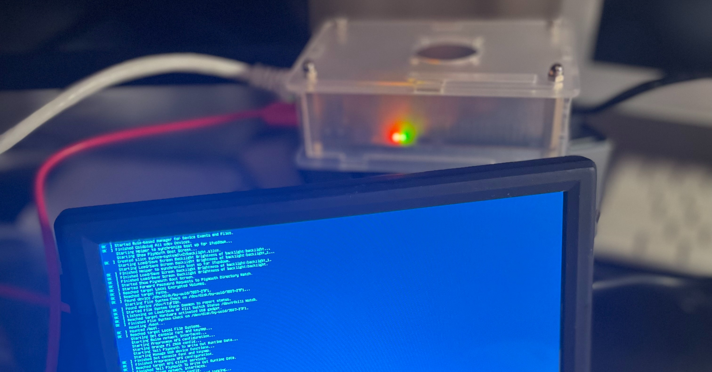

I was tasked recently to find which of our processes was accessing a [NFS share](https://en.wikipedia.org/wiki/Network_File_System). During this process, I found that some tools are better adapted than others for the task.

In this article, I want to share with you my findings. The whole process was fun and gave me ideas on how to use these tools to tackle similar problems in the future.

## What is NFS?

From Wikipedia:

> Network File System (NFS) is a distributed file system protocol originally developed by Sun Microsystems (Sun) in 1984, allowing a user on a client computer to access files over a computer network much like local storage is accessed. NFS, like many other protocols, builds on the Open Network Computing Remote Procedure Call (ONC RPC) system. NFS is an open IETF standard defined in a Request for Comments (RFC), allowing anyone to implement the protocol.

Please note that this is not a full tutorial on NFS. For that, please take a look at the following [tutorial](https://www.redhat.com/sysadmin/getting-started-nfs). Instead here we will focus only on detecting acces to a shared drive using several techiques as well setting up 2 servers and one client.

Also, I do use a different OS to set up both the server and the client so instructions on how to do the task change a little bit.

## How to Set Up a NFS Server and Client

My lab setup has one NFS server and two clients:


On my setup, I will have three computers talking to each other. One of them will be the NFS server and the other two will be a client.

| Machine     | OS                               | Hardware                                      | Mode                     |
|-------------|----------------------------------|-----------------------------------------------|--------------------------|
| OrangePi5   | Ubuntu Armbian 23.8.1 jammy      | Orange Pi 5                                   | Server:/data             |
| RaspberriPi | Debian 20.04.4 LTS (Focal Fossa) | Raspberry Pi 4 Model B Rev 1.4                | Server:/var/log/suricata |
| Dmaf5       | Fedora 37 (Workstation Edition)  | AMD Ryzen 5 3550H with Radeon Vega Mobile Gfx | Client                   |

### How to Configure the Server

I will prepare my OrangePI machine to be the NFS server. Do so, enter the following commands:

```shell
sudo apt-get update
sudo apt-get upgrade
sudo apt-get install nfs-kernel-server -y
sudo systemctl enable nfs-kernel-server.service --now
```

Next step is to tell the [server we want to share](https://ubuntu.com/server/docs/service-nfs). 

For that, we will edit the [/etc/exports](https://www.man7.org/linux/man-pages/man5/exports.5.html) file (```sudo vi /etc/exports history```):

```text
/data *(ro,all_squash,async,no_subtree_check)
```

Please check the man page to understand what these options mean. 

In a nutshell, export /data:

* Is read-only
* Maps IDs to anonymous id
* This option allows the NFS server to violate the NFS protocol and reply to requests before any changes made by that request have been committed to stable storage
* This option disables subtree checking. It's the default.

Now it is time to activate our shared directories:

```shell
root@orangepi5:~# sudo exportfs -a
root@orangepi5:~# sudo showmount -e
Export list for orangepi5:
/data (everyone)
```

I did something similar to the other host, raspberrypi:

```shell
root@raspberrypi:~# cat /etc/exports
# /etc/exports: the access control list for filesystems which may be exported
#		to NFS clients.  See exports(5).
#
/var/log/suricata *(ro,all_squash,async,no_subtree_check)
root@raspberrypi:~# showmount -e
Export list for raspberrypi:
/var/log/suricata *
```

### How to Configure the Client

First thing is to confirm we can indeed see the shared mount points from our server:

```shell
(tutorials) [josevnz@dmaf5 SpyOnNfs]$ sudo showmount -e orangepi5
Export list for orangepi5:
/data raspberrypi,dmaf5
```

Data is shared with two machines – just what we expected.

Now, there are several ways to mount this drive. One of them is manually,  another one is at startup, and the last one, my preferred one, is on demand.

#### How to Set Up the AutoMount Client on Fedora Linux

First we [set the service](https://access.redhat.com/documentation/en-us/red_hat_enterprise_linux/4/html/system_administration_guide/mounting_nfs_file_systems-mounting_nfs_file_systems_using_autofs):

```shell
sudo dnf install -y autofs
sudo systemct enable autofs.service --now
```

Then we set this up, so we end mounting remote /data into local /misc/data. For that, sdd the following line to your /etc/auto.master:

```shell
[root@dmaf5 ~]# vi /etc/auto.misc
# After editing the file, adding our entry to the last line of the file ...
[root@dmaf5 ~]# cat /etc/auto.misc
#
# This is an automounter map and it has the following format
# key [ -mount-options-separated-by-comma ] location
# Details may be found in the autofs(5) manpage

cd              -fstype=iso9660,ro,nosuid,nodev :/dev/cdrom

data            -ro,soft,rsize=16384,wsize=16384 orangepi5:/data
suricata        -ro,soft,rsize=16384,wsize=16384 raspberrypi:/var/log/suricata
```

Restart the service one more time:

```shell
[root@dmaf5 ~]# systemctl enable autofs.service --now
```

And the smoke test:

```shell
[root@dmaf5 ~]# ls -l /misc/data
total 0
drwxrwxr-x. 1 root 1001 48 Apr  7 17:57 nexus
[root@dmaf5 ~]# ls /misc/suricata
certs       eve.json.7  files            http.log    stats.log.1     suricata.log.2        suricata-start.log.3  tls.log.4
core        fast.log    http-data.log    http.log.1  stats.log.2     suricata.log.3        suricata-start.log.4  tls.log.5
eve.json    fast.log.1  http-data.log.1  http.log.2  stats.log.3     suricata.log.4        suricata-start.log.5  tls.log.6
eve.json.1  fast.log.2  http-data.log.2  http.log.3  stats.log.4     suricata.log.5        suricata-start.log.6  tls.log.7
eve.json.2  fast.log.3  http-data.log.3  http.log.4  stats.log.5     suricata.log.6        suricata-start.log.7
eve.json.3  fast.log.4  http-data.log.4  http.log.5  stats.log.6     suricata.log.7        tls.log
eve.json.4  fast.log.5  http-data.log.5  http.log.6  stats.log.7     suricata-start.log    tls.log.1
eve.json.5  fast.log.6  http-data.log.6  http.log.7  suricata.log    suricata-start.log.1  tls.log.2
eve.json.6  fast.log.7  http-data.log.7  stats.log   suricata.log.1  suricata-start.log.2  tls.log.3
```

Now we are ready to play with our service.

## How to Create a Python Program that Reads Files into the NFS Server

For our example, we want to determine if a Python application is reading data from this directory. This script has 2 features:

* Performs a one time read view of a file. This will teach us how to capture this type of scenerarios, when a file is not opened all the time
* And the script also follows updates on a file periodically.

Here is how our test script looks like in action:

```shell
./scripts/test_script.py \
--quick_read /misc/data/nexus/log/jvm.log \
--follow /misc/suricata/eve.json \
--verbose
...
2023-09-10 14:48:22,889 <dependency_failed type='leaf_type' ctxk='java/io/FileOutputStream' witness='java/net/SocketOutputStream' stamp='66511.794'/>
2023-09-10 14:48:22,889 <dependency_failed type='leaf_type' ctxk='java/io/FileOutputStream' witness='java/net/SocketOutputStream' stamp='66511.794'/>
2023-09-10 14:48:22,889 <dependency_failed type='leaf_type' ctxk='java/io/FileOutputStream' witness='java/net/SocketOutputStream' stamp='66511.794'/>
2023-09-10 14:48:22,889 <dependency_failed type='leaf_type' ctxk='java/io/FileOutputStream' witness='java/net/SocketOutputStream' stamp='66511.794'/>
2023-09-10 14:48:22,889 <dependency_failed type='leaf_type' ctxk='java/io/FileOutputStream' witness='java/net/SocketOutputStream' stamp='66511.794'/>
2023-09-10 14:48:22,889 <dependency_failed type='leaf_type' ctxk='java/io/FileOutputStream' witness='java/net/SocketOutputStream' stamp='66511.794'/>
2023-09-10 14:48:22,889 <dependency_failed type='leaf_type' ctxk='java/io/FileOutputStream' witness='java/net/SocketOutputStream' stamp='66511.794'/>
2023-09-10 14:48:22,890 <dependency_failed type='leaf_type' ctxk='java/io/FileOutputStream' witness='java/net/SocketOutputStream' stamp='66511.794'/>
2023-09-10 14:48:22,890 <dependency_failed type='unique_concrete_method' ctxk='java/io/ByteArrayOutputStream' x='java/io/ByteArrayOutputStream write ([BII)V' witness='sun/security/ssl/HandshakeOutStream' stamp='66511.855'/>
2023-09-10 14:48:22,890 <dependency_failed type='unique_concrete_method' ctxk='java/io/ByteArrayOutputStream' x='java/io/ByteArrayOutputStream write ([BII)V' witness='sun/security/ssl/HandshakeOutStream' stamp='66511.855'/>
...
# Ctrl-C to exit
```

The code, written in Python, is pretty simple:

```python
#!/usr/bin/env python
"""
Simple script to simulate light activity on NFS drives
Author Jose Vicente Nunez (kodegeek.com@protonmail.com)
"""
import concurrent
import os
import time
from concurrent.futures import ThreadPoolExecutor, ALL_COMPLETED
from pathlib import Path
from argparse import ArgumentParser
import logging

logging.basicConfig(format='%(asctime)s %(message)s', encoding='utf-8', level=logging.DEBUG)


def forever_read(the_file: Path, verbose: bool = False):
    for line in continuous_read(the_file=the_file):
        if verbose:
            logging.warning(line.strip())


def continuous_read(the_file: Path):
    """
    Continuously read the contents of file
    :param the_file:
    :return:
    """
    with open(the_file, 'r') as file_data:
        file_data.seek(0, os.SEEK_END)
        while True:
            line = file_data.readline()
            if not line:
                time.sleep(0.1)
                continue
            yield line


def quick_read(the_file: Path, verbose: bool = False):
    """
    Red the whole file and close it once done
    :param verbose:
    :param the_file:
    :return:
    """
    with open(the_file, 'r') as file_data:
        for line in file_data:
            if verbose:
                logging.warning(line.strip())


if __name__ == "__main__":
    PARSER = ArgumentParser(description=__doc__)
    PARSER.add_argument(
        '--verbose',
        action='store_true',
        default=False,
        help='Enable verbose mode'
    )
    PARSER.add_argument(
        '--quick_read',
        type=Path,
        required=True,
        help='Read a file once'
    )
    PARSER.add_argument(
        '--follow',
        type=Path,
        required=True,
        help='Read a file continuously'
    )
    OPTIONS = PARSER.parse_args()
    try:
        with ThreadPoolExecutor(max_workers=3) as tpe:
            futures = [
                tpe.submit(forever_read, OPTIONS.follow, OPTIONS.verbose),
                tpe.submit(quick_read, OPTIONS.quick_read, OPTIONS.verbose)
            ]
            concurrent.futures.wait(futures, return_when=ALL_COMPLETED)
    except KeyboardInterrupt:
        pass
```

Now, let's go over how we can see if our script is indeed accessing an NFS partition.

### Common steps

First we need to learn where to look for. So on the machine, check for NFS on /etc/fstab (for mount points that are available since the machine was rebooted):

```shell
[root@dmaf5 ~]# rg -e 'rsize=' /etc/fstab
```

Then on the AutoMount files:

```shell
[root@dmaf5 ~]# rg -e 'rsize=' /etc/auto*
/etc/auto.misc
17:data            -ro,soft,rsize=16384,wsize=16384 orangepi5:/data
18:suricata        -ro,soft,rsize=16384,wsize=16384 raspberrypi:/var/log/suricata
```

The regular expressions are not exact science, but you get the idea what to look for next.

### Using the tools

We need to confirm if there was access to any of the following partitions mounted over NFS:

* /misc/data
* /misc/suricata

Next will show you a set of tools that will make the task easier, each one of them with their own strength and limitations.

Starting with [lsof](https://www.redhat.com/sysadmin/analyze-processes-lsof) and [ripgrep](https://github.com/BurntSushi/ripgrep) combined.

### Lsof and rg (capture and filtering)

```shell
[josevnz@dmaf5 docs]$ lsof -w -b| rg -e '/misc/data|/misc/suricata'
python    36509                 josevnz    3   unknown                           /misc/suricata/eve.json
python    36509 36510 python    josevnz    3   unknown                           /misc/suricata/eve.json
python    36509 36511 python    josevnz    3   unknown                           /misc/suricata/eve.json
```

I passed the '-b' options to lsof to avoid it from getting stuck, in case the [NFS handle is stale](https://access.redhat.com/solutions/2674).

A few things about lsof:
* If you are using Autofs, you should know than mount points eventually get un-mounted to save bandwidth. This can be problematic when
trying to catch the access of a file that is only opened once. 
* The short-lived read didn't show up because the filehandle was close after we inspected the process.
* If you want to monitor ALL the processes on this machine, you may need run as root. You can only inspect your own processes without special privileges.

Still, lsof is a great tool to investigate.

Next strategy involves monitoring from the beginning, to catch the elusive short-read. We will use [strace](https://strace.io/)

### Using strace

```shell
sudo dnf install -y strace
(tutorials) [josevnz@dmaf5 SpyOnNfs]$ strace -f ./scripts/test_script.py --quick_read /misc/data/nexus/log/jvm.log --follow /misc/suricata/eve.json 2>&1| rg -e '/misc/data|/misc/suricata'
execve("./scripts/test_script.py", ["./scripts/test_script.py", "--quick_read", "/misc/data/nexus/log/jvm.log", "--follow", "/misc/suricata/eve.json"], 0x7ffd9ae29738 /* 46 vars */) = 0
execve("/home/josevnz/virtualenv/tutorials/bin/python", ["python", "./scripts/test_script.py", "--quick_read", "/misc/data/nexus/log/jvm.log", "--follow", "/misc/suricata/eve.json"], 0x7ffe269dbf88 /* 46 vars */) = 0
[pid 38241] openat(AT_FDCWD, "/misc/suricata/eve.json", O_RDONLY|O_CLOEXEC <unfinished ...>
[pid 38242] openat(AT_FDCWD, "/misc/data/nexus/log/jvm.log", O_RDONLY|O_CLOEXEC <unfinished ...>
```

The ```openat(AT_FDCWD)``` entries give away the two files our script is reading from NFS. But as you can tell this approach has some caveats:

* We are filtering the output. Best is to save the output to a file with 'tee' and then search there
* It requires starting the process with strace from the beginning. Yes, you could do a 'strace -p $PID' to attach later to the process, but you risk missing short-lived reads

There is a different way? Time to move on to the next tool, [tshark](https://www.wireshark.org/docs/man-pages/tshark.html) and how to use a network capture to confirm access to the share.

### Using tshark

We can also capture the network traffic and filter out only NFS. [It is not perfect](https://ask.wireshark.org/question/3582/how-to-capture-filename-path-for-nfsv4-traffic-using-tshark/), but it may be sufficient.

Find out first which network interface is used to communicate with the NFS server. In my case is easy, they all connect using a wired private network:

```shell
[josevnz@dmaf5 docs]$ ip --oneline address|rg -e 'eno|wlp'
3: eno1    inet 192.168.68.70/22 brd 192.168.71.255 scope global dynamic noprefixroute eno1\       valid_lft 4568sec preferred_lft 4568sec
4: wlp4s0    inet 192.168.1.95/24 brd 192.168.1.255 scope global dynamic noprefixroute wlp4s0\       valid_lft 3423sec preferred_lft 3423sec
4: wlp4s0    inet6 fe80::ac40:5365:7f09:a5d2/64 scope link noprefixroute \       valid_lft forever preferred_lft forever
```

For this example is eno1 with IP address '192.168.68.70'. Then capture the traffic, and with some luck we will get the file path:

```shell
[root@dmaf5 ~]# tshark -i eno1 -Y "nfs"
Running as user "root" and group "root". This could be dangerous.
Capturing on 'eno1'
 ** (tshark:42326) 16:02:47.417145 [Main MESSAGE] -- Capture started.
 ** (tshark:42326) 16:02:47.417286 [Main MESSAGE] -- File: "/var/tmp/wireshark_eno1rEGxiu.pcapng"
   13 1.601197994 192.168.68.70 → 192.168.68.60 NFS 450 V4 Call GETATTR FH: 0x90ba4ee1  ; V4 Call GETATTR FH: 0x90ba4ee1
   14 1.601374466 192.168.68.70 → 192.168.68.60 NFS 258 V4 Call GETATTR FH: 0x90ba4ee1
   15 1.601395155 192.168.68.70 → 192.168.68.60 NFS 258 V4 Call GETATTR FH: 0x90ba4ee1
   16 1.602155254 192.168.68.60 → 192.168.68.70 NFS 310 V4 Reply (Call In 13) GETATTR
   17 1.602368826 192.168.68.60 → 192.168.68.70 NFS 554 V4 Reply (Call In 13) GETATTR  ; V4 Reply (Call In 14) GETATTR
   19 1.602515091 192.168.68.70 → 192.168.68.60 NFS 274 V4 Call READ StateID: 0xa902 Offset: 57552896 Len: 12288
   20 1.602557170 192.168.68.60 → 192.168.68.70 NFS 310 V4 Reply (Call In 15) GETATTR
   22 1.603156327 192.168.68.60 → 192.168.68.70 NFS 1730 V4 Reply (Call In 19) READ
   66 4.611124808 192.168.68.70 → 192.168.68.60 NFS 642 V4 Call GETATTR FH: 0x90ba4ee1  ; V4 Call GETATTR FH: 0x90ba4ee1  ; V4 Call GETATTR FH: 0x90ba4ee1
   67 4.611301059 192.168.68.70 → 192.168.68.60 NFS 258 V4 Call GETATTR FH: 0x90ba4ee1
   68 4.611809385 192.168.68.60 → 192.168.68.70 NFS 310 V4 Reply (Call In 66) GETATTR
   69 4.611887552 192.168.68.60 → 192.168.68.70 NFS 310 V4 Reply (Call In 66) GETATTR
   71 4.611976479 192.168.68.60 → 192.168.68.70 NFS 310 V4 Reply (Call In 66) GETATTR
   72 4.620685968 192.168.68.60 → 192.168.68.70 NFS 310 V4 Reply (Call In 67) GETATTR
   74 5.017200005 192.168.68.70 → 192.168.68.60 NFS 250 V4 Call GETATTR FH: 0x9419c00c
   75 5.017804843 192.168.68.70 → 192.168.68.59 NFS 242 V4 Call GETATTR FH: 0x314e720f
   76 5.017838787 192.168.68.60 → 192.168.68.70 NFS 310 V4 Reply (Call In 74) GETATTR
   77 5.018131217 192.168.68.70 → 192.168.68.60 NFS 326 V4 Call OPEN DH: 0x90ba4ee1/
   78 5.018711408 192.168.68.60 → 192.168.68.70 NFS 386 V4 Reply (Call In 77) OPEN StateID: 0x9984
   79 5.018855699 192.168.68.59 → 192.168.68.70 NFS 310 V4 Reply (Call In 75) GETATTR
   81 5.018980434 192.168.68.70 → 192.168.68.59 NFS 262 V4 Call GETATTR FH: 0xecd332cc
   82 5.019934959 192.168.68.59 → 192.168.68.70 NFS 310 V4 Reply (Call In 81) GETATTR
   83 5.020032853 192.168.68.70 → 192.168.68.59 NFS 262 V4 Call GETATTR FH: 0x261d4440
   84 5.020734032 192.168.68.59 → 192.168.68.70 NFS 310 V4 Reply (Call In 83) GETATTR
   85 5.020874175 192.168.68.70 → 192.168.68.59 NFS 330 V4 Call OPEN DH: 0xc9b4831b/
```

This is great, there is activity against 2 NFS servers, 192.168.68.59 and 192.168.68.60. But, there is a way to see the name of files?

tshark has a way to spit information by field. Problem is, NFS has lots of them:

```shell
[root@dmaf5 ~]# for field in $(tshark -G fields| cut -d'        ' -f3|rg -e '^nfs\.'); do echo "-e $field"; done|head -n 10
Running as user "root" and group "root". This could be dangerous.
-e nfs.unknown
-e nfs.svr4
-e nfs.knfsd_le
-e nfs.nfsd_le
-e nfs.knfsd_new
-e nfs.ontap_v3
-e nfs.ontap_v4
-e nfs.ontap_gx_v3
-e nfs.celerra_vnx
-e nfs.gluster
```

So let's [capture them](https://www.wireshark.org/docs/dfref/n/nfs.html) into a variable ([also need to enable some options](https://wiki.wireshark.org/NFS_Preferences)):

```shell
[root@dmaf5 ~]# fields=$(for field in $(tshark -G fields| cut -d'       ' -f3|rg -e '^nfs\.'); do echo "-e $field"; done)
[root@dmaf5 ~]# tshark -i eno1 --enable-protocol nfs -o nfs.file_name_snooping:true -o nfs.file_full_name_snooping:true -T fields -E header=y -E separator=, -E quote=d $fields
Running as user "root" and group "root". This could be dangerous.
nfs.unknown,nfs.svr4,nfs.knfsd_le,nfs.nfsd_le,nfs.knfsd_new,nfs.ontap_v3,nfs.ontap_v4,nfs.ontap_gx_v3,n...
```

I managed to get the filename only once, then after interrupting and restarting the program I got no luck.

And yet no sign of the file name. The file handle was in the contents but this is not very useful if you want a quick way to see what was accessed.

There is an easier way to do this? Sysdig may offer some answers.

### Using Sysdig

While trying to find the elusive mount points, I stumbled into [Sysdig](https://github.com/draios/sysdig):

Sysdig instruments your physical and virtual machines at the OS level by installing into the Linux kernel and capturing system calls and other OS events. 

Sysdig also makes it possible to create trace files for system activity, similarly to what you can do for networks with tools like tcpdump and Wireshark. 

I decided to use the latest version ([0.33.1](https://github.com/draios/sysdig/releases/tag/0.33.1)) for Fedora 37 where my script is running):

```shell
sudo dnf install -y https://github.com/draios/sysdig/releases/download/0.33.1/sysdig-0.33.1-x86_64.rpm
# Wait a little bit, as a kernel module needs to be compiled and prepared...
Installed:
  bison-3.8.2-3.fc37.x86_64                    dkms-3.0.11-1.fc37.noarch          elfutils-libelf-devel-0.189-3.fc37.x86_64  flex-2.6.4-11.fc37.x86_64            kernel-devel-6.4.13-100.fc37.x86_64 
  kernel-devel-matched-6.4.13-100.fc37.x86_64  libzstd-devel-1.5.5-1.fc37.x86_64  m4-1.4.19-4.fc37.x86_64                    openssl-devel-1:3.0.9-1.fc37.x86_64  sysdig-0.33.1-1.x86_64              
  zlib-devel-1.2.12-5.fc37.x86_64             
```

How easy is to probe out script is indeed accessing the NFS mounted directories? Let's print three fields of interest and the name of the accesed file:

```shell
# `sysdig -l` will output every single field you can capture
[root@dmaf5 ~]# sysdig -p"%proc.cmdline,%fd.name" proc.name contains python and fd.name contains /misc
python ./scripts/test_script.py --quick_read /misc/data/nexus/log/jvm.log --follow /misc/suricata/eve.json --verbose,/misc/suricata/eve.json
python ./scripts/test_script.py --quick_read /misc/data/nexus/log/jvm.log --follow /misc/suricata/eve.json --verbose,/misc/suricata/eve.json
python ./scripts/test_script.py --quick_read /misc/data/nexus/log/jvm.log --follow /misc/suricata/eve.json --verbose,/misc/suricata/eve.json
python ./scripts/test_script.py --quick_read /misc/data/nexus/log/jvm.log --follow /misc/suricata/eve.json --verbose,/misc/suricata/eve.json
python ./scripts/test_script.py --quick_read /misc/data/nexus/log/jvm.log --follow /misc/suricata/eve.json --verbose,/misc/suricata/eve.json
python ./scripts/test_script.py --quick_read /misc/data/nexus/log/jvm.log --follow /misc/suricata/eve.json --verbose,/misc/suricata/eve.json
python ./scripts/test_script.py --quick_read /misc/data/nexus/log/jvm.log --follow /misc/suricata/eve.json --verbose,/misc/suricata/eve.json
python ./scripts/test_script.py --quick_read /misc/data/nexus/log/jvm.log --follow /misc/suricata/eve.json --verbose,/misc/suricata/eve.json
python ./scripts/test_script.py --quick_read /misc/data/nexus/log/jvm.log --follow /misc/suricata/eve.json --verbose,/misc/suricata/eve.json
python ./scripts/test_script.py --quick_read /misc/data/nexus/log/jvm.log --follow /misc/suricata/eve.json --verbose,/misc/data/nexus/log/jvm.log
python ./scripts/test_script.py --quick_read /misc/data/nexus/log/jvm.log --follow /misc/suricata/eve.json --verbose,/misc/data/nexus/log/jvm.log
python ./scripts/test_script.py --quick_read /misc/data/nexus/log/jvm.log --follow /misc/suricata/eve.json --verbose,/misc/data/nexus/log/jvm.log
python ./scripts/test_script.py --quick_read /misc/data/nexus/log/jvm.log --follow /misc/suricata/eve.json --verbose,/misc/data/nexus/log/jvm.log
python ./scripts/test_script.py --quick_read /misc/data/nexus/log/jvm.log --follow /misc/suricata/eve.json --verbose,/misc/data/nexus/log/jvm.log
python ./scripts/test_script.py --quick_read /misc/data/nexus/log/jvm.log --follow /misc/suricata/eve.json --verbose,/misc/data/nexus/log/jvm.log
python ./scripts/test_script.py --quick_read /misc/data/nexus/log/jvm.log --follow /misc/suricata/eve.json --verbose,/misc/data/nexus/log/jvm.log
...
```

What if you want to capture all the data, and filter later? One way to do it is capturing to a file:

```shell
# Capture for one minute...
[root@dmaf5 ~]# timeout --preserve-status 1m sysdig -w /tmp/sysdig.dump
[root@dmaf5 ~]# ls -lh /tmp/sysdig.dump
-rw-r--r--. 1 root root 32M Sep 10 19:03 /tmp/sysdig.dump
```

And then replay the contents, with filtering (replay doesn't need elevated privileges):

```shell
[root@dmaf5 ~]# sysdig -r /tmp/sysdig.dump -p"%proc.cmdline,%fd.name" proc.name contains python and fd.name contains /misc|sort -u
python ./scripts/test_script.py --quick_read /misc/data/nexus/log/jvm.log --follow /misc/suricata/eve.json --verbose,/misc/data/nexus/log/jvm.log
python ./scripts/test_script.py --quick_read /misc/data/nexus/log/jvm.log --follow /misc/suricata/eve.json --verbose,/misc/suricata/eve.json
```

Sysdig supports scripting, using the [LUA language](https://www.lua.org/). For example, it has a very convenient version of lsof:

```shell
[root@dmaf5 ~]# sysdig -cl|rg lsof
lsof            List (and optionally filter) the open file descriptors.
```

So let's use it:

```shell
[root@dmaf5 ~]# sysdig -c lsof|rg misc
automount           52410   52410   root    8       directory   /misc
automount           52410   52413   root    8       directory   /misc
automount           52410   52414   root    8       directory   /misc
automount           52410   52415   root    8       directory   /misc
automount           52410   52418   root    8       directory   /misc
automount           52410   52421   root    8       directory   /misc
python              75840   75840   josevnz 3       file        /misc/suricata/eve.json
python              75840   75841   josevnz 3       file        /misc/suricata/eve.json
python              75840   75842   josevnz 3       file        /misc/suricata/eve.json
```

What I liked about this tool:

* Can work with older kernels (like 4.xx)
* Has a powerful expression language for filtering
* Easy to learn and well documented
* You can write your own scripts if you know LUA

Before finishing up let's look at one more tool, BPF.

### BPF probe

Originally Berkeley Packet Filter, is a kernel and user-space observability scheme for Linux.

The BPF is a [very powerful tool](https://www.linuxjournal.com/content/bpf-observability-getting-started-quickly), and this short article won't even scratch the surface.

Yes, this is huge. I'm learning this myself.

I found that the [bcc](https://github.com/iovisor/bcc) repository has lots of ready to use scripts that we could use to track our NFS access, and even check for performance (more examples [here](https://github.com/iovisor/bpftrace), and on the [BPF Performance Book repository](https://github.com/brendangregg/bpf-perf-tools-book/tree/master)).

But more interesting is how you can write tools yourself to monitor pretty much anything you want. For this tutorial, I will use some ready to use programs that use the traces to capture useful information.

As a first step, we will need to install a high level interpreter for our scripts. Again, on my Fedora Linux machine:

```shell
[josevnz@dmaf5 ~]$ sudo dnf install -y bpftrace.x86_64 bcc-tools.x86_64
# And check if the kernel has btf enabled
[josevnz@dmaf5 ~]$ ls -la /sys/kernel/btf/vmlinux
-r--r--r--. 1 root root 5635179 Sep 12 04:21 /sys/kernel/btf/vmlinux
```

On a separate terminal run again the NFS test script:
```shell
. ~/virtualenv/tutorials/bin/activate
cd SpyOnNfs/
./scripts/test_script.py --quick_read /misc/data/nexus/log/jvm.log --follow /misc/suricata/eve.json --verbose
```

You can trace all the files opened by a program, like top:

```shell
18:59:20 loadavg: 1.20 1.00 0.74 1/1175 28520

TID     COMM             READS  WRITES R_Kb    W_Kb    T FILE
28520   clear            2      0      60      0       R xterm-256color
28203   python           7      0      56      0       R eve.json
28347   filetop          2      0      15      0       R loadavg
824     systemd-oomd     2      0      8       0       R memory.swap.current
824     systemd-oomd     2      0      8       0       R memory.low
...
```

But it doesn't print the full path. It's more useful to ask a NFS snoop and see if one of our files show up:

```shell
[josevnz@dmaf5 SuricataLog]$ sudo /usr/share/bcc/tools/nfsslower 1
# Commented out some warnings ...
Tracing NFS operations that are slower than 1 ms... Ctrl-C to quit
TIME     COMM           PID    T BYTES   OFF_KB   LAT(ms) FILENAME
19:02:25 python         28202  R 1460    62150       1.96 eve.json
19:02:28 python         28202  R 2446    62151       2.09 eve.json
19:02:31 python         28202  R 970     62154       1.99 eve.json
19:02:34 python         28202  R 3335    62155       2.43 eve.json
19:02:37 python         28202  R 4564    62158       1.84 eve.json
19:02:40 python         28202  R 5876    62162       1.89 eve.json
19:02:43 python         28202  R 4504    62168       1.61 eve.json
19:02:46 python         28202  R 3131    62173       1.92 eve.json
```
This is much better. Also, we can see than the latency is almost two milliseconds.

We can also monitor mount/ umount operations:

```shell
[josevnz@dmaf5 SuricataLog]$ sudo /usr/share/bcc/tools/mountsnoop 
# Commented out some warnings ...
2 warnings generated.
COMM             PID     TID     MNT_NS      CALL
mount.nfs        29012   29012   4026531841  mount("orangepi5:/data", "/misc/data", "nfs", MS_RDONLY, "sloppy,soft,rsize=16384,wsize=16384,vers=4.2,addr=192.168.68.59,clientaddr=192.168.68.68") = 0
```

This is good as well, we can see the activity over NFS we wanted to confirm.

## What is next?

You learned several tools and as you may have guessed, you can use them to snoop on more than just opened files on NFS.

It is always useful to know more than one tool. Sysdig has a special mention for being very versatile, powerful and yet easy to use. Also can we extended with scripts written in the LUA language.

BPF is another alternative and will give you incredible access to the kernel calls. Be prepared to spend time reading and learning how to use the tools.
