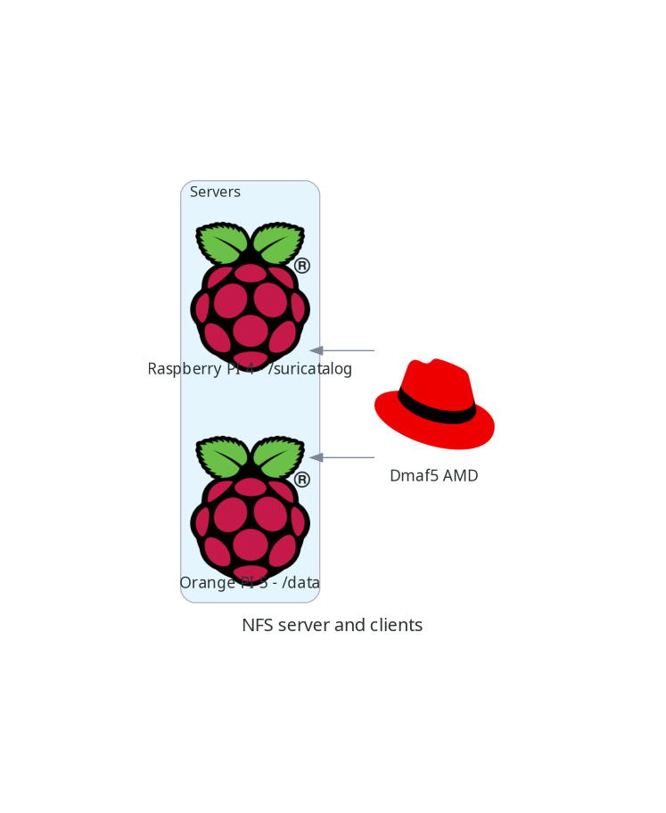

# Spy On NFS

I was tasked recently to find which of our processes was accessing a NFS share. During this process, I found than some 
tools are better adapted than others for the task.

I want to share with you my findings, the whole process was fun and gave me ideas how to use this tools
to tackle similar problems in the future.

*Please note than this is not a tutorial on NFS*. For that, please take a look to the following [tutorial](https://www.redhat.com/sysadmin/getting-started-nfs).

## A little bit of history

## NFS preparation

My lab setup has one NFS server and 2 clients:



On my setup I will have 3 computers talking to each other, one of them will be the NFS server and the other 2 will be 
a client.

| Machine     | OS                               | Hardware                                      | Mode   |
|-------------|----------------------------------|-----------------------------------------------|--------|
| OrangePi5   | Ubuntu Armbian 23.8.1 jammy      | Orange Pi 5                                   | Server |
| Dmaf5       | Fedora 37 (Workstation Edition)  | AMD Ryzen 5 3550H with Radeon Vega Mobile Gfx | Client |
| RaspberriPi | Debian 20.04.4 LTS (Focal Fossa) | Raspberry Pi 4 Model B Rev 1.4                | Client |

### Server configuration

I will prepare my OrangePI machine to be the NFS server. It is very easy to do:

```shell
sudo apt-get update
sudo apt-get upgrade
sudo apt-get install nfs-kernel-server -y
```

next step is to tell the server what we want to share. For that we will edit the [/etc/exports](https://www.man7.org/linux/man-pages/man5/exports.5.html) file (```sudo vi /etc/exports history```):

```text
/data dmaf5(ro,all_squash,async,no_subtree_check) raspberrypi(ro,all_squash,async,no_subtree_check)
```

Please check the man page to understand what this options mean.

Now it is time to activate our shared directories:

```shell
root@orangepi5:~# sudo exportfs -ra
root@orangepi5:~# sudo showmount -e
Export list for orangepi5:
/data raspberrypi,dmaf5

```

### Client configuration

First thing is to confirm we can indeed see the shared mount points from our server:

```shell
(tutorials) [josevnz@dmaf5 SpyOnNfs]$ sudo showmount -e orangepi5
Export list for orangepi5:
/data raspberrypi,dmaf5
```

Data is shared with 2 machines, just what we expected.

Now, there are several ways to mount this drive, one of them is manually, the other is at startup and the last one, my preferred, is on demand.

#### Setting the AutoMount client on Fedora Linux

## Our case of study, a simple python program that reads and writes files into the NFS server

## What is next?