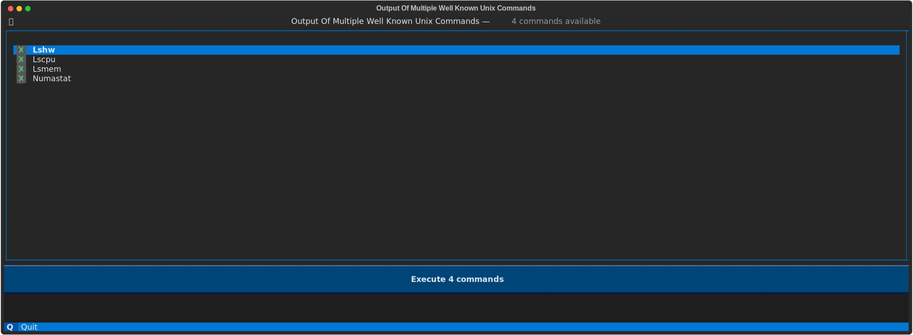
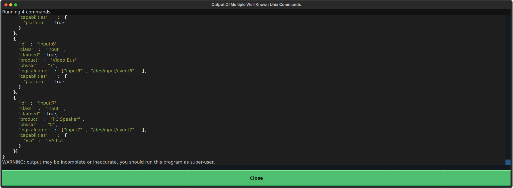
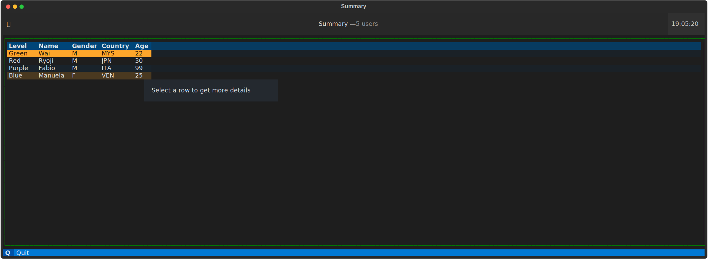
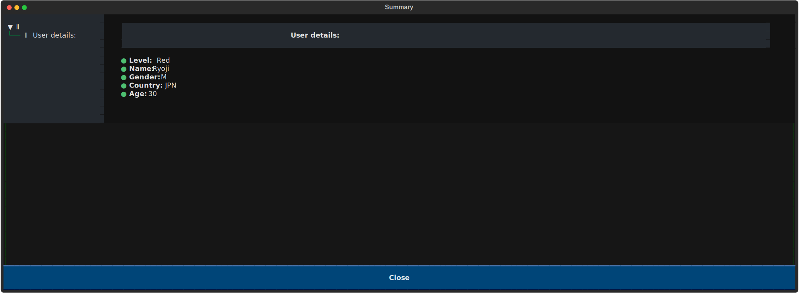
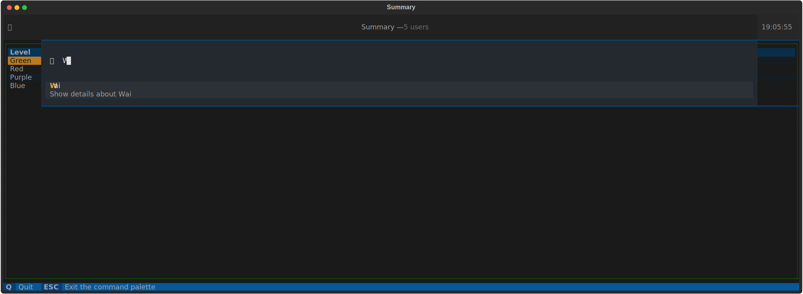

# Crash course to Textual

Python on Linux has nice GUI (Graphic User Interface) development libraries like [TkInter](https://docs.python.org/3/library/tkinter.html), but what if you cannot run graphical applications?

Text terminals, are available on not just Linux but BSD and other great Unix like operating systems. And if you write code in Python you should be using [Textual](https://textual.textualize.io/)

So what is Textual?

> Textual is a Rapid Application Development framework for Python, built by Textualize.io.
> Build sophisticated user interfaces with a simple Python API. Run your apps in the terminal or a web browser!

In this quick introduction, I will show you 2 examples of what you can do with Textual and where you can go after that

## Installation

First create a virtual environment

```shell
python3 -m venv ~/virtualenv/Textualize
```

Then you can either clone the Git repository and make an editable distribution:

```shell
. ~/virtualenv/Textualize/bin/activate
pip install --upgrade pip
pip install --upgrade wheel
pip install --upgrade build
pip install --editable .
```

Or just Install from Pypi.org:

```shell
. ~/virtualenv/Textualize/bin/activate
pip install --upgrade KodegeekTextualize
```

## Our first application: A log scroller




### Display results on a separate screen



*TODO*

## Second example: A table with race results



This example shows you how to display race results on a table (Using a DataTable widget). The application allows you to:

* Sort by column 
* Click on a row to show race details on a full window
* Search the table and show racer details or run application commands

### Using screens to show more complex views



### You can search too, using the command palette



## Troubleshooting a Textual application

[Debugging](https://github.com/josevnz/tutorials/blob/main/docs/PythonDebugger/README.md) a Python Textual application is a little bit more challenging, that is because the fact some operations can be asynchronous and putting breakpoints may be cumbersome when troubleshooting widgets.

Depending on the situation, there are some tools you can use. But first make sure you have the textual dev tools:

```shell
pip install textual-dev==1.3.0
```

### Make sure you are capturing the right keys

You are not sure what keys are being captured by a Textual application? Run the key app:

```shell
textual keys
```
Then you can press your key combinations and confirm what events are generated in Textual.

### A picture is worth more than a thousand words

Say that you have a problem placing components on a layout, and you want to show others where you are stuck. Textual allows you to take a screenshot of your running application:

```shell
textual run --screenshot 5 ./kodegeek_textualize/log_scroller.py
```

That's how I created the images for this tutorial.

### Capturing events and printing custom messages

Textual has a logger that is part of every instance of an Application:

```python
my_app = self.screen.app
my_app.log.info(f"Loaded provider: CustomCommand")
```

In order to see this messages, you need first to start a console:

```shell
. ~/virtualenv/Textualize/bin/activate
textual console
```

Then on another terminal run your application

```shell
. ~/virtualenv/Textualize/bin/activate
textual run --dev ./kodegeek_textualize/log_scroller.py
```

You will see now events and messages flowing into the terminal where the console is running:

```shell

▌Textual Development Console v0.46.0                                                                                                                                                      
▌Run a Textual app with textual run --dev my_app.py to connect.                                                                                                                           
▌Press Ctrl+C to quit.                                                                                                                                                                    
─────────────────────────────────────────────────────────────────────────────── Client '127.0.0.1' connected ────────────────────────────────────────────────────────────────────────────────
[20:29:43] SYSTEM                                                                                                                                                                 app.py:2188
Connected to devtools ( ws://127.0.0.1:8081 )
[20:29:43] SYSTEM                                                                                                                                                                 app.py:2192
---
[20:29:43] SYSTEM                                                                                                                                                                 app.py:2194
driver=<class 'textual.drivers.linux_driver.LinuxDriver'>
[20:29:43] SYSTEM                                                                                                                                                                 app.py:2195
loop=<_UnixSelectorEventLoop running=True closed=False debug=False>
[20:29:43] SYSTEM                                                                                                                                                                 app.py:2196
features=frozenset({'debug', 'devtools'})
[20:29:43] SYSTEM                                                                                                                                                                 app.py:2228
STARTED FileMonitor({PosixPath('/home/josevnz/TextualizeTutorial/docs/Textualize/kodegeek_textualize/os_app.tcss')})
[20:29:43] EVENT                                                                              
```

Another advantage of running your application in developer mode is that if you change your CSS, the application will try to render again without a restart.

## Writing unit tests

What if you want to write [unit tests](https://docs.python.org/3/library/unittest.html) for your brand new Textual application?

*TODO*

## What is next

* You should definitely take a look at the [official tutorial](https://textual.textualize.io/tutorial/). Lots of examples and pointers to the reference [API](https://textual.textualize.io/api/).
* Textual can use widgets from the project that started all, [Rich](https://github.com/Textualize/rich). I think some, if not any of these components will get merged into Textual at some point. Textual framework is more capable for complex applications using a high level API, but Rich has lots of nice features.
* [Textual-web](https://github.com/Textualize/textual-web) is a promising project, that will allow you to run Textual applications on a browser. It is less mature than Textual but is evolving really fast.
* Debugging applications in Python can get complicated. Sometimes you may have to [mix different tools](https://github.com/josevnz/DebuggingApplications/blob/main/StracePythonWireshark/README.md) to figure out what is wrong with an application.
* Textual is used by other projects. One of them that is super easy to use is [Trogon](https://github.com/Textualize/trogon), it will [make your CLI self discoverable](https://github.com/josevnz/CLIWithClickAndTrogon/blob/main/README.md).
* Finally, [check the projects](https://www.textualize.io/projects/). There are a lot of useful Open Source applications on the portfolio.